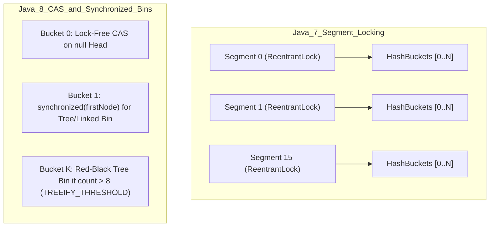

# Section 11: Multithreading, Concurrency & Distributed Systems Mastery

A comprehensive guide for Senior, Staff, and Distributed Systems technical interview rounds. This guide breaks down the **"When to Use What"** decision trees, architectural trade-offs, internal JVM/hardware mechanics, and distributed algorithms.

---

## Part 1: "When to Use What" Synchronization Decision Matrix

### 1. Synchronization Primitives Comparison

| Primitive | Mechanism | Ownership | Fairness Option | Best Use Case | When NOT to Use |
| :--- | :--- | :--- | :--- | :--- | :--- |
| **`synchronized`** | JVM monitor lock (biased $\to$ thin $\to$ fat) | Yes (reentrant per thread) | No (JVM managed) | Simple critical sections, idiomatic, auto-releases on exception | High contention with timeouts, try-lock, or multiple condition variables |
| **`ReentrantLock`** | AQS (AbstractQueuedSynchronizer) CAS + wait queue | Yes (reentrant per thread) | Yes (`new ReentrantLock(true)`) | Timed lock attempts (`tryLock`), interruptible locks, multiple `Condition`s | Simple blocks where `synchronized` is cleaner; forgetting `unlock()` in `finally` |
| **`ReentrantReadWriteLock`**| Shared Read Lock + Exclusive Write Lock | Yes (Write lock only) | Yes | Read-heavy workloads ($> 90\%$ reads) with slow write operations | Short read operations (lock acquisition overhead dwarfs critical section) or write-heavy |
| **`StampedLock`** | Optimistic reading (version timestamp) + Read/Write lock | No (not reentrant) | No | Extremely high read throughput where writes rarely overlap with reads | Reentrant calls (will deadlock!), nested loops calling synchronized methods |
| **`Semaphore`** | Counting permit dispenser via AQS | **No ownership** (any thread can release) | Yes | Limiting concurrent access to finite resource pools (e.g., DB connections, rate limiters) | Exclusive mutual exclusion (Mutex) where only lock owner should release |
| **`CountDownLatch`** | One-time countdown barrier ($N \to 0$) | No | N/A | Waiting for $N$ parallel initialization tasks / worker threads to finish | Cyclic tasks that repeat every round (cannot be reset!) |
| **`CyclicBarrier`** | Reusable rendez-vous barrier for $N$ threads | No | N/A | Multi-phase parallel algorithms (e.g., iterative matrix simulations, MapReduce rounds) | One-time countdowns or asymmetric producer/consumer sync |

---

### 2. `volatile` vs `Atomic*` (CAS) vs Locks

| Construct | Guarantees Provided | Does NOT Guarantee | Underlying Hardware Mechanism |
| :--- | :--- | :--- | :--- |
| **`volatile`** | **Visibility** (direct Main Memory reads/writes) + **Ordering** (prevents compiler/CPU reordering via Memory Barriers) | **Atomicity** on compound actions (e.g. `count++` is read-modify-write!) | CPU Cache Coherence (MESI protocol) + StoreLoad memory barriers |
| **`AtomicInteger` / `AtomicReference`** | **Visibility + Atomicity** via Lock-Free CAS | Safe composite state across multiple independent atomic variables | Hardware CPU instructions (`CMPXCHG`), busy-spin loop |
| **`Locks` (`synchronized` / `ReentrantLock`)** | **Visibility + Atomicity + Mutual Exclusion** across arbitrary code blocks | Lock-freedom (can suffer from thread blocking, context switching, priority inversion) | OS Futex / Thread park & unpark via OS scheduler |

---

### 3. `ConcurrentHashMap` Concurrency Model Deep Dive

Interviewers love asking how `ConcurrentHashMap` evolved from Java 7 to Java 8+:

- **Java 7**: Used **Segmented Locking** with 16 independent `Segment`s extending `ReentrantLock` (concurrency level 16).
- **Java 8+**: Removed segments. Uses **Lock-Free CAS** (`Compare-And-Swap`) to insert the first node in an empty bucket, and **`synchronized(firstNode)`** locking only the specific bin during collisions. Buckets with $> 8$ collisions transform into **Red-Black Trees** ($O(\log N)$ worst-case lookup).

---

## Part 2: Distributed Systems Core Building Blocks

### 1. Consistent Hashing with Virtual Nodes (VNodes)
- **Problem with Naive Hashing (`hash(key) % N`)**: Adding or removing 1 server causes almost **100% of all keys to rehash and migrate**, cache-stampeding the entire database.
- **Consistent Hashing**: Hashes both servers and keys onto a circular ring $[0 \dots 2^{32}-1]$.
  - Key is assigned to the first server encountered moving clockwise.
  - On adding/removing a server, only **$K / N$** keys move on average.
- **Virtual Nodes (VNodes)**: Maps each physical server to $V$ virtual positions (e.g., `Server1#1`, `Server1#2` $\dots$) on the ring.
  - **Eliminates Hotspots**: Produces a statistically uniform distribution across physical nodes.
  - **Heterogeneous Capacity**: Powerful nodes can be assigned proportionally more VNodes.

---

### 2. Leader Election (Lease & Heartbeat Model)
- **Use Case**: Primary-replica databases, coordinator nodes in Kafka/Zookeeper, distributed schedulers.
- **Mechanisms**:
  - **Bully Algorithm**: Highest ID node takes over when leader fails ($O(N^2)$ messages).
  - **Lease-based Leader Election**: Nodes compete for an ephemeral lock with a Time-To-Live (TTL). The leader must renew heartbeats before TTL expires.

---

### 3. Load Balancing Algorithms
- **Round Robin (RR)**: Selects $(i + 1) \pmod N$. Ignores server capacity.
- **Weighted Round Robin (WRR)**: Assigns weight $w_i$ per server. Can produce bursts of requests to the heaviest server.
- **Smooth Weighted Round Robin (SWRR / Nginx Algorithm)**:
  - Each server has `current_weight` (starts at 0) and `effective_weight`.
  - In each turn: `current_weight += effective_weight`. Pick server with highest `current_weight`, then decrement its `current_weight` by total weight sum.
  - Result: Smooth, evenly interleaved distribution without burstiness.
