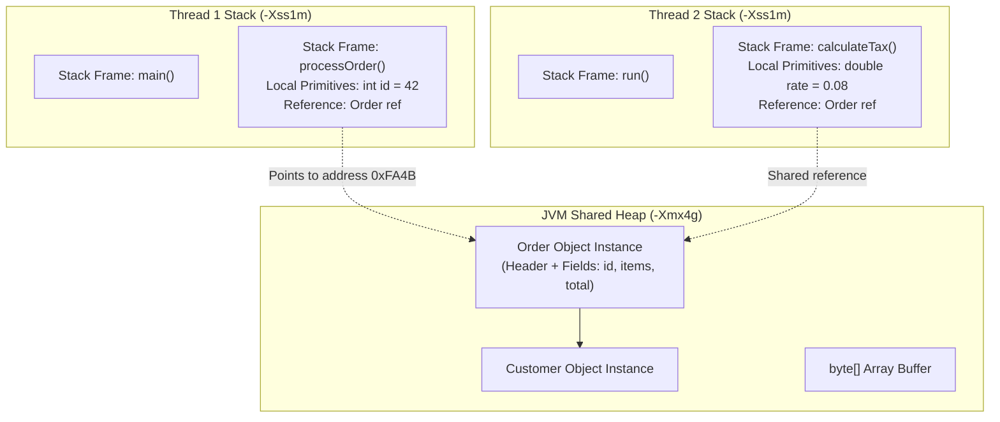
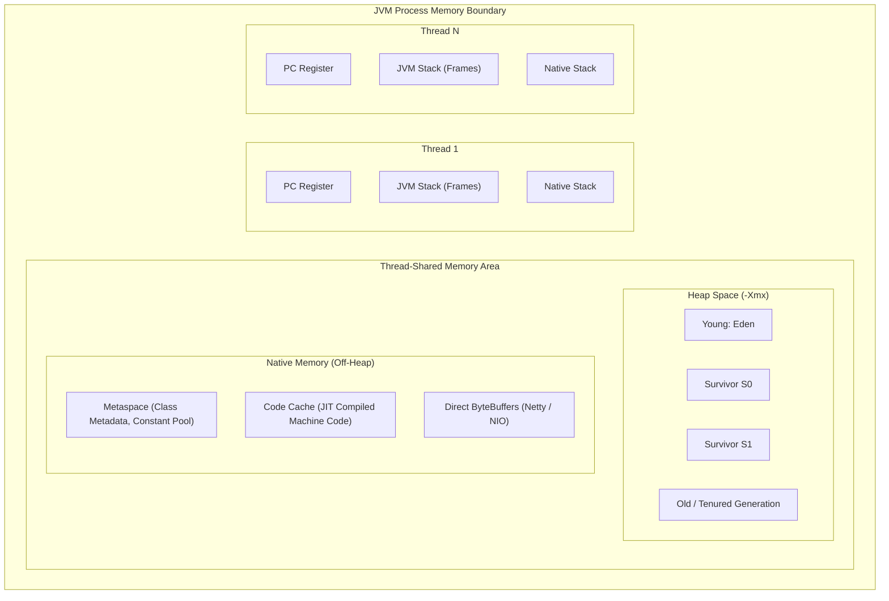
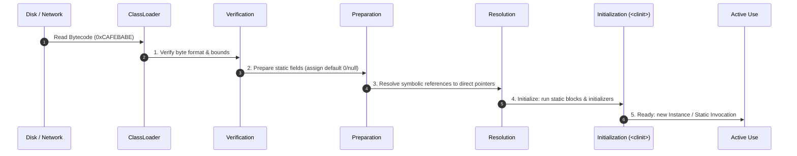
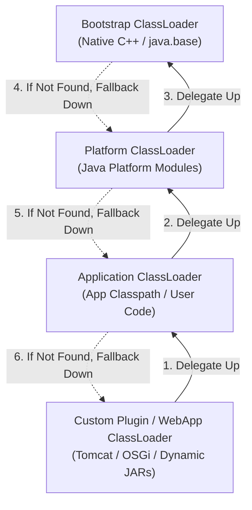
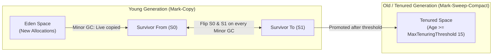
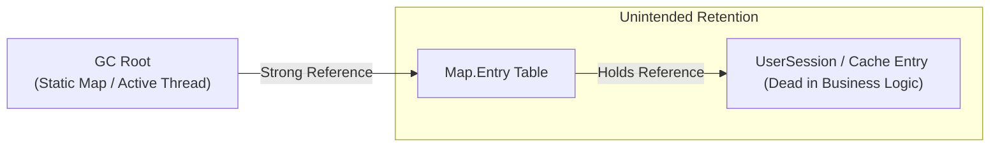
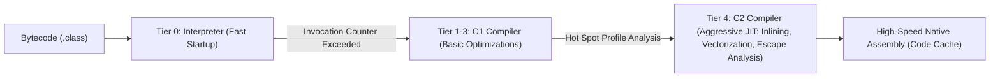
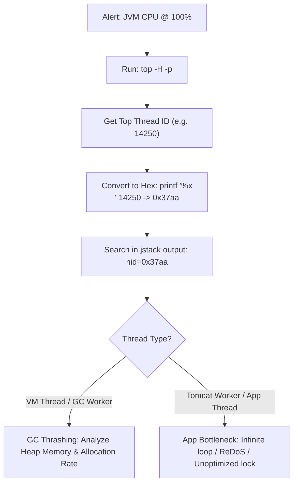

# ☕ JVM Internals: Architectural Deep-Dive & Senior Interview Master Playbook

This master guide covers **Questions 1 through 15** with deep-dive technical mechanics, 1–2 minute verbal interview pitch scripts, Mermaid architecture diagrams, pros & cons, real-world production outage scenarios, and zero-dependency Java code.

---

## 📑 JVM Internals Table of Contents

1. [Q1: Difference between Heap and Stack Memory](#q1-what-is-the-difference-between-heap-and-stack-memory)
2. [Q2: How the JVM Memory Model (Runtime Data Areas) Works](#q2-how-does-the-jvm-memory-model-work)
3. [Q3: Class Loading Lifecycle (Loading, Linking, Initialization)](#q3-explain-the-class-loading-lifecycle)
4. [Q4: Bootstrap, Platform, and Application ClassLoaders](#q4-what-are-bootstrap-platform-and-application-classloaders)
5. [Q5: How Garbage Collection Works Internally (Mark-Sweep-Compact, Safepoints, Generational Hypothesis)](#q5-how-does-garbage-collection-work-internally)
6. [Q6: G1 GC vs ZGC vs Serial GC (Algorithms, Latency vs Throughput)](#q6-g1-gc-vs-zgc-vs-serial-gc)
7. [Q7: What Triggers a Full GC?](#q7-what-triggers-a-full-gc)
8. [Q8: How to Identify Memory Leaks in Production](#q8-how-do-you-identify-memory-leaks-in-production)
9. [Q9: What is a Heap Dump and When/How to Analyze It](#q9-what-is-a-heap-dump-and-when-would-you-analyze-it)
10. [Q10: How the JIT Compiler Improves Performance (Tiered Compilation C1/C2)](#q10-how-does-the-jit-compiler-improve-performance)
11. [Q11: What is Escape Analysis? (Scalar Replacement, Lock Coarsening)](#q11-what-is-escape-analysis)
12. [Q12: Metaspace vs PermGen (Off-Heap Architecture, Memory Management)](#q12-what-is-metaspace-and-how-is-it-different-from-permgen)
13. [Q13: How to Troubleshoot OutOfMemoryError (OOM in Heap, Metaspace, Direct Buffer, OS Threads)](#q13-how-do-you-troubleshoot-outofmemoryerror)
14. [Q14: How to Troubleshoot High CPU Usage in JVM Applications (Thread Dumps, Top -H, Async-Profiler)](#q14-how-do-you-troubleshoot-high-cpu-usage-in-jvm-applications)
15. [Q15: Production Tools for JVM Performance Analysis (CLI, APM, Profilers)](#q15-what-tools-do-you-use-for-jvm-performance-analysis)

---

### Q1. What is the difference between Heap and Stack memory?

#### 🎯 1-Minute Verbal Pitch for Interviews
> *"Stack memory is thread-private, allocated per thread at execution time, and holds stack frames containing method parameters, local primitive variables, and references to objects. It operates as a strict LIFO structure, with $O(1)$ allocation and deallocation happening automatically when a method frame pops. No GC is involved, making it extremely fast, but it is bounded by `-Xss` (typically 1MB per thread), failing with `StackOverflowError` if exceeded.
>
> In contrast, the Heap is a shared global memory pool created at JVM startup (`-Xms`, `-Xmx`) where all dynamic object instances and arrays reside. Access to Heap is managed by Garbage Collection cycles. It is subject to concurrent access synchronization and fails with `OutOfMemoryError: Java heap space` when the GC can no longer reclaim memory for new allocations."*

#### 🏗️ Architecture Diagram


#### ⚖️ Trade-offs & Detailed Comparison
| Dimension | Stack Memory | Heap Memory |
| :--- | :--- | :--- |
| **Scope & Concurrency** | Thread-private; strictly thread-safe. | Globally shared across all threads; requires concurrency controls (synchronized, locks). |
| **Lifecycle & Deallocation** | Deterministic LIFO; instantly popped upon method return. | Non-deterministic; re-claimed asynchronously via Garbage Collection. |
| **Allocation Cost** | Fast pointer bump ($O(1)$ CPU register manipulation). | Search/bump in Eden / TLAB (Thread-Local Allocation Buffer) + GC overhead. |
| **Failure Mode** | `java.lang.StackOverflowError` (deep/infinite recursion). | `java.lang.OutOfMemoryError: Java heap space`. |
| **Sizing Flags** | `-Xss<size>` (Default ~1024 KB on 64-bit JVMs). | `-Xms<initial>` and `-Xmx<max>`. |

#### 🚨 Production Scenario & Gotcha
**Scenario**: In high-concurrency microservices (e.g. 5,000 active Tomcat threads), setting `-Xss2m` consumes $5000 \times 2\text{MB} = 10\text{GB}$ of off-heap RAM just for thread stacks, triggering OS Out-Of-Memory kills (`OOMKilled` in Kubernetes) even when Heap utilization is under 30%.
**Fix**: Keep `-Xss` at default `1m` or migrate to Java 21 Virtual Threads where continuation stack frames are dynamically allocated on the Heap in small chunks.

---

### Q2. How does the JVM memory model work?

#### 🎯 1-Minute Verbal Pitch for Interviews
> *"The JVM Memory Architecture is split into two primary domains: **Thread-Private Areas** (Program Counter Register, JVM Method Stack, and Native Method Stack) and **Thread-Shared Areas** (Heap, Metaspace, and Code Cache).
>
> When code executes, the PC register tracks the bytecode instruction offset for the current thread. The Method Stack manages method execution via stack frames. The Heap manages the entire lifecycle of objects, partitioned into Generational spaces: Young Generation (Eden, Survivor spaces S0/S1) and Old (Tenured) Generation. Metaspace, located in Native OS memory since Java 8, stores class metadata, method bytecode, runtime constant pool, and static fields.
>
> On top of this, the **Java Memory Model (JMM, JSR-133)** defines the concurrency semantics—specifying how threads interact through main memory and local CPU caches, providing `happens-before` guarantees via `volatile`, `synchronized`, and `final`."*

#### 🏗️ Architecture Diagram


#### ⚖️ Memory Segment Responsibilities
1. **Program Counter (PC) Register**: Micro-pointer to the next bytecode instruction to be executed by the execution engine.
2. **JVM Stack**: Stores stack frames. Each frame holds:
   - *Local Variable Table (LVT)*: primitive types and reference pointers.
   - *Operand Stack*: Workspace for bytecode execution (e.g. `iadd`, `aload`).
   - *Dynamic Linking*: Symbolic references to runtime constant pool.
   - *Return Address*: Normal return or exception dispatch info.
3. **Native Method Stack**: Executes C/C++ JNI (Java Native Interface) code.
4. **Metaspace**: Stores loaded class structure, method tables, annotations.
5. **Code Cache**: Holds native x86/ARM assembly generated by C1/C2 JIT compilers.

---

### Q3. Explain the Class Loading lifecycle.

#### 🎯 1-Minute Verbal Pitch for Interviews
> *"The JVM Class Loading lifecycle consists of three major phases: **Loading**, **Linking**, and **Initialization**, followed by Use and Unloading.
>
> 1. **Loading**: The ClassLoader reads binary `.class` bytecode (from disk, JAR, or network) into memory and creates a `java.lang.Class` object in the Heap while pushing metadata to Metaspace.
> 2. **Linking** has 3 sub-steps:
>    - **Verification**: Validates magic number `0xCAFEBABE`, bytecode structure, and stack map frames to ensure memory safety.
>    - **Preparation**: Allocates memory for static variables and assigns **default zero-values** (e.g. `null`, `0`, `false`).
>    - **Resolution**: Replaces symbolic references in the constant pool with direct memory pointers.
> 3. **Initialization**: The JVM runs the `<clinit>` method, executing static variable initializers and static initialization blocks in lexical order under strict class-level locking."*

#### 🏗️ Lifecycle Sequence Diagram


#### 💻 Code Demonstration: Preparation vs Initialization
```java
public class ClassLoadingDemo {
    // During PREPARATION: value is initialized to default 0
    // During INITIALIZATION: value is set to 42, then static block executes
    public static int value = 42;

    static {
        System.out.println("Static block executed: <clinit> invoked");
    }
}
```

---

### Q4. What are Bootstrap, Platform, and Application ClassLoaders?

#### 🎯 1-Minute Verbal Pitch for Interviews
> *"Java uses a hierarchical ClassLoader architecture governed by the **Parent Delegation Model**.
>
> 1. **Bootstrap ClassLoader**: The root loader written in native C/C++. It loads core Java platform classes (`java.base`, `rt.jar`, `java.lang.*`). In Java code, `String.class.getClassLoader()` returns `null` because Bootstrap has no Java object representation.
> 2. **Platform ClassLoader** (formerly Extension ClassLoader): Loads extended standard modules (e.g. `java.sql`, `java.xml`) from standard runtime image modules.
> 3. **Application (System) ClassLoader**: Loads application classes from the application classpath (`-classpath`, `-cp`, or `CLASSPATH` env).
> 4. **Custom ClassLoaders**: Used by frameworks (OSGi, Tomcat, Spring DevTools) to load classes from custom locations or enable dynamic hot-reloading by breaking delegation order (e.g., Child-First in web servlet containers)."*

#### 🏗️ Parent Delegation Model


#### ⚖️ Why Parent Delegation Exists
- **Security & Sandboxing**: Prevents malicious code from overriding core classes like `java.lang.Object` or `java.lang.SecurityManager`.
- **Deduplication**: Ensures a class loaded once by a parent is never duplicated in memory by child loaders.

---

### Q5. How does Garbage Collection work internally?

#### 🎯 1-Minute Verbal Pitch for Interviews
> *"Garbage Collection is the automatic memory management process in the JVM. It relies on the **Weak Generational Hypothesis**: most objects die shortly after creation, while objects surviving multiple cycles tend to live for a long time.
>
> The GC mechanism involves 3 core phases:
> 1. **Root Tracing (Reachability Analysis)**: Traces object graphs starting from **GC Roots** (Active Thread Stacks, Static Variables, JNI Global/Local handles, JVM System classes). Any unreferenced object is marked dead.
> 2. **Safepoints & Stop-the-World (STW)**: Threads are brought to a synchronized halt at safepoints (loops, method calls) so memory graphs do not mutate during marking.
> 3. **Reclaim Algorithms**:
>    - **Mark-Copy**: Copies live objects from Eden to Survivor/Tenured and wipes Eden in one sweep (used in Young Gen).
>    - **Mark-Sweep-Compact**: Marks live objects, sweeps dead ones, and slides live objects together to eliminate external fragmentation in Old Gen."*

#### 🏗️ Generational Object Promotion Diagram


---

### Q6. G1 GC vs ZGC vs Serial GC?

#### 🎯 1-Minute Verbal Pitch for Interviews
> *"**Serial GC** is single-threaded, designed for single-core or embedded environments with tiny heaps (<100MB), freezing all threads during STW collections.
>
> **G1 GC (Garbage-First)** is the default collector since Java 9. It partitions the heap into 2,048 equal-sized contiguous regions (1MB–32MB) dynamically assigned as Eden, Survivor, or Old. G1 tracks reclamation value and collects the regions with the most garbage first within a user-defined pause time target (`-XX:MaxGCPauseMillis=200`).
>
> **ZGC (Z Garbage Collector)** is a low-latency, scalable collector in modern Java (Java 17/21). It handles terabyte-scale heaps (up to 16TB) with **sub-millisecond STW pause times** (<1ms) regardless of heap size. It achieves this using **colored pointers** (metadata bits in 64-bit reference pointers) and **load barriers** to execute concurrent marking, relocation, and compaction while application worker threads run concurrently."*

#### ⚖️ Deep Comparison Matrix
| Dimension | Serial GC (`-XX:+UseSerialGC`) | G1 GC (`-XX:+UseG1GC`) | ZGC (`-XX:+UseZGC`) |
| :--- | :--- | :--- | :--- |
| **STW Pause Time** | Hundreds of ms to seconds | 10ms – 200ms (Predictable target) | **< 1ms (Sub-millisecond)** |
| **Heap Scalability** | < 512 MB | 4 GB – 64 GB | **16 MB up to 16 TB** |
| **Throughput Efficiency** | Low on multi-core | Very High ($\sim 95\%+$ CPU to app) | High ($\sim 90-93\%$ due to load barriers) |
| **Key Mechanism** | Single-threaded Mark-Compact | Region-based, Remembered Sets (RSet) | Colored pointers (4 metadata bits) + Read load barrier |
| **Best Scenario** | CLI tools, AWS Lambda (cold starts) | High-throughput web APIs, microservices | Ultra-low-latency finance, real-time trading, massive in-memory caches |

---

### Q7. What triggers a Full GC?

#### 🎯 1-Minute Verbal Pitch for Interviews
> *"A Full GC is an expensive Stop-the-World event where the JVM collects both Young and Old generations (and Metaspace) simultaneously.
>
> The primary triggers are:
> 1. **Promotion Failure**: When objects from Young Gen are promoted to Old Gen during a Minor GC, but the Old Gen lacks contiguous space due to memory fragmentation.
> 2. **Concurrent Mode Failure (in G1/CMS)**: When the application allocates memory faster than the concurrent marking cycle can reclaim it, forcing G1 to fall back to a single-threaded STW Full GC.
> 3. **Metaspace Exhaustion**: Metaspace reaches `MaxMetaspaceSize` or hits its dynamic high-water mark, triggering class unloading.
> 4. **Explicit `System.gc()`**: Invoked by code or third-party libraries (unless `-XX:+DisableExplicitGC` is set).
> 5. **Humongous Object Allocation**: In G1 GC, allocating objects larger than 50% of a region size triggers eager Old Gen collections if free contiguous regions are unavailable."*

#### 🛠️ Production Prevention Checklist
- Set `-XX:+DisableExplicitGC` to prevent library code from freezing the JVM.
- Set `-XX:InitiatingHeapOccupancyPercent=45` (IHOP) in G1GC to start concurrent marking earlier.
- Ensure `-XX:MetaspaceSize` is set close to `-XX:MaxMetaspaceSize` (e.g. `256m`) to avoid dynamic resizing Full GCs during application startup.

---

### Q8. How do you identify memory leaks in production?

#### 🎯 1-Minute Verbal Pitch for Interviews
> *"A memory leak in Java occurs when unused objects remain reachable from GC Roots, preventing the GC from reclaiming their memory, resulting in a progressive saw-tooth heap profile until an `OutOfMemoryError` occurs.
>
> My production identification playbook:
> 1. **Metrics & APM**: Monitor Heap usage post-Major GC. If baseline memory after GC continuously trends upwards, a leak is active.
> 2. **Live Histogram**: Run `jcmd <pid> GC.class_histogram` to inspect top class instances by count and retained bytes.
> 3. **Heap Dump Analysis**: Capture a heap dump via `jcmd <pid> GC.heap_dump /tmp/dump.hprof` and open it in **Eclipse Memory Analyzer (MAT)** or **IntelliJ Profiler**.
> 4. **Find Leak Suspects**: Run MAT's *Leak Suspects Report* and inspect the **Dominator Tree** to identify the object retaining the largest subtree (e.g., unbounded static `ConcurrentHashMap`, unclosed `ThreadLocal`, or dangling listener registrations)."*

#### 🏗️ Memory Leak Mechanism


---

### Q9. What is a Heap Dump and when would you analyze it?

#### 🎯 1-Minute Verbal Pitch for Interviews
> *"A Heap Dump is a binary snapshot of all objects residing in the JVM Heap at a specific point in time, formatted as an HPROF file. It captures object classes, field values, array contents, and the full graph of references connecting objects to GC Roots.
>
> **When to Analyze It**:
> - Immediately following an `OutOfMemoryError: Java heap space`.
> - When memory utilization remains abnormally high ($>85\%$) despite repeated Full GC cycles.
> - During performance benchmarking to optimize memory footprint and cache sizing.
>
> **How to Generate It Safely in Production**:
> - Automated flag: `-XX:+HeapDumpOnOutOfMemoryError -XX:HeapDumpPath=/var/log/heap_dumps/`
> - On-demand non-disruptive trigger: `jcmd <pid> GC.heap_dump /var/log/heap.hprof`"*

---

### Q10. How does the JIT Compiler improve performance?

#### 🎯 1-Minute Verbal Pitch for Interviews
> *"The JVM starts executing code via the **Interpreter**, which translates bytecode into native CPU instructions line-by-line. While fast to start, interpretation is slow for repetitive operations.
>
> The **JIT (Just-In-Time) Compiler** identifies 'hot spots' (methods or loops executed thousands of times) using execution counters. Under **Tiered Compilation (`-XX:+TieredCompilation`)**:
> 1. **C1 Compiler (Client)** performs quick compilations with lightweight profiling and basic optimizations (Tier 1 to 3).
> 2. **C2 Compiler (Server / Graal)** performs aggressive optimizations (Tier 4):
>    - **Method Inlining**: Replaces method calls with method bodies, eliminating call-stack overhead.
>    - **Loop Unrolling & Vectorization (SIMD)**: Uses hardware vector instructions.
>    - **Dead Code Elimination & Branch Prediction**: Removes unreachable branches.
>    - **Escape Analysis**: Converts heap allocations to stack allocations or CPU registers."*

#### 🏗️ Tiered Compilation Pipeline


---

### Q11. What is Escape Analysis?

#### 🎯 1-Minute Verbal Pitch for Interviews
> *"Escape Analysis is an aggressive JIT C2 optimization technique that determines whether an object allocated inside a method is accessible outside that method's lexical scope or by other threads.
>
> An object can have three escape states:
> 1. **GlobalEscape**: Escapes the method and thread (e.g. stored in a static field, returned from method, or passed to another thread).
> 2. **ArgEscape**: Passed as an argument to another method but does not escape the current thread.
> 3. **NoEscape**: Completely confined to the current method.
>
> If an object is **NoEscape**, the JIT applies:
> - **Scalar Replacement**: Breaks the object into its constituent primitive fields and maps them directly to CPU registers or stack slots, avoiding Heap allocation entirely!
> - **Lock Elision**: Strips out synchronization locks if the object is proven thread-confined."*

#### 💻 Code Demonstration: Escape Analysis in Action
```java
public class EscapeAnalysisDemo {
    record Point(int x, int y) {}

    public int calculateSum() {
        // Point p does NOT escape calculateSum()
        // JIT Scalar Replacement decomposes p into two local ints: int x = 10, int y = 20
        // Result: ZERO heap allocation, ZERO GC pressure!
        Point p = new Point(10, 20);
        return p.x() + p.y();
    }
}
```

---

### Q12. What is Metaspace and how is it different from PermGen?

#### 🎯 1-Minute Verbal Pitch for Interviews
> *"Before Java 8, class metadata, interned Strings, and static variables were stored in **PermGen (Permanent Generation)**, which was a contiguous part of the JVM Heap managed by `-XX:MaxPermSize`. PermGen frequently threw `java.lang.OutOfMemoryError: PermGen space` in applications with heavy dynamic proxy generation (e.g., Spring, Hibernate, CGLIB) because sizing it accurately was very difficult.
>
> In Java 8, PermGen was completely replaced by **Metaspace**.
> Key Differences:
> 1. **Location**: Metaspace resides in **Native OS Memory**, not the JVM Heap.
> 2. **Sizing**: Metaspace automatically grows by default up to available OS memory (though best practice mandates capping it via `-XX:MaxMetaspaceSize=512m`).
> 3. **Interned Strings & Static Variables**: Moved to the regular JVM Heap in Java 7/8, leaving Metaspace exclusively for class metadata, method bytecode, and constant pools."*

#### ⚖️ PermGen vs Metaspace Comparison
| Feature | PermGen (Java 7 and earlier) | Metaspace (Java 8+) |
| :--- | :--- | :--- |
| **Memory Backing** | JVM Heap Space | Native OS Virtual Memory |
| **Default Max Size** | Fixed (64MB / 82MB default) | Unlimited (Bounded only by OS RAM) |
| **Configuration Flags** | `-XX:PermSize`, `-XX:MaxPermSize` | `-XX:MetaspaceSize`, `-XX:MaxMetaspaceSize` |
| **Interned Strings & Statics** | In PermGen | Moved to Main Heap |
| **GC Behavior** | Collected during Full GC | ClassLoader unloading triggers Metaspace cleanup |

---

### Q13. How do you troubleshoot OutOfMemoryError?

#### 🎯 1-Minute Verbal Pitch for Interviews
> *"Troubleshooting `OutOfMemoryError` requires identifying the exact OOM subtype because each points to a distinct memory region:
>
> 1. **`OOM: Java heap space`**: Heap is exhausted. Diagnose using Heap Dump (`.hprof`) via Eclipse MAT. Check for unindexed DB queries loading millions of rows into memory or unbounded static caches.
> 2. **`OOM: Metaspace`**: ClassLoader leak. Caused by continuous redeployments, dynamic proxy generation (CGLIB/ByteBuddy), or reflection caches not being collected. Set `-XX:MaxMetaspaceSize=512m`.
> 3. **`OOM: Direct buffer memory`**: Off-heap NIO memory exhausted (Netty / gRPC). Caused by unreleased `ByteBuf` instances (`ReferenceCountUtil.release()`).
> 4. **`OOM: Unable to create new native thread`**: OS process thread limit reached (`ulimit -u` or `/proc/sys/kernel/pid_max`) or excessive `-Xss` stack allocation leaving insufficient OS virtual memory."*

#### 🛠️ Immediate Triage Command Sequence
```bash
# 1. Inspect live process memory stats
jcmd <PID> VM.native_memory baseline
jcmd <PID> GC.class_histogram | head -n 25

# 2. Check OS limits for thread creation OOM
ulimit -a
cat /proc/sys/kernel/threads-max

# 3. Trigger immediate heap dump for offline analysis
jcmd <PID> GC.heap_dump /tmp/oom_analysis.hprof
```

---

### Q14. How do you troubleshoot high CPU usage in JVM applications?

#### 🎯 1-Minute Verbal Pitch for Interviews
> *"When a JVM application spikes to 100% CPU, I isolate whether the CPU is consumed by **Application Worker Threads** (e.g. infinite loops, regex catastrophic backtracking, hash collisions) or **JVM Background Threads** (e.g. GC thrashing).
>
> My standard 4-step triage:
> 1. **Identify Top Thread PID**: Run `top -H -p <JVM_PID>` to find the specific native Thread ID consuming the highest CPU (e.g. thread `14250`).
> 2. **Convert to Hex**: Convert decimal PID to hex: `printf "%x\n" 14250` $\to$ `0x37aa`.
> 3. **Inspect Thread Dump**: Run `jcmd <PID> Thread.print` or `jstack <PID>` and grep for `nid=0x37aa`. Look at the thread name and stack trace.
> 4. **Differentiate GC vs Business Code**: If the top thread is `VM Thread` or `G1 Concurrent Refinement Thread`, the CPU is pegged by GC thrashing due to low heap headroom. If it's a Tomcat worker thread, inspect the exact method line in the stack trace."*

#### 🏗️ CPU Triage Flowchart


---

### Q15. What tools do you use for JVM performance analysis?

#### 🎯 1-Minute Verbal Pitch for Interviews
> *"In production and performance tuning, I use a layered toolset spanning CLI utilities, profilers, and APM systems:
>
> 1. **Built-in JDK CLI Tools**:
>    - `jcmd`: Swiss-army knife for heap dumps, thread dumps, GC histograms, and Native Memory Tracking (NMT).
>    - `jstat -gcutil <pid> 1000`: Real-time GC monitoring (Eden, Survivor, Old, Metaspace % and pause durations).
> 2. **Low-Overhead Production Profilers**:
>    - **Async-Profiler**: The gold standard for CPU and allocation profiling; avoids Safepoint Bias using `AsyncGetCallTrace` and perf events, generating interactive Flame Graphs.
>    - **JDK Flight Recorder (JFR) & JDK Mission Control (JMC)**: Low-overhead ($<1\%$) kernel-level runtime event telemetry built directly into HotSpot.
> 3. **Offline Diagnostic Tools**:
>    - **Eclipse Memory Analyzer (MAT)**: Dominator tree and retained heap calculation for memory leak isolation.
> 4. **Distributed APM Observability**:
>    - Datadog / Dynatrace / Prometheus + Grafana with Micrometer metrics."*

---
