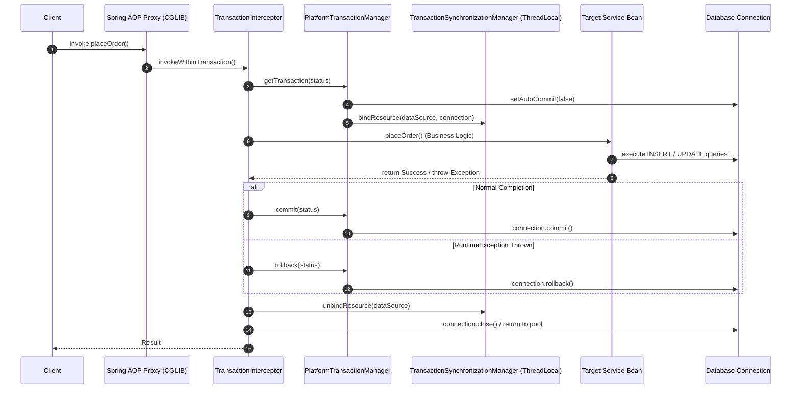
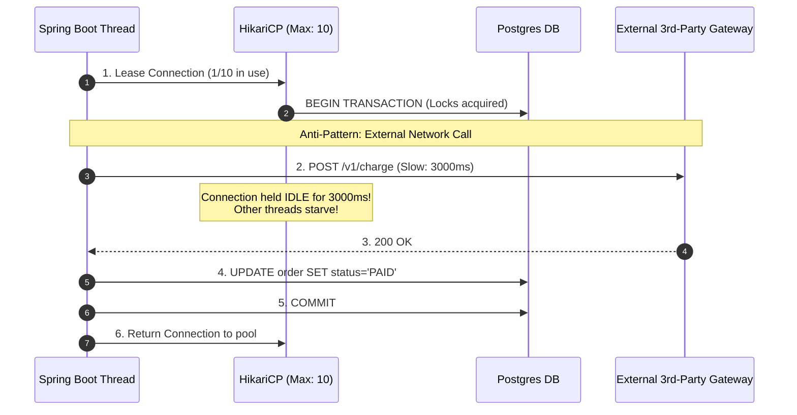

# 🍃 Spring @Transactional: Mechanics, Propagation, Isolation & Production Traps

This master guide covers **Questions 16 through 30** with deep-dive internal mechanics, 1–2 minute verbal interview pitch scripts, Mermaid architecture diagrams, pros & cons, transaction anomalies, and zero-dependency Java simulation code.

---

## 📑 Spring @Transactional Table of Contents

1. [Q16: How @Transactional Works Internally (AOP, Interceptors, ThreadLocal)](#q16-how-does-transactional-work-internally)
2. [Q17: Why @Transactional Sometimes Does Not Work (Common Gotchas)](#q17-why-does-transactional-sometimes-not-work)
3. [Q18: What Exceptions Trigger Transaction Rollback? (Checked vs Unchecked)](#q18-what-exceptions-trigger-transaction-rollback)
4. [Q19: Difference between REQUIRED and REQUIRES_NEW](#q19-what-is-the-difference-between-required-and-requires_new)
5. [Q20: Explain All Transaction Propagation Types](#q20-explain-all-transaction-propagation-types)
6. [Q21: What is Transaction Isolation? (ACID Foundations)](#q21-what-is-transaction-isolation)
7. [Q22: Explain All Isolation Levels (Read Uncommitted, Read Committed, Repeatable Read, Serializable)](#q22-explain-all-isolation-levels)
8. [Q23: What Causes Dirty Reads?](#q23-what-causes-dirty-reads)
9. [Q24: What Causes Phantom Reads?](#q24-what-causes-phantom-reads)
10. [Q25: Why Should API Calls Be Avoided Inside Transactions?](#q25-why-should-api-calls-be-avoided-inside-transactions)
11. [Q26: What Happens During Nested Transactions (Savepoints)?](#q26-what-happens-during-nested-transactions)
12. [Q27: What is Transaction Synchronization (TransactionSynchronizationManager)?](#q27-what-is-transaction-synchronization)
13. [Q28: How to Debug Transaction Issues in Production](#q28-how-do-you-debug-transaction-issues)
14. [Q29: What is the Self-Invocation Problem?](#q29-what-is-the-self-invocation-problem)
15. [Q30: How Spring Uses Proxies for Transaction Management (JDK Dynamic vs CGLIB)](#q30-how-does-spring-use-proxies-for-transaction-management)

---

### Q16. How does @Transactional work internally?

#### 🎯 1-Minute Verbal Pitch for Interviews
> *"Spring's `@Transactional` is an AOP-driven declarative transaction management mechanism implemented via dynamic proxies.
>
> When Spring bootstraps a bean annotated with `@Transactional`, it wraps the target bean in a dynamic proxy (using CGLIB or JDK Dynamic Proxy). When a caller invokes a transactional method:
> 1. The proxy intercepts the call and routes it to `TransactionInterceptor`.
> 2. `TransactionInterceptor` consults the `PlatformTransactionManager` (e.g., `DataSourceTransactionManager`, `JpaTransactionManager`) via `TransactionAspectSupport`.
> 3. The transaction manager obtains a database connection from the `DataSource`, sets `autoCommit = false`, and binds this connection to the current thread using `TransactionSynchronizationManager` via a `ThreadLocal` map.
> 4. The target business method executes on that thread, sharing the bound DB connection.
> 5. If execution completes normally, the transaction manager calls `connection.commit()`. If an unhandled `RuntimeException` or `Error` escapes, it calls `connection.rollback()`. Finally, it unbinds the connection and resets `autoCommit`."*

#### 🏗️ Internal Interception Sequence Diagram


---

### Q17. Why does @Transactional sometimes not work?

#### 🎯 1-Minute Verbal Pitch for Interviews
> *"There are five classic reasons why `@Transactional` fails silently in production:
>
> 1. **Self-Invocation (Internal Method Calls)**: Calling a `@Transactional` method from another method within the same class bypasses the Spring proxy, invoking the target instance directly with zero transaction interception.
> 2. **Non-Public Method Visibility**: Spring AOP proxies only intercept `public` methods by default. Putting `@Transactional` on `private`, `protected`, or package-private methods is ignored.
> 3. **Swallowed Exceptions (Catch-and-Suppress)**: If code catches a `RuntimeException` inside a `try-catch` block and does not re-throw it, the proxy sees normal completion and issues a `commit()`.
> 4. **Checked Exceptions without `rollbackFor`**: Throwing a checked `Exception` (e.g. `IOException`, `SQLException`) will **NOT** trigger rollback by default unless explicitly configured via `@Transactional(rollbackFor = Exception.class)`.
> 5. **Incorrect Proxy Mode / Bean Not Managed**: Calling the method on an instance created via `new OrderService()` instead of an injected Spring Bean."*

#### 💻 Anti-Pattern vs Solution
```java
@Service
public class OrderService {

    // ❌ PITFALL 1: Self-invocation bypasses proxy!
    public void processOrder(Order order) {
        // Direct internal call does NOT go through the proxy; NO transaction is started!
        this.saveOrderWithTx(order);
    }

    @Transactional
    public void saveOrderWithTx(Order order) {
        // ... DB writes ...
    }

    // ❌ PITFALL 2: Exception caught and swallowed -> commit will execute!
    @Transactional
    public void executePayment(Payment p) {
        try {
            chargeCard(p);
        } catch (Exception e) {
            log.error("Payment failed", e); // Transaction will COMMIT because exception was not rethrown!
        }
    }
}
```

---

### Q18. What exceptions trigger transaction rollback?

#### 🎯 1-Minute Verbal Pitch for Interviews
> *"By default, Spring follows the EJB convention: transactions are rolled back **ONLY** for **Unchecked Exceptions** (subclasses of `java.lang.RuntimeException`) and `java.lang.Error`.
>
> **Checked Exceptions** (subclasses of `java.lang.Exception` excluding `RuntimeException`, such as `SQLException`, `IOException`, or custom business checked exceptions) **do NOT trigger a rollback**; Spring commits the transaction!
>
> To ensure checked exceptions trigger a rollback, you must explicitly declare `@Transactional(rollbackFor = Exception.class)` or specify individual exception classes. Conversely, you can use `noRollbackFor` to prevent rollback for benign domain exceptions."*

#### ⚖️ Rollback Rule Matrix
| Exception Type | Example | Default Rollback Behavior? | How to Override |
| :--- | :--- | :---: | :--- |
| `RuntimeException` (Unchecked) | `NullPointerException`, `IllegalArgumentException` | **YES (Rollback)** | `noRollbackFor = SpecificException.class` |
| `Error` (Unchecked) | `OutOfMemoryError`, `StackOverflowError` | **YES (Rollback)** | Standard JVM behavior |
| `Exception` (Checked) | `IOException`, `SQLException`, `CustomCheckedException` | **NO (Commits!)** | **`rollbackFor = Exception.class`** |

---

### Q19. What is the difference between REQUIRED and REQUIRES_NEW?

#### 🎯 1-Minute Verbal Pitch for Interviews
> *"**`PROPAGATION_REQUIRED`** (Spring's default) joins the current transaction if one exists; if none exists, it creates a new one. Both outer and inner methods execute within the **same physical database transaction**. If the inner method throws an exception, the entire transaction is marked `RollbackOnly`, meaning the outer method cannot commit even if it catches the exception.
>
> **`PROPAGATION_REQUIRES_NEW`** always suspends the active outer transaction and creates an **independent, separate physical database transaction** with its own new DB connection. The inner transaction commits or rolls back independently of the outer transaction. Once the inner transaction completes, the outer transaction resumes.
>
> **Critical Scenario**: We use `REQUIRES_NEW` for audit logging or notification dispatch where the audit record must be committed even if the primary business transaction fails and rolls back."*

#### 🏗️ REQUIRED vs REQUIRES_NEW Execution Flow

```mermaid
flowchart TD
    subgraph REQUIRED_Case ["Propagation: REQUIRED (Single Shared Transaction)"]
        OuterA["Outer Method (Tx 1)"] --> InnerA["Inner Method (Joins Tx 1)"]
        InnerA -->|Throws Exception| RollbackA["Tx 1 Marked RollbackOnly -> Entire Tx Rolls Back"]
    end

    subgraph REQUIRES_NEW_Case ["Propagation: REQUIRES_NEW (Independent Suspended Transactions)"]
        OuterB["Outer Method (Tx 1)"] -->|Suspends Tx 1| InnerB["Inner Method (New Connection: Tx 2)"]
        InnerB -->|Commits Tx 2| ResumeB["Resume Outer Tx 1"]
        ResumeB -->|Outer Tx 1 can Commit or Rollback independently| EndB["Done"]
    end
```


---

### Q20. Explain all transaction propagation types.

#### 🎯 1-Minute Verbal Pitch for Interviews
> *"Spring defines 7 transaction propagation behaviors in `org.springframework.transaction.annotation.Propagation`:
>
> 1. **`REQUIRED`** *(Default)*: Uses active transaction, or creates a new one.
> 2. **`REQUIRES_NEW`**: Suspends active transaction and starts a completely new, independent physical transaction.
> 3. **`SUPPORTS`**: Executes within an active transaction if present; otherwise runs non-transactionally without starting one.
> 4. **`NOT_SUPPORTED`**: Suspends active transaction if present and executes non-transactionally.
> 5. **`MANDATORY`**: Requires an active transaction; throws `IllegalTransactionStateException` if none exists.
> 6. **`NEVER`**: Executes non-transactionally; throws `IllegalTransactionStateException` if an active transaction exists.
> 7. **`NESTED`**: Executes within a nested transaction using **JDBC Savepoints** if an active transaction exists; allows partial rollback to savepoint without failing the outer transaction."*

#### ⚖️ Propagation Decision Table
| Propagation | Existing Tx Present? | No Existing Tx? | Use Case |
| :--- | :--- | :--- | :--- |
| **`REQUIRED`** | Joins existing Tx | Starts new Tx | Standard business CRUD services. |
| **`REQUIRES_NEW`**| Suspends existing; starts new | Starts new Tx | Independent Audit logging, billing charge attempts. |
| **`SUPPORTS`** | Joins existing Tx | Runs non-transactionally | Read-only search queries that can participate if called from write flow. |
| **`NOT_SUPPORTED`**| Suspends existing | Runs non-transactionally | Heavy read reports or long I/O calls to avoid holding locks. |
| **`MANDATORY`** | Joins existing Tx | **Throws Exception** | Helper DAO methods that must never run outside a transactional boundary. |
| **`NEVER`** | **Throws Exception** | Runs non-transactionally | Operations that strictly conflict with DB locks (e.g., long external sync). |
| **`NESTED`** | Creates DB **Savepoint** | Starts new Tx | Complex workflows where sub-steps can fail and retry without rolling back root. |

---

### Q21. What is transaction isolation?

#### 🎯 1-Minute Verbal Pitch for Interviews
> *"Transaction Isolation is the **'I' in ACID** properties. It defines the degree to which the modifications made by one concurrent database transaction are visible to and isolated from other concurrent transactions.
>
> In multi-user concurrent systems, unconstrained read/write operations lead to concurrency anomalies: **Dirty Reads**, **Non-Repeatable Reads**, and **Phantom Reads**.
>
> Higher isolation levels prevent these anomalies by taking stronger row, table, or predicate locks (or using Multi-Version Concurrency Control - MVCC), but at the trade-off of decreased concurrent throughput and increased risk of lock contention and deadlocks."*

---

### Q22. Explain all isolation levels.

#### 🎯 1-Minute Verbal Pitch for Interviews
> *"The SQL standard and Spring support 4 standard isolation levels:
>
> 1. **`READ_UNCOMMITTED`**: Lowest isolation. A transaction can read uncommitted data written by other concurrent transactions. Suffers from Dirty Reads, Non-Repeatable Reads, and Phantom Reads.
> 2. **`READ_COMMITTED`** *(Default in PostgreSQL, Oracle, SQL Server)*: A transaction can only read data committed before the query started. Eliminates Dirty Reads, but Non-Repeatable Reads and Phantom Reads can occur.
> 3. **`REPEATABLE_READ`** *(Default in MySQL InnoDB)*: Guarantees that any row read once will return the exact same values on subsequent reads within the same transaction. Eliminates Dirty Reads and Non-Repeatable Reads. MySQL InnoDB also prevents Phantom Reads using Next-Key locking.
> 4. **`SERIALIZABLE`**: Highest isolation. Completely isolates transactions as if executed sequentially via range/predicate locking. Eliminates all anomalies but severely degrades throughput."*

#### ⚖️ Isolation Level Anomaly Matrix
| Isolation Level | Dirty Read | Non-Repeatable Read | Phantom Read | Performance |
| :--- | :---: | :---: | :---: | :---: |
| **`READ_UNCOMMITTED`** | ❌ Allowed | ❌ Allowed | ❌ Allowed | Highest |
| **`READ_COMMITTED`** | ✅ **Prevented** | ❌ Allowed | ❌ Allowed | High |
| **`REPEATABLE_READ`** | ✅ **Prevented** | ✅ **Prevented** | ❌ Allowed* | Moderate |
| **`SERIALIZABLE`** | ✅ **Prevented** | ✅ **Prevented** | ✅ **Prevented** | Lowest |

*\*Note: MySQL InnoDB prevents Phantom Reads in REPEATABLE_READ via MVCC snapshot reads and Next-Key Gap Locks.*

---

### Q23. What causes dirty reads?

#### 🎯 1-Minute Verbal Pitch for Interviews
> *"A **Dirty Read** occurs when Transaction A modifies a row but has not yet committed, and Transaction B reads that uncommitted modified row. If Transaction A subsequently encounters an error and **rolls back**, the data read by Transaction B is invalid and never truly existed in the database.
>
> **Example**:
> - User has $100 balance.
> - Tx 1 updates balance to $500 (uncommitted).
> - Tx 2 reads balance as $500 and approves a $400 withdrawal.
> - Tx 1 rolls back balance to $100.
> - Result: Overdraft and financial inconsistency.
>
> **Remedy**: Configure minimum isolation level **`READ_COMMITTED`**."*

---

### Q24. What causes phantom reads?

#### 🎯 1-Minute Verbal Pitch for Interviews
> *"A **Phantom Read** occurs in range queries: Transaction A queries a set of rows matching a `WHERE` condition (e.g. `SELECT * FROM orders WHERE total > 100`) returning 5 rows. Simultaneously, Transaction B **inserts and commits a new row** satisfying the condition (`total = 150`). When Transaction A executes the identical range query again, it gets 6 rows. The newly appeared row is a 'phantom'.
>
> **Difference from Non-Repeatable Read**:
> - *Non-Repeatable Read*: An existing single row's **data is modified/deleted**.
> - *Phantom Read*: New rows are **inserted** into a queried range.
>
> **Remedy**: Use **`SERIALIZABLE`** or DB-specific **Next-Key Gap Locking**."*

---

### Q25. Why should API calls be avoided inside transactions?

#### 🎯 1-Minute Verbal Pitch for Interviews
> *"Executing external synchronous HTTP/REST/gRPC API calls inside a `@Transactional` boundary is one of the most destructive anti-patterns in backend engineering.
>
> **The Root Cause**:
> When a method begins with `@Transactional`, it leases a physical database connection from the HikariCP pool and holds open table/row locks.
> If the external API takes **2 to 5 seconds** (or times out at 30s) due to network jitter:
> 1. The database connection is held completely idle, blocked on network I/O.
> 2. With 50 concurrent requests, the entire HikariCP connection pool (default 10–30) becomes 100% exhausted.
> 3. Every other incoming request blocks on `HikariPool-1 - Connection is not available, request timed out after 30000ms`, triggering a cascading catastrophic outage across the entire microservice.
>
> **Solution**: Follow the **Split-Transaction / Outbox Pattern**: execute external I/O outside transaction boundaries, or publish async events to Kafka."*

#### 🏗️ Connection Pool Starvation Architecture


---

### Q26. What happens during nested transactions?

#### 🎯 1-Minute Verbal Pitch for Interviews
> *"In Spring, `Propagation.NESTED` creates a **Nested Transaction** using underlying **JDBC Savepoints** if an existing physical transaction is active.
>
> Key Mechanics:
> 1. It runs within the **same physical database connection and transaction** as the outer transaction (unlike `REQUIRES_NEW` which leases a 2nd connection).
> 2. Before executing the nested method, Spring sets a JDBC Savepoint: `connection.setSavepoint("savepoint_name")`.
> 3. If the nested method throws an exception, Spring catches it and rolls back **only to the savepoint** (`connection.rollback(savepoint)`), leaving the outer transaction valid and able to continue and commit.
> 4. If the outer transaction rolls back, all nested transactions are rolled back with it."*

---

### Q27. What is transaction synchronization?

#### 🎯 1-Minute Verbal Pitch for Interviews
> *"Transaction Synchronization is the mechanism in Spring managed by `TransactionSynchronizationManager` that allows application components and callbacks to register hooks with the active transaction lifecycle.
>
> Common lifecycle hooks via `TransactionSynchronization`:
> - `beforeCommit(boolean readOnly)`
> - `afterCommit()`
> - `afterCompletion(int status)` (e.g. `STATUS_COMMITTED`, `STATUS_ROLLED_BACK`)
>
> **Critical Real-World Use Case**:
> When publishing a Kafka message or clearing a Redis cache following a DB write, doing so directly in the method can emit an event for data that hasn't committed yet. We use `TransactionSynchronizationManager.registerSynchronization()` or `@TransactionalEventListener(phase = TransactionPhase.AFTER_COMMIT)` to guarantee the event is published **only after the DB commit succeeds**."*

#### 💻 Code Example: After-Commit Kafka Dispatch
```java
@Transactional
public void createOrder(Order order) {
    orderRepository.save(order);

    // Register callback: runs ONLY after DB physical commit completes
    TransactionSynchronizationManager.registerSynchronization(new TransactionSynchronization() {
        @Override
        public void afterCommit() {
            kafkaTemplate.send("order-created-topic", order.getId());
        }
    });
}
```

---

### Q28. How do you debug transaction issues?

#### 🎯 1-Minute Verbal Pitch for Interviews
> *"My systematic strategy for debugging transaction issues in production:
>
> 1. **Enable Spring Transaction Logging**: Set `logging.level.org.springframework.transaction.interceptor=TRACE` and `logging.level.org.springframework.jdbc.datasource=DEBUG` to inspect exact transaction creation, propagation joins, suspensions, and commit/rollback events.
> 2. **Monitor HikariCP Metrics**: Inspect `HikariPool-1` active, idle, and waiting threads via Micrometer/Prometheus.
> 3. **Inspect ThreadLocal State Programmatically**:
>    `TransactionSynchronizationManager.isActualTransactionActive()` and `TransactionSynchronizationManager.getCurrentTransactionName()`.
> 4. **Database Lock & Long-Running Transaction Query**: Query `pg_stat_activity` (PostgreSQL) or `SHOW PROCESSLIST` / `sys.innodb_lock_waits` (MySQL) to find idle-in-transaction connections holding table locks."*

---

### Q29. What is the self-invocation problem?

#### 🎯 1-Minute Verbal Pitch for Interviews
> *"The self-invocation problem occurs when a method inside a Spring bean calls another method within the same bean (e.g., `this.helperMethod()`).
>
> Because Spring transaction management relies on **AOP Dynamic Proxies**, interception logic only executes when an external caller invokes the method through the **Proxy object reference**.
>
> When `this.methodB()` is called internally:
> 1. The invocation uses the raw `this` pointer (target instance), completely bypassing the Spring proxy.
> 2. `@Transactional`, `@Async`, and `@Cacheable` annotations on `methodB()` are **completely ignored**.
>
> **Three Solutions**:
> 1. **Refactor into a separate Service Bean** (Cleanest architectural fix).
> 2. **Self-injection**: Inject `OrderService` into itself with `@Lazy`.
> 3. **`AopContext.currentProxy()`**: Enable `exposeProxy = true` on `@EnableAspectJAutoProxy` and invoke `((OrderService) AopContext.currentProxy()).methodB()`."*

#### 🏗️ Self-Invocation Bypass Diagram
```mermaid
flowchart TD
    subgraph ExternalCall ["External Call: Proxy Interception Works"]
        ClientA[Controller] -->|1. Calls placeOrder()| ProxyA[Spring CGLIB Proxy]
        ProxyA -->|2. Starts Transaction| InterceptorA[TransactionInterceptor]
        InterceptorA -->|3. Delegates| TargetA[OrderService Instance]
    end

    subgraph InternalCall ["Self-Invocation: Proxy Bypassed!"]
        TargetA -->|4. Calls this.saveAuditLog()| TargetA
        noteA["Bypasses Proxy!<br>@Transactional on saveAuditLog() is IGNORED!"]
    end
```

---

### Q30. How does Spring use proxies for transaction management?

#### 🎯 1-Minute Verbal Pitch for Interviews
> *"Spring AOP employs two proxying mechanisms to enforce transactional boundaries:
>
> 1. **JDK Dynamic Proxies** (`java.lang.reflect.Proxy`): Used when the target class implements one or more interfaces. It creates an in-memory proxy class implementing the same interfaces and routing calls via an `InvocationHandler`.
> 2. **CGLIB Proxies** (Code Generation Library via ByteBuddy): Used when the target class does not implement an interface, or by default in **Spring Boot 2.x and 3.x** (`spring.aop.proxy-target-class=true`). CGLIB dynamically subclasses the target class at runtime and overrides methods via method interceptors.
>
> **Key Limitations**:
> - CGLIB cannot proxy `final` classes or override `final` methods.
> - Private methods cannot be intercepted by either proxy mechanism."*

---
