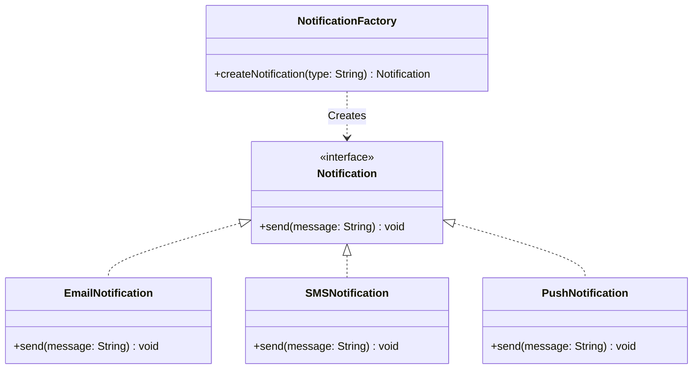
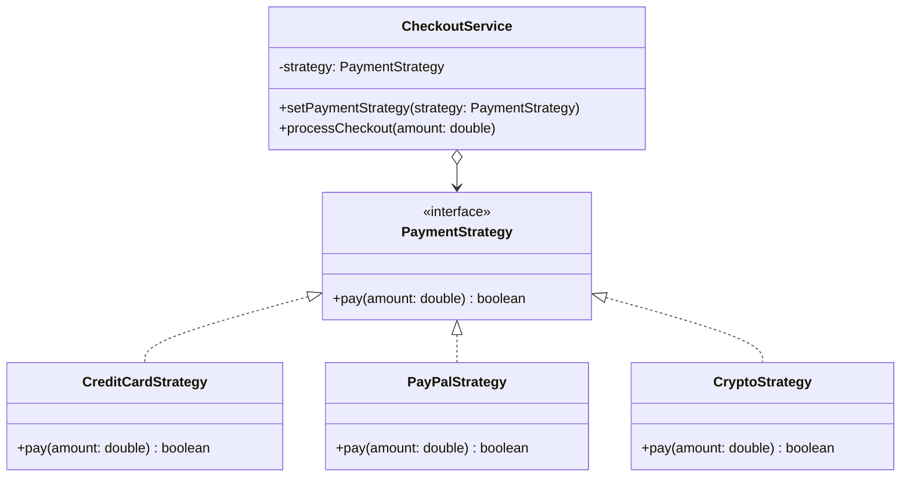
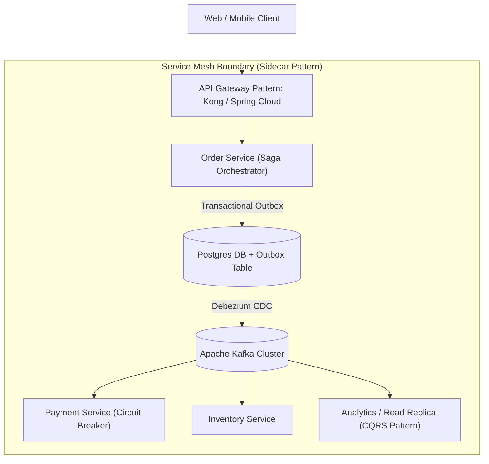

# 🏛️ Java & Enterprise Design Patterns: Master Interview Playbook

This master guide covers **Questions 31 through 45** with deep architectural foundations, 1–2 minute verbal interview pitch scripts, Mermaid diagrams, pros & cons, enterprise microservices architectures, and zero-dependency Java code.

---

## 📑 Design Patterns Table of Contents

1. [Q31: What Problem Does the Factory Pattern Solve?](#q31-what-problem-does-the-factory-pattern-solve)
2. [Q32: Factory Pattern vs Abstract Factory Pattern](#q32-factory-pattern-vs-abstract-factory-pattern)
3. [Q33: When Should You Use the Builder Pattern?](#q33-when-should-you-use-the-builder-pattern)
4. [Q34: Why is Builder Preferred for Immutable Objects?](#q34-why-is-builder-preferred-for-immutable-objects)
5. [Q35: How Do You Implement a Thread-Safe Singleton? (Bill Pugh, Double-Checked Locking, Enum)](#q35-how-do-you-implement-a-thread-safe-singleton)
6. [Q36: What are the Drawbacks of Singleton?](#q36-what-are-the-drawbacks-of-singleton)
7. [Q37: Strategy Pattern with Real-World Payment Gateway Example](#q37-explain-the-strategy-pattern-with-a-real-world-example)
8. [Q38: When Would You Use the Observer Pattern?](#q38-when-would-you-use-the-observer-pattern)
9. [Q39: How is Observer Used in Event-Driven Systems?](#q39-how-is-observer-used-in-event-driven-systems)
10. [Q40: Adapter Pattern vs Decorator Pattern](#q40-adapter-pattern-vs-decorator-pattern)
11. [Q41: What Problem Does the Proxy Pattern Solve?](#q41-what-problem-does-the-proxy-pattern-solve)
12. [Q42: Template Method Pattern vs Strategy Pattern](#q42-how-is-the-template-method-pattern-different-from-strategy)
13. [Q43: What is Dependency Injection and Which Pattern Does it Use?](#q43-what-is-dependency-injection-and-which-pattern-does-it-use)
14. [Q44: Which Design Patterns are Commonly Used in Spring Framework?](#q44-which-design-patterns-are-commonly-used-in-spring-framework)
15. [Q45: Which Design Patterns are Most Commonly Used in Microservices?](#q45-which-design-patterns-are-most-commonly-used-in-microservices)

---

### Q31. What problem does the Factory Pattern solve?

#### 🎯 1-Minute Verbal Pitch for Interviews
> *"The **Factory Pattern** solves the problem of tight coupling between client code and concrete object instantiation.
>
> In standard code, using `new ConcreteNotification()` ties the caller directly to a specific class, violating the **Open/Closed Principle (OCP)** and **Dependency Inversion Principle (DIP)**.
>
> The Factory Pattern encapsulates instantiation logic behind a single interface or method. The client requests an object by contract or type token (e.g. `NotificationFactory.get("SMS")`), and the factory returns an interface implementation (`Notification`). This allows new types to be introduced without modifying existing client callers, centralizes complex object creation logic, and simplifies unit testing via mocking."*

#### 🏗️ Factory Architecture Diagram


---

### Q32. Factory Pattern vs Abstract Factory Pattern?

#### 🎯 1-Minute Verbal Pitch for Interviews
> *"The difference lies in the **scope of instantiation**:
>
> - **Factory Method Pattern**: Uses a single method to create **one product** belonging to a single inheritance hierarchy (e.g., `createButton()`).
> - **Abstract Factory Pattern**: Is a **Factory of Factories**. It provides an interface for creating **families of related or dependent objects** without specifying their concrete classes (e.g., `GUIFactory` with `createButton()`, `createCheckbox()`, and `createScrollBar()`).
>
> **Real-World Scenario**: In a multi-cloud deployment manager, an `AWSResourceFactory` creates `EC2Instance` and `S3Bucket`, while a `GCPResourceFactory` creates `GCEInstance` and `GCSBucket`. The client code operates against the generic `CloudResourceFactory`."*

#### ⚖️ Comparison Table
| Feature | Factory Method | Abstract Factory |
| :--- | :--- | :--- |
| **Granularity** | Creates a single product. | Creates families of related products. |
| **Implementation** | Typically inheritance-based (subclasses override factory method) or switch/lookup. | Composition-based (factory object is passed to client). |
| **Complexity** | Low to medium. | High (requires multiple abstract and concrete interfaces). |

---

### Q33. When should you use the Builder Pattern?

#### 🎯 1-Minute Verbal Pitch for Interviews
> *"The **Builder Pattern** is designed to solve the **Telescoping Constructor Anti-Pattern** and the **JavaBeans Mutability Anti-Pattern** when constructing complex domain objects with many optional parameters (typically $>4$ parameters).
>
> **When to Use It**:
> 1. An object has multiple parameters, many of which are optional with sensible defaults.
> 2. The construction process requires step-by-step assembly with input validation before object allocation.
> 3. You need the created object to be completely **Immutable** (all `final` fields with no setter methods).
>
> **Why Telescoping Constructors Fail**: `new HttpRequest("POST", url, headers, null, 3000, true, null)` is unreadable, prone to parameter-ordering bugs, and difficult to maintain."*

---

### Q34. Why is Builder preferred for immutable objects?

#### 🎯 1-Minute Verbal Pitch for Interviews
> *"In Java, constructing an immutable object using the JavaBeans pattern (no-arg constructor + setters) fails because the object is in an **inconsistent, mutable state** between consecutive setter calls and cannot be made `final`.
>
> The Builder pattern solves this by:
> 1. Gathering all parameters inside a mutable helper `Builder` object.
> 2. Executing multi-field validation rules atomically.
> 3. Passing the validated parameters to a private constructor of the target class, which assigns them to strictly `private final` fields.
> 4. Returning a fully initialized, thread-safe, immutable object with zero setters.
>
> This guarantees thread safety without synchronization and prevents **Thread Escape** during partial construction."*

#### 💻 Code Demonstration: Immutable Builder
```java
public final class DatabaseConfig {
    private final String host;
    private final int port;
    private final int maxConnections;
    private final boolean sslEnabled;

    private DatabaseConfig(Builder b) {
        this.host = b.host;
        this.port = b.port;
        this.maxConnections = b.maxConnections;
        this.sslEnabled = b.sslEnabled;
    }

    public static class Builder {
        private String host = "localhost";
        private int port = 5432;
        private int maxConnections = 10;
        private boolean sslEnabled = false;

        public Builder host(String host) { this.host = host; return this; }
        public Builder port(int port) { this.port = port; return this; }
        public Builder maxConnections(int max) { this.maxConnections = max; return this; }
        public Builder sslEnabled(boolean ssl) { this.sslEnabled = ssl; return this; }

        public DatabaseConfig build() {
            if (host == null || port <= 0) throw new IllegalStateException("Invalid DB config");
            return new DatabaseConfig(this);
        }
    }
}
```

---

### Q35. How do you implement a thread-safe Singleton?

#### 🎯 1-Minute Verbal Pitch for Interviews
> *"There are three industry-standard ways to implement a thread-safe Singleton in Java:
>
> 1. **Bill Pugh Singleton (Initialization-on-Demand Holder)** *(Recommended for standard classes)*: Leverages JVM class-loading mechanics. The inner static helper class `Holder` is only loaded when `getInstance()` is called. The JVM guarantees thread-safe, lazy initialization without any `synchronized` locking overhead.
> 2. **Double-Checked Locking (DCL) with `volatile`**: Checks for null, synchronizes on the class monitor, and checks again. The instance field **MUST be declared `volatile`** to prevent CPU instruction reordering during object allocation (`memory allocate -> initialize -> assign pointer`).
> 3. **Enum Singleton (Joshua Bloch Effective Java)**: 100% thread-safe, JVM-managed, and intrinsically immune to **Reflection attacks** and **Serialization duplicate instance attacks**."*

#### 💻 Code: 3 Thread-Safe Implementations
```java
// 1. Bill Pugh Singleton (Lazy, High Performance, Zero Synchronization)
public class BillPughSingleton {
    private BillPughSingleton() {}
    private static class Holder {
        private static final BillPughSingleton INSTANCE = new BillPughSingleton();
    }
    public static BillPughSingleton getInstance() {
        return Holder.INSTANCE;
    }
}

// 2. Double-Checked Locking (Requires 'volatile'!)
public class DoubleCheckedSingleton {
    private static volatile DoubleCheckedSingleton instance;
    private DoubleCheckedSingleton() {}
    public static DoubleCheckedSingleton getInstance() {
        if (instance == null) {
            synchronized (DoubleCheckedSingleton.class) {
                if (instance == null) {
                    instance = new DoubleCheckedSingleton();
                }
            }
        }
        return instance;
    }
}

// 3. Enum Singleton (Immune to Reflection & Serialization attacks)
public enum EnumSingleton {
    INSTANCE;
    public void executeQuery() { /* business logic */ }
}
```

---

### Q36. What are the drawbacks of Singleton?

#### 🎯 1-Minute Verbal Pitch for Interviews
> *"While Singleton ensures a single instance, it introduces significant architectural drawbacks:
>
> 1. **Unit Testing Nightmare**: Singletons introduce global mutable state. Mocking them in unit tests is notoriously difficult (requiring PowerMock or reflection).
> 2. **Hidden Dependencies**: Components access `Singleton.getInstance()` directly rather than declaring dependencies explicitly in their constructors, violating Inversion of Control.
> 3. **Tight Coupling & Violation of Single Responsibility Principle (SRP)**: The class controls its own lifecycle in addition to its business responsibilities.
> 4. **ClassLoader Issues**: If an application runs across multiple ClassLoaders (e.g. in OSGi or Tomcat webapps), each ClassLoader creates its own separate Singleton instance, breaking the singleton guarantee."*

---

### Q37. Explain the Strategy Pattern with a real-world example.

#### 🎯 1-Minute Verbal Pitch for Interviews
> *"The **Strategy Pattern** defines a family of interchangeable algorithms, encapsulates each one into a separate class, and makes them dynamically selectable at runtime based on context.
>
> **Real-World Payment Processing Example**:
> An e-commerce checkout service accepts different payment methods: `CreditCardPaymentStrategy`, `PayPalPaymentStrategy`, and `CryptoPaymentStrategy`. Instead of a massive `switch-case` block in the checkout service, each strategy implements a common `PaymentStrategy` interface. The `CheckoutService` accepts a `PaymentStrategy` via constructor or method argument, executing `strategy.pay(amount)`.
>
> **Benefits**: Adheres strictly to the **Open/Closed Principle**—adding Google Pay requires creating one new class without touching existing checkout logic."*

#### 🏗️ Strategy Pattern Diagram


---

### Q38. When would you use the Observer Pattern?

#### 🎯 1-Minute Verbal Pitch for Interviews
> *"Use the **Observer Pattern** when a one-to-many dependency exists between objects such that when the state of one object (the **Subject / Observable**) changes, all its dependents (**Observers**) must be notified and updated automatically without tight coupling.
>
> **Ideal Scenarios**:
> - Real-time stock ticker or crypto price feeds updating multiple dashboard widgets.
> - UI event listener architectures (e.g., button click handlers).
> - Reactive streams (`Flow.Publisher` / `Flow.Subscriber` in Java 9+).
> - Domain events within an aggregate boundary."*

---

### Q39. How is Observer used in event-driven systems?

#### 🎯 1-Minute Verbal Pitch for Interviews
> *"In modern distributed event-driven systems, the Observer pattern scales from in-memory callbacks into **Distributed Pub/Sub Message Brokers** (Apache Kafka, RabbitMQ, AWS SNS/SQS).
>
> The core design shifts:
> 1. **Subject $\to$ Event Producer / Kafka Topic**: Publishes state-change events (e.g. `OrderPlacedEvent`).
> 2. **Observer $\to$ Consumer Group**: Multiple independent microservices (Inventory, Notification, Fraud, Analytics) subscribe to the topic.
> 3. **Decoupling**: The producer has zero knowledge of who is listening, enabling temporal decoupling, independent autoscaling, and zero-downtime additions of new downstream consumers."*

---

### Q40. Adapter Pattern vs Decorator Pattern?

#### 🎯 1-Minute Verbal Pitch for Interviews
> *"Both patterns wrap an underlying object, but their **architectural intents** are fundamentally different:
>
> - **Adapter Pattern**: Converts the **interface** of an existing class into another interface that clients expect. It bridges incompatible interfaces without altering behavior (e.g. wrapping a legacy 3rd-party XML payment library to conform to modern JSON `PaymentGateway` interface).
> - **Decorator Pattern**: Keeps the **exact same interface**, but dynamically attaches **new responsibilities and behaviors** to an object at runtime (e.g. `BufferedInputStream` wrapping `FileInputStream`, or adding caching and rate-limiting wrappers around a repository).
>
> **Rule of Thumb**: *Adapter changes the interface; Decorator enhances the behavior.*"*

#### ⚖️ Comparison Table
| Feature | Adapter Pattern | Decorator Pattern |
| :--- | :--- | :--- |
| **Primary Intent** | Interface conversion / compatibility. | Dynamic behavior extension. |
| **Interface Match** | Changes target interface to new interface. | Implements the identical target interface. |
| **Number of Objects** | Typically adapts a single legacy object. | Can be stacked in chains (Decorator on Decorator). |
| **Java Stdlib Example** | `Arrays.asList()`, `InputStreamReader` | `new BufferedReader(new FileReader())` |

---

### Q41. What problem does the Proxy Pattern solve?

#### 🎯 1-Minute Verbal Pitch for Interviews
> *"The **Proxy Pattern** provides a surrogate or placeholder for another object to **control access to it**.
>
> It solves four core enterprise problems:
> 1. **Virtual Proxy (Lazy Loading)**: Defers expensive object creation (e.g. loading a 50MB image or heavy Hibernate entity collection) until it is first accessed.
> 2. **Protection Proxy (Security & Access Control)**: Validates user credentials/roles before delegating to the target method.
> 3. **Remote Proxy (RPC / RMI / gRPC)**: Provides a local interface representation for an object running in another JVM or remote host.
> 4. **Smart Reference Proxy (AOP, Transactions, Caching)**: Adds cross-cutting concerns like transaction demarcation (`@Transactional`), caching (`@Cacheable`), and latency metrics without mutating target code."*

---

### Q42. How is the Template Method Pattern different from Strategy?

#### 🎯 1-Minute Verbal Pitch for Interviews
> *"While both patterns promote algorithm flexibility:
>
> - **Template Method Pattern** is based on **Inheritance**. A parent abstract class defines the invariant skeletal workflow in a `final` method and declares primitive abstract hook methods (`step1()`, `step2()`) for subclasses to override. The algorithm structure is fixed at compile-time.
> - **Strategy Pattern** is based on **Composition**. It defines algorithms behind an interface and injects them into the context class. The entire algorithm can be swapped dynamically at runtime.
>
> **Rule of Thumb**: *Template Method uses subclassing to vary steps of an algorithm; Strategy uses composition to swap the entire algorithm.*"*

---

### Q43. What is Dependency Injection and which pattern does it use?

#### 🎯 1-Minute Verbal Pitch for Interviews
> *"**Dependency Injection (DI)** is a software design design technique implementing the broader **Inversion of Control (IoC)** principle. Instead of an object constructing its own dependencies (via `new`), an external entity (the IoC Container) injects required dependencies at runtime via **Constructor**, **Setter**, or **Field injection**.
>
> **Underlying Design Patterns**:
> 1. **Factory Pattern / Service Locator**: The IoC container acts as a centralized factory creating and resolving bean graphs.
> 2. **Strategy Pattern**: Injected dependencies represent strategies conforming to contracts.
> 3. **Proxy Pattern**: Injected beans are wrapped in proxies for transactions and AOP interception."*

---

### Q44. Which design patterns are commonly used in Spring Framework?

#### 🎯 1-Minute Verbal Pitch for Interviews
> *"Spring is a masterclass in enterprise design patterns:
>
> 1. **Singleton Pattern**: Default Spring Bean scope (`@Scope("singleton")`).
> 2. **Factory Method & Abstract Factory**: `BeanFactory`, `ApplicationContext`, and `FactoryBean<T>`.
> 3. **Proxy Pattern**: Spring AOP, `@Transactional`, `@Async`, and `@Secured` using CGLIB and JDK Dynamic Proxies.
> 4. **Template Method Pattern**: `JdbcTemplate`, `RestTemplate`, `TransactionTemplate`, and `JmsTemplate`.
> 5. **Observer Pattern**: `ApplicationEventPublisher`, `@EventListener`, and `ApplicationListener<E>`.
> 6. **Adapter Pattern**: Spring MVC `HandlerAdapter` mapping disparate controller method signatures.
> 7. **Decorator Pattern**: `HttpHeadResponseDecorator`, WebSockets session decorators."*

---

### Q45. Which design patterns are most commonly used in Microservices?

#### 🎯 1-Minute Verbal Pitch for Interviews
> *"In distributed microservices architectures, the most critical design patterns include:
>
> 1. **Saga Pattern (Orchestration vs Choreography)**: Manages distributed transactions across multiple microservices using compensating transactions instead of 2-Phase Commit (2PC).
> 2. **Transactional Outbox Pattern**: Solves dual-write inconsistencies between database updates and Kafka event publishing via Debezium CDC.
> 3. **Circuit Breaker Pattern (Resilience4j / Envoy)**: Prevents cascading failure by opening the circuit when downstream error rates exceed a threshold.
> 4. **API Gateway Pattern (Spring Cloud Gateway / Kong)**: Single entry point handling routing, authentication, rate limiting, and SSL termination.
> 5. **CQRS (Command Query Responsibility Segregation)**: Separates read and write datastores to optimize write integrity and high-speed read views.
> 6. **Sidecar Pattern (Service Mesh / Istio)**: Deploys auxiliary proxies alongside microservice containers to handle telemetry, mTLS, and traffic shaping."*

#### 🏗️ Microservices Enterprise Patterns Blueprint


---
