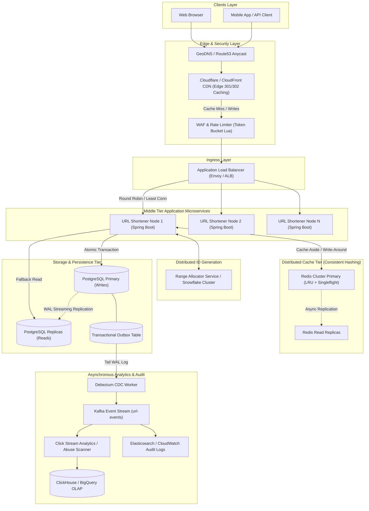

# System Design: Production-Grade Globally Distributed URL Shortener Service (TinyURL / Bitly)

> **Architectural Reference Baseline**:
> This system design strictly adopts the dimensional capacity equations, hardware latency thresholds, and cost modeling defined in the master [Capacity Planning & Cloud Cost Estimation Framework (00_capacity_planning_and_cost_estimation_framework.md)](file:///Volumes/Workspace/dev/github/personal/balasus1/leetcode/system-design/00_capacity_planning_and_cost_estimation_framework.md).

---

## 1. Fundamentals, Latency Metrics & Technical Glossary

When communicating in high-level architectural reviews and staff/principal interviews, precision in terminology and metric definition is vital:

### 1.1 Understanding Percentiles (P50, P90, P95, P99, P99.9) & The Flaw of Averages
- **Why "Average (Mean) Latency" is a Trap**: 
  Average latency hides extreme tail outliers. For example, if $99$ requests take $2\text{ ms}$ and $1$ request encounters a stop-the-world JVM Garbage Collection pause taking $2000\text{ ms}$, the average is:
  $$\text{Average Latency} = \frac{(99 \times 2\text{ ms}) + 2000\text{ ms}}{100} = 21.98\text{ ms}$$
  While the dashboard shows a seemingly healthy $\approx 22\text{ ms}$ average, $1$ out of every $100$ users experienced an unacceptable $2\text{-second}$ freeze.
- **P50 (Median)**: $50\%$ of user requests are served within this time. Represents the experience of the typical user.
- **P90**: $90\%$ of requests are faster than this duration ($1$ in $10$ requests is slower).
- **P95**: $95\%$ of requests are faster than this duration ($1$ in $20$ requests is slower). Common service-level objective (SLO) threshold for customer-facing web tiers.
- **P99**: $99\%$ of requests are faster than this duration ($1$ in $100$ requests is slower). The gold standard SLA metric in modern low-latency distributed systems.
- **P99.9 (Three Nines Tail)**: $99.9\%$ of requests are faster than this duration ($1$ in $1000$ is slower). At scale (e.g., $100,000\text{ QPS}$), a P99.9 latency affects $100\text{ requests every single second}$.

### 1.2 Cascading Tail Latency in Microservices Fan-Out
When a user request fans out to $N$ independent downstream microservices or database shards in parallel, the probability that the composite user request experiences a tail latency is:
$$\text{Probability of slow user response} = 1 - (1 - p)^N$$
Where $p$ is the probability of an individual microservice being slow (e.g., $p = 0.01$ for P99):

| Downstream Services ($N$) | Risk of Composite User Request Hitting P99 Slowness |
| :--- | :--- |
| **$N = 1$ service** | $1 - (0.99)^1 = \mathbf{1.0\%}$ |
| **$N = 10$ services** | $1 - (0.99)^{10} \approx \mathbf{9.56\%}$ |
| **$N = 50$ services** | $1 - (0.99)^{50} \approx \mathbf{39.5\%}$ |
| **$N = 100$ services** | $1 - (0.99)^{100} \approx \mathbf{63.4\%}$ |

*Key Takeaway: In a large fan-out system ($100$ microservice calls), over $63\%$ of your composite requests will be bottlenecked by the slowest tail response unless active tail-mitigation techniques (hedged requests, strict deadlines, singleflight) are enforced.*

### 1.3 Technical Glossary
- **Ingress**: All network traffic arriving from external clients into your cloud boundary (e.g., HTTP POST requests to create a short link, payload bytes).
- **Egress**: All network traffic departing from your infrastructure back to clients (e.g., HTTP 302 Redirect headers, response bodies, analytical pings).
- **QPS (Queries Per Second) / TPS (Transactions Per Second)**: The rate of incoming requests processed per second:
  $$QPS = \frac{\text{Total Requests}}{\text{Time in Seconds}}$$
- **Round-Robin Load Balancing**: A scheduling algorithm where requests are distributed sequentially across a pool of application instances without regard to instance load. Weighted round-robin assigns capacity weights per machine.
- **Consistent Hashing**: A distributed hashing scheme (e.g., Ketama) on a virtual $2^{32}-1$ integer ring where changing the number of cache/database nodes results in only $\frac{K}{N}$ keys needing remapping (where $K$ is keys and $N$ is nodes), avoiding massive cache stampedes.
- **Lamport Timestamps / Logical Clocks**: A mechanism to establish a partial causal ordering of events in a distributed system without relying on synchronized physical clocks, where every node increments a local counter and tags messages with $\max(clock_{\text{local}}, clock_{\text{msg}}) + 1$.
- **Circuit Breaker**: A stability pattern (e.g., Resilience4j, Envoy) that monitors remote calls. If the error threshold is breached, the breaker trips to **OPEN**, failing fast and protecting downstream systems from cascade failures, before transitioning through **HALF-OPEN** for recovery probes.
- **Singleflight / Request Coalescing**: When a cache key expires and thousands of concurrent requests miss the cache simultaneously, Singleflight ensures only **one** upstream query hits the database while the remaining requests wait and share the single result, eliminating the Thundering Herd / Cache Stampede problem.
- **Transactional Outbox Pattern**: An architectural pattern where database mutations and outgoing event messages are saved atomically within the same local DB transaction. A separate Change Data Capture (CDC) worker asynchronously reads the outbox table and publishes events to Kafka, guaranteeing *At-Least-Once* delivery without 2-Phase Commit (2PC).

---

## 2. Requirements & System Scope

### 2.1 Functional Requirements
1. **Shorten URL**: Given a long URL (e.g., `https://example.com/articles/2026/09/distributed-systems-at-scale`), generate a unique, highly compact alias (e.g., `https://sho.rt/aZ9k1Q`).
2. **Redirection**: When accessing `https://sho.rt/{alias}`, redirect the user to the original long URL with sub-10ms latency at the cache layer.
3. **Custom Vanity URLs**: Support optional custom aliases (e.g., `https://sho.rt/system-design`) up to 16 alphanumeric characters.
4. **Link Expiration / TTL**: Allow users to define an optional expiration time (default: 5 years; custom: 1 hour to 10 years).
5. **Basic Analytics**: Track redirect click counts, referrer headers, client geolocation, and user-agent asynchronously.

### 2.2 Non-Functional Requirements & Latency Budgets (SLA / SLO)
1. **High Availability ($99.999\%$ / Five Nines)**: $\le 5.26\text{ minutes}$ of downtime per year. Read redirects must never fail.
2. **Latency Budget**:
   - **Read / Redirect Path**: $\text{P50} < 3\text{ ms}$, $\text{P95} < 8\text{ ms}$, $\text{P99} < 15\text{ ms}$ (via Edge CDN / Local Redis).
   - **Write / Creation Path**: $\text{P50} < 20\text{ ms}$, $\text{P95} < 50\text{ ms}$, $\text{P99} < 100\text{ ms}$.
3. **Read-Heavy Workload**: Read-to-write ratio is typically skewed ($\ge 10:1$).
4. **Data Durability & Consistency**: Zero data loss for generated mappings. Read-after-write strong consistency for newly created aliases.
5. **Security & Abuse Prevention**: Token-bucket rate limiting per IP, phishing URL scanning, and ID obfuscation to prevent sequential link enumeration.

### 2.3 Out of Scope
- Full enterprise multi-tenant RBAC platform (user teams, SSO, billing).
- Complex real-time BI dashboard analytics (deferred to asynchronous OLAP data warehouse / ClickHouse pipeline).

---

## 3. Back-of-the-Envelope Calculations & Capacity Planning

*(Referencing mathematical formulas from `00_capacity_planning_and_cost_estimation_framework.md`)*

### 3.1 Baseline Assumptions
- **Baseline Write Traffic**: $1\text{ Million (1,000,000)}$ new URL shortening requests per month.
- **Read-to-Write Ratio**: $10:1$ (10 reads for every 1 write).
- **Retention Period**: $5\text{ Years}$ (with 10-year projection).
- **URL Character Set**: Base62 (`[0-9, a-z, A-Z]`), 62 distinct characters.
- **Peak-to-Average Multiplier**: $3\times$.

```text
================================================================================
TIME CONVERSIONS & CONSTANTS
================================================================================
1 Day                    = 24 * 3600 = 86,400 Seconds ≈ 8.64 * 10^4 Seconds
1 Month                  = 30 Days = 30 * 24 * 3600 Seconds = 2,592,000 Seconds
                         ≈ 2.592 * 10^6 Seconds
1 Year                   = 365 Days = 31,536,000 Seconds ≈ 3.15 * 10^7 Seconds
5 Years                  = 5 * 12 Months = 60 Months = 155,520,000 Seconds
                         ≈ 1.555 * 10^8 Seconds
10 Years                 = 10 * 12 Months = 120 Months = 311,040,000 Seconds
                         ≈ 3.11 * 10^8 Seconds

================================================================================
TRAFFIC ESTIMATION (QPS)
================================================================================
[1] Write Traffic:
    Monthly Writes       = 1,000,000 writes/month
    Average Write QPS    = 1,000,000 / 2,592,000 s
                         = 0.3858 writes/second (≈ 0.39 QPS)
    Peak Write QPS (3x)  = 0.3858 * 3
                         ≈ 1.16 writes/second

[2] Read Traffic (10:1 Ratio):
    Monthly Reads        = 1,000,000 * 10 = 10,000,000 reads/month
    Average Read QPS     = 10,000,000 / 2,592,000 s
                         = 3.858 reads/second (≈ 3.86 QPS)
    Peak Read QPS (3x)   = 3.858 * 3
                         ≈ 11.58 reads/second

[3] Total QPS (Read + Write):
    Average Total QPS    = 0.39 + 3.86 = 4.25 QPS
    Peak Total QPS       = 1.16 + 11.58 = 12.74 QPS

================================================================================
URL SPACE & CHARACTER LENGTH CALCULATION
================================================================================
Total Writes over 5 Years  = 1,000,000 * 12 * 5 = 60,000,000 (60 Million URLs)
Total Writes over 10 Years = 1,000,000 * 12 * 10 = 120,000,000 (120 Million URLs)

Base62 Permutations:
    62^6 = 56,800,235,584 ≈ 56.8 Billion unique URLs
    62^7 = 3,521,614,606,208 ≈ 3.52 Trillion unique URLs

Selection:
    A 7-character Base62 string yields > 3.52 Trillion URLs.
    For 60 Million records over 5 years, 7 characters uses < 0.002% of key space,
    providing immense headroom against key collisions and brute-force guessing.

================================================================================
STORAGE CONSUMPTION ESTIMATION
================================================================================
Per Record Schema Breakdown:
    - id (BIGINT / 64-bit int)          : 8 Bytes
    - short_key (VARCHAR(16), Base62)   : 16 Bytes
    - original_url (VARCHAR(2048))      : 512 Bytes (avg length)
    - user_id (UUID / BIGINT)           : 16 Bytes
    - created_at (TIMESTAMP WITH TZ)    : 8 Bytes
    - expires_at (TIMESTAMP WITH TZ)    : 8 Bytes
    - is_active, is_custom (BOOLEAN)    : 2 Bytes
    - DB Indexing & B-Tree Overhead     : ~100 Bytes
    -------------------------------------------------------
    Total Estimated Row Size            ≈ 570 Bytes ≈ 600 Bytes / record

[1] Storage over 1 Month:
    1,000,000 records * 600 Bytes       = 600,000,000 Bytes = 600 MB / month

[2] Storage over 5 Years:
    60,000,000 records * 600 Bytes      = 36,000,000,000 Bytes = 36 GB

[3] Storage over 10 Years:
    120,000,000 records * 600 Bytes     = 72,000,000,000 Bytes = 72 GB

[4] Replicated Production Storage (3x Multi-AZ + 50% Backup Snapshots):
    36 GB * 3 (Replicas) + 18 GB (Snapshots) = 126 GB Usable Storage

================================================================================
MEMORY & CACHING REQUIREMENTS (80-20 PARETO PRINCIPLE)
================================================================================
Assuming 20% of the active URLs generate 80% of read traffic.
Daily Read Volume:
    Daily Reads          = 10,000,000 / 30 = 333,333 reads/day
    Daily Unique Hot URLs= 20% of 333,333 = 66,666 unique URLs/day

Memory Cache Size:
    Cache Item Size (ShortKey + LongURL + metadata) ≈ 600 Bytes
    Daily Hot Cache Size = 66,666 * 600 Bytes
                         = 39,999,600 Bytes ≈ 40 MB / day

Weekly Hot Cache Size (with buffer):
    40 MB * 7 days       ≈ 280 MB
    Allocating a 4 GB - 8 GB Redis cluster provides >99% Cache Hit Ratio.

================================================================================
NETWORK BANDWIDTH ESTIMATION (INGRESS / EGRESS)
================================================================================
[1] Ingress (Incoming Traffic):
    - Write Ingress: 0.39 writes/sec * 600 Bytes/request = 234 Bytes/sec
      Peak Write Ingress (3x) = 702 Bytes/sec
    - Read Ingress: 3.86 reads/sec * 100 Bytes (HTTP GET headers) = 386 Bytes/sec
    Total Average Ingress Bandwidth = 234 + 386 = 620 Bytes/sec ≈ 0.005 Mbps
    Peak Ingress Bandwidth          ≈ 0.02 Mbps

[2] Egress (Outgoing Traffic):
    - Write Egress: 0.39 writes/sec * 300 Bytes (JSON response) = 117 Bytes/sec
    - Read Egress: 3.86 reads/sec * 600 Bytes (HTTP 302 Header + Location) = 2,316 Bytes/sec
    Total Average Egress Bandwidth  = 117 + 2,316 = 2,433 Bytes/sec ≈ 2.43 KB/s ≈ 0.02 Mbps
    Peak Egress Bandwidth           ≈ 0.06 Mbps

================================================================================
MONTHLY CLOUD COST ESTIMATION (AWS US-EAST PRODUCTION DEPLOYMENT)
================================================================================
[1] Compute Tier:
    - 2 x AWS c6i.large (2 vCPU, 4 GB RAM) for App Pods ($62.05/mo each) = $124.10 / mo
[2] Database Tier:
    - AWS RDS PostgreSQL db.t4g.medium Multi-AZ (2 vCPU, 4 GB RAM)      = $105.12 / mo
[3] Cache Tier:
    - AWS ElastiCache Redis cache.t4g.micro (0.5 GB RAM) Primary + Replica = $26.28 / mo
[4] Storage & Snapshots:
    - 150 GB EBS gp3 SSD ($12.00) + 100 GB S3 Snapshots ($2.30)        = $14.30 / mo
[5] Network Egress & Edge CDN (Cloudflare Pro Plan):
    - Base Plan + Bandwidth Tolls                                       = $25.00 / mo
--------------------------------------------------------------------------------
TOTAL ESTIMATED MONTHLY CLOUD SPEND                                     ≈ $294.80 / month
TOTAL ESTIMATED ANNUAL CLOUD SPEND                                      ≈ $3,537.60 / year
================================================================================
```

---

## 4. Architectural Alternatives Deep-Dive (Trade-offs & Blast Radius)

This section systematically breaks down every architectural decision point, comparing competing approaches, outlining their Pros & Cons, explaining **Why NOT to choose them**, and evaluating their **consequences and failure impact**.

---

### 4.1 Decision 1: Short Key Generation Strategy

```text
+-----------------------------------------------------------------------------------------------------+
| COMPARISON MATRIX: KEY GENERATION STRATEGIES                                                        |
+----------------------+-------------------+-----------------------+--------------------+-------------+
| Approach             | Collision Risk    | Coordination Overhead | Security / Enum    | Scalability |
+----------------------+-------------------+-----------------------+--------------------+-------------+
| 1. Hash + Truncation | Moderate / High   | High (DB Retry Loop)  | High (Randomized)  | Low-Medium  |
| 2. Central DB AutoInc| Zero              | Bottleneck (Single DB)| Poor (Sequential)  | Low         |
| 3. Offline KGS       | Zero              | Moderate (Zookeeper)  | High (Pre-shuffled)| Very High   |
| 4. Range Allocator   | Zero              | Low (Per-instance lock| High (With Obfusc.)| Extremely Hi|
| 5. Snowflake + Feistel| Zero (Guaranteed)| Zero (Clock-dependent)| High (Cryptographic| Maximum     |
+----------------------+-------------------+-----------------------+--------------------+-------------+
```

#### Approach A: MD5 / SHA-256 Hashing with Truncation
* **How it Works**: Compute $\text{MD5}(\text{original\_url})$, take the first 43 bits (7 Base62 chars). If a collision occurs in the database, append a counter or timestamp and re-hash.
* **Pros**: Deterministic; identical URLs can yield identical short keys if deduplication is required.
* **Cons**: Hash collisions are mathematically inevitable (Birthday Paradox). Requires an expensive database lookup query for *every* write to detect collisions.
* **Why NOT**: As data grows to billions of rows, the collision probability increases, triggering multiple cascading DB round-trips for a single write, causing P99 write latency spikes.
* **Blast Radius / Impact**: Write amplification and database CPU saturation under burst traffic due to retry loops.

#### Approach B: Centralized Database Auto-Increment Sequence
* **How it Works**: Use PostgreSQL `BIGSERIAL` or MySQL `AUTO_INCREMENT`, convert the 64-bit ID to Base62.
* **Pros**: Simple to implement; zero hash collisions; compact key size.
* **Cons**: Single Point of Failure (SPOF); multi-master write replication causes ID collisions unless odd/even step offsets are used; sequential URLs are vulnerable to crawler enumeration attacks (e.g., `sho.rt/0001` $\rightarrow$ `sho.rt/0002`).
* **Why NOT**: The primary database becomes a write serialization bottleneck. Auto-increment cannot be scaled horizontally across multiple active-active write regions.
* **Blast Radius / Impact**: A primary DB failure halts all URL creation across the entire organization.

#### Approach C: Offline Key Generation Service (KGS)
* **How it Works**: A background cluster pre-generates billions of unique random 7-character strings in advance and stores them in a `keys` table with two states: `USED` and `UNUSED`. Application servers pull batches of keys into local memory.
* **Pros**: URL creation is lightning fast ($O(1)$ key lookup with no hash computation). Zero runtime collision risk.
* **Cons**: Additional infrastructure to manage (KGS cluster + synchronization service like ZooKeeper/etcd); keys loaded into server RAM are lost if the server crashes unexpectedly.
* **Why NOT**: High operational complexity. Managing data synchronization and preventing duplicate key distribution across distributed worker instances requires distributed locking.
* **Blast Radius / Impact**: If KGS fails or loses state, all incoming writes fail immediately.

#### Approach D: Partitioned Range Allocator (Recommended for Enterprise)
* **How it Works**: A central coordination service (etcd or Redis) assigns large sequential ID blocks (e.g., 1,000,000 IDs per batch) to each application instance. Node 1 gets $[1\text{M} - 2\text{M}]$, Node 2 gets $[2\text{M} - 3\text{M}]$. Each node increments its local counter in memory with zero network latency.
* **Pros**: Zero database coordination per write request; 100% collision-free; instances survive temporary coordinator outages until their local range is exhausted.
* **Cons**: If a node restarts, unused IDs in its local allocation buffer are skipped (creating small gaps in the ID sequence).
* **Why NOT (Trade-off)**: Gaps in the sequence are completely harmless because the 7-character Base62 space ($3.52\text{ Trillion}$) easily absorbs millions of lost IDs.
* **Blast Radius / Impact**: Minimal. Loss of coordinator only affects nodes needing a *new* range allocation (once every few days).

#### Approach E: Distributed 64-bit Snowflake ID + Feistel Permutation (Recommended for Cloud-Native)
* **How it Works**: Each instance generates time-ordered 64-bit IDs independently using timestamp + worker ID + sequence counter. Before Base62 encoding, the ID is permuted using a reversible Feistel cipher to scramble sequence patterns without collision.
* **Pros**: Truly decentralized; zero network calls for ID generation; cryptographically non-enumerable.
* **Cons**: Susceptible to NTP clock backwards drift (mitigated by rejecting requests if clock moves backward).
* **Blast Radius / Impact**: Node-level NTP desynchronization stops only the affected node while peer nodes continue serving traffic.

---

### 4.2 Decision 2: Storage & Database Tier

```text
+-----------------------------------------------------------------------------------------------------+
| COMPARISON MATRIX: DATABASE ENGINE SELECTION                                                        |
+----------------------+-------------------+-----------------------+--------------------+-------------+
| Database Type        | Latency (Read/Wr) | ACID Transactions     | Horizontal Sharding| Operational |
+----------------------+-------------------+-----------------------+--------------------+-------------+
| 1. PostgreSQL/MySQL  | 2ms / 15ms        | Full (Strong)         | Moderate (B-Tree)  | Low-Medium  |
| 2. Cassandra/Scylla  | 5ms / 2ms         | Eventual / Tunable    | Native Linear      | High        |
| 3. DynamoDB / NoSQL  | 4ms / 8ms         | Single-row ACID       | Fully Managed      | Very Low    |
| 4. Redis Only (RAM)  | <1ms / <1ms       | In-Memory (AOF/RDB)   | Cluster Sharding   | Medium      |
+----------------------+-------------------+-----------------------+--------------------+-------------+
```

#### Approach A: Relational Database (PostgreSQL / MySQL) — **Selected Primary Store**
* **Why Chosen**: 
  1. Our 5-year dataset is only $\approx 36\text{ GB}$ (very compact).
  2. B-Tree index on `short_key` guarantees $O(\log N) \approx O(1)$ in-memory lookups.
  3. ACID compliance guarantees immediate consistency when checking custom vanity URL uniqueness.
  4. Outbox table supports transactional CDC event streams into Kafka.
* **When NOT to Choose**: If write volume exceeds $50,000\text{ writes/sec}$ (our baseline is $\approx 1.16\text{ QPS}$ peak).

#### Approach B: Wide-Column NoSQL (Apache Cassandra / ScyllaDB)
* **Pros**: Linearly scalable writes; masterless architecture with no single point of failure.
* **Cons**: No native support for unique constraints on secondary columns (checking if a custom vanity alias already exists requires a lightweight transaction or separate partition lookup, which is slow).
* **Why NOT**: Overkill for a $36\text{ GB}$ dataset; adds massive operational complexity (compaction tuning, tombstone management, JVM garbage collection).
* **Blast Radius / Impact**: High operational burden and complex backup/restore mechanics.

#### Approach C: Pure In-Memory Database (Redis with Disk Persistence)
* **Pros**: Sub-millisecond reads and writes.
* **Cons**: RAM is significantly more expensive than SSD storage; AOF/RDB persistence can lose recent transactions during hard power-off crashes.
* **Why NOT**: Violates durability non-functional requirements. Data must survive cold restarts without risk of memory truncation.

---

### 4.3 Decision 3: HTTP Redirect Code: 301 vs 302/307

```text
+-----------------------------------------------------------------------------------------------------+
| TRADE-OFF COMPARISON: HTTP REDIRECT STATUS CODES                                                    |
+------------------------------------+----------------------------------------------------------------+
| HTTP 301 (Moved Permanently)       | HTTP 302 (Found) / HTTP 307 (Temporary Redirect)               |
+------------------------------------+----------------------------------------------------------------+
| - Browser caches redirect locally  | - Browser NEVER caches redirect permanently                    |
| - Origin server gets 0 traffic on  | - Every click reaches your service or edge CDN                 |
|   subsequent clicks from same user | - Enables 100% accurate, real-time click & geolocation telemetry|
| - Severe loss of analytics metrics | - Allows instant URL destination updates or link disabling     |
| - Cannot revoke malicious links    | - Slightly higher egress bandwidth and server load             |
+------------------------------------+----------------------------------------------------------------+
```

* **Architectural Verdict**: Use **HTTP 302 (Found)** or **HTTP 307 (Temporary Redirect)**.
* **Why**: The entire business value of a URL shortener relies on click telemetry (attribution, fraud detection, referrer tracking) and the ability to instantly revoke phishing/malicious links. HTTP 301 permanently binds the browser, rendering telemetry impossible.

---

### 4.4 Decision 4: Cache Eviction & Stampede Protection

```text
+-----------------------------------------------------------------------------------------------------+
| COMPARISON: CACHE STAMPEDE MITIGATION TECHNIQUES                                                    |
+----------------------+-------------------+-----------------------+--------------------+-------------+
| Technique            | Complexity        | DB Protection Under   | Latency Spike on   | Memory      |
|                      |                   | Cache Expiry Spike    | Expiration         | Overhead    |
+----------------------+-------------------+-----------------------+--------------------+-------------+
| 1. Standard TTL Exp. | Trivial           | Zero (Thundering Herd)| High (DB Stall)    | Minimal     |
| 2. Distributed Lock  | Moderate (Redlock)| High (1 query to DB)  | Moderate (Waiters) | Minimal     |
| 3. Singleflight      | Low (In-Process)  | High (1 query per app)| Zero (Coalesced)   | Low         |
| 4. XFetch Probabil.  | Moderate (Math)   | Perfect (Background)  | Zero (Pre-warmed)  | Low         |
+----------------------+-------------------+-----------------------+--------------------+-------------+
```

#### The XFetch Algorithm (Probabilistic Early Refresh)
To guarantee that high-traffic viral links never experience cache miss spikes, the application uses **XFetch**:

$$\Delta - \beta \times \ln(\text{rand}()) > \text{TTL}$$

Where $\Delta$ is the execution time to compute/fetch the value from DB, $\beta > 0$ is an aggressiveness factor, and $\text{rand}() \in (0, 1]$. As TTL approaches zero, the probability of a background thread proactively refreshing the cache before expiration approaches $1.0$.

---

## 5. High-Level Architecture (HLD)



---

## 6. Low-Level Design (LLD) & Data Modeling

### 6.1 Database Schema (PostgreSQL DDL)

```sql
CREATE TABLE url_mappings (
    id BIGINT PRIMARY KEY,
    short_key VARCHAR(16) NOT NULL,
    original_url VARCHAR(2048) NOT NULL,
    user_id UUID,
    is_custom BOOLEAN DEFAULT FALSE NOT NULL,
    click_count BIGINT DEFAULT 0 NOT NULL,
    created_at TIMESTAMP WITH TIME ZONE DEFAULT CURRENT_TIMESTAMP NOT NULL,
    expires_at TIMESTAMP WITH TIME ZONE,
    is_active BOOLEAN DEFAULT TRUE NOT NULL,
    version INT DEFAULT 1 NOT NULL -- Optimistic Concurrency Control (OCC)
);

-- Unique index on short_key for O(1) B-Tree lookup
CREATE UNIQUE INDEX idx_url_mappings_short_key ON url_mappings (short_key);

-- Partial index for active unexpired links
CREATE INDEX idx_url_mappings_active_expiry ON url_mappings (expires_at) 
WHERE is_active = TRUE AND expires_at IS NOT NULL;

-- Transactional Outbox table for atomic event emission
CREATE TABLE outbox_events (
    event_id UUID PRIMARY KEY,
    aggregate_type VARCHAR(64) NOT NULL,
    aggregate_id VARCHAR(64) NOT NULL,
    event_type VARCHAR(64) NOT NULL,
    payload JSONB NOT NULL,
    created_at TIMESTAMP WITH TIME ZONE DEFAULT CURRENT_TIMESTAMP NOT NULL,
    processed BOOLEAN DEFAULT FALSE NOT NULL
);
```

### 6.2 Key Encoding: Base62 + Feistel Permutation (Clipboard Code)

```java
package com.shortener.engine.util;

import org.springframework.stereotype.Component;

/**
 * Reversible 32-bit Feistel Cipher for ID Obfuscation + Base62 Encoding
 */
@Component
public class ObfuscatedBase62Encoder {
    private static final String BASE62_CHARS = "0123456789abcdefghijklmnopqrstuvwxyzABCDEFGHIJKLMNOPQRSTUVWXYZ";
    private static final int BASE = BASE62_CHARS.length();
    private static final int ROUNDS = 4;
    private static final int KEY = 0x5A17E9B3;

    public String encode(long sequentialId) {
        long obfuscatedId = obfuscate(sequentialId);
        return toBase62(obfuscatedId);
    }

    public long decode(String base62Str) {
        long obfuscatedId = fromBase62(base62Str);
        return deobfuscate(obfuscatedId);
    }

    private String toBase62(long value) {
        if (value == 0) return String.valueOf(BASE62_CHARS.charAt(0));
        StringBuilder sb = new StringBuilder();
        while (value > 0) {
            sb.append(BASE62_CHARS.charAt((int) (value % BASE)));
            value /= BASE;
        }
        return sb.reverse().toString();
    }

    private long fromBase62(String str) {
        long result = 0;
        for (int i = 0; i < str.length(); i++) {
            char c = str.charAt(i);
            int index = BASE62_CHARS.indexOf(c);
            if (index == -1) throw new IllegalArgumentException("Invalid Base62 character: " + c);
            result = result * BASE + index;
        }
        return result;
    }

    private long obfuscate(long id) {
        int l = (int) (id >> 16) & 0xFFFF;
        int r = (int) (id & 0xFFFF);
        for (int i = 0; i < ROUNDS; i++) {
            int nextL = r;
            int nextR = l ^ (roundFunction(r, KEY ^ i) & 0xFFFF);
            l = nextL;
            r = nextR;
        }
        return (((long) l) << 16) | (r & 0xFFFF);
    }

    private long deobfuscate(long obfuscatedId) {
        int l = (int) (obfuscatedId >> 16) & 0xFFFF;
        int r = (int) (obfuscatedId & 0xFFFF);
        for (int i = ROUNDS - 1; i >= 0; i--) {
            int prevR = l;
            int prevL = r ^ (roundFunction(l, KEY ^ i) & 0xFFFF);
            l = prevL;
            r = prevR;
        }
        return (((long) l) << 16) | (r & 0xFFFF);
    }

    private int roundFunction(int val, int key) {
        return ((val * 0x45A3) ^ key) >>> 3;
    }
}
```

---

## 7. Production Code Implementations

### 7.1 Spring Boot Service Layer with Circuit Breaker (Java)

```java
package com.shortener.engine.service;

import com.shortener.engine.entity.UrlMappingEntity;
import com.shortener.engine.repository.UrlMappingRepository;
import com.shortener.engine.util.ObfuscatedBase62Encoder;
import io.github.resilience4j.circuitbreaker.annotation.CircuitBreaker;
import lombok.RequiredArgsConstructor;
import lombok.extern.slf4j.Slf4j;
import org.springframework.data.redis.core.StringRedisTemplate;
import org.springframework.kafka.core.KafkaTemplate;
import org.springframework.stereotype.Service;
import org.springframework.transaction.annotation.Transactional;

import java.time.Duration;
import java.time.Instant;
import java.util.Optional;

@Slf4j
@Service
@RequiredArgsConstructor
public class UrlShortenerService {

    private final UrlMappingRepository repository;
    private final ObfuscatedBase62Encoder encoder;
    private final StringRedisTemplate redisTemplate;
    private final KafkaTemplate<String, String> kafkaTemplate;

    private static final String CACHE_PREFIX = "url:short:";
    private static final String REDIS_COUNTER_KEY = "global:url:id:seq";
    private static final String KAFKA_TOPIC_CLICKS = "url-clicks-topic";

    @Transactional
    public String createShortUrl(String longUrl, String customAlias, Long ttlSeconds) {
        if (customAlias != null && !customAlias.isBlank()) {
            if (repository.existsByShortKey(customAlias)) {
                throw new IllegalArgumentException("Custom alias '" + customAlias + "' is already in use.");
            }
            long uniqueId = getNextDistributedId();
            return saveMapping(uniqueId, customAlias, longUrl, ttlSeconds, true);
        }

        long uniqueId = getNextDistributedId();
        String shortKey = encoder.encode(uniqueId);
        return saveMapping(uniqueId, shortKey, longUrl, ttlSeconds, false);
    }

    @CircuitBreaker(name = "redisUrlFetch", fallbackMethod = "resolveFallback")
    public Optional<String> resolveShortUrl(String shortKey) {
        String cacheKey = CACHE_PREFIX + shortKey;
        String cachedUrl = redisTemplate.opsForValue().get(cacheKey);

        if (cachedUrl != null) {
            emitClickEvent(shortKey);
            return Optional.of(cachedUrl);
        }

        // Cache miss -> Query DB
        return repository.findByShortKeyAndActiveTrue(shortKey)
                .filter(entity -> entity.getExpiresAt() == null || entity.getExpiresAt().isAfter(Instant.now()))
                .map(entity -> {
                    Duration ttl = entity.getExpiresAt() != null 
                            ? Duration.between(Instant.now(), entity.getExpiresAt()) 
                            : Duration.ofDays(7);
                    redisTemplate.opsForValue().set(cacheKey, entity.getOriginalUrl(), ttl);
                    emitClickEvent(shortKey);
                    return entity.getOriginalUrl();
                });
    }

    public Optional<String> resolveFallback(String shortKey, Throwable t) {
        log.warn("Redis Circuit OPEN. Direct DB fallback for key: {}. Reason: {}", shortKey, t.getMessage());
        return repository.findByShortKeyAndActiveTrue(shortKey)
                .filter(entity -> entity.getExpiresAt() == null || entity.getExpiresAt().isAfter(Instant.now()))
                .map(UrlMappingEntity::getOriginalUrl);
    }

    private String saveMapping(long id, String shortKey, String longUrl, Long ttlSeconds, boolean isCustom) {
        Instant now = Instant.now();
        Instant expiresAt = (ttlSeconds != null && ttlSeconds > 0) ? now.plusSeconds(ttlSeconds) : null;

        UrlMappingEntity entity = UrlMappingEntity.builder()
                .id(id)
                .shortKey(shortKey)
                .originalUrl(longUrl)
                .custom(isCustom)
                .createdAt(now)
                .expiresAt(expiresAt)
                .active(true)
                .build();

        repository.save(entity);

        Duration cacheTtl = (expiresAt != null) ? Duration.between(now, expiresAt) : Duration.ofDays(7);
        redisTemplate.opsForValue().set(CACHE_PREFIX + shortKey, longUrl, cacheTtl);

        return shortKey;
    }

    private long getNextDistributedId() {
        Long next = redisTemplate.opsForValue().increment(REDIS_COUNTER_KEY, 1);
        if (next == null) {
            throw new IllegalStateException("Failed to generate distributed ID from Redis counter.");
        }
        return next;
    }

    private void emitClickEvent(String shortKey) {
        kafkaTemplate.send(KAFKA_TOPIC_CLICKS, shortKey, String.valueOf(System.currentTimeMillis()));
    }
}
```

---

### 7.2 Frontend Web Component & Clipboard Integration (JavaScript)

```html
<!DOCTYPE html>
<html lang="en">
<head>
    <meta charset="UTF-8">
    <title>URL Shortener</title>
    <style>
        body { font-family: -apple-system, sans-serif; background: #0f172a; color: #fff; display: flex; justify-content: center; align-items: center; min-height: 100vh; margin: 0; }
        .card { background: #1e293b; padding: 2rem; border-radius: 12px; width: 400px; box-shadow: 0 10px 25px rgba(0,0,0,0.5); }
        input { width: 100%; padding: 0.75rem; margin: 0.5rem 0 1rem; background: #0f172a; border: 1px solid #334155; border-radius: 6px; color: #fff; box-sizing: border-box; }
        button { width: 100%; padding: 0.75rem; background: #38bdf8; border: none; border-radius: 6px; font-weight: 600; cursor: pointer; color: #0f172a; }
        .result { display: none; margin-top: 1rem; padding: 0.75rem; background: #0f172a; border-radius: 6px; justify-content: space-between; align-items: center; }
        .copy-btn { width: auto; padding: 0.4rem 0.8rem; background: #334155; color: #fff; }
    </style>
</head>
<body>
<div class="card">
    <h2>🚀 URL Shortener</h2>
    <input type="url" id="longUrl" placeholder="https://example.com/very-long-url" required>
    <input type="text" id="customAlias" placeholder="Custom alias (optional)">
    <button id="submitBtn" onclick="shortenUrl()">Generate Link</button>
    <div class="result" id="resultBox">
        <a id="shortLink" target="_blank" style="color: #38bdf8; word-break: break-all;"></a>
        <button class="copy-btn" id="copyBtn" onclick="copyLink()">Copy</button>
    </div>
</div>

<script>
    async function shortenUrl() {
        const longUrl = document.getElementById('longUrl').value.trim();
        const customAlias = document.getElementById('customAlias').value.trim();
        const submitBtn = document.getElementById('submitBtn');
        if (!longUrl) return alert('Please enter a destination URL');

        submitBtn.disabled = true;
        submitBtn.innerText = 'Shortening...';

        try {
            const res = await fetch('/api/v1/urls/shorten', {
                method: 'POST',
                headers: { 'Content-Type': 'application/json' },
                body: JSON.stringify({ original_url: longUrl, custom_alias: customAlias || null })
            });
            const data = await res.json();
            if (!res.ok) throw new Error(data.message || 'Error shortening URL');

            document.getElementById('shortLink').href = data.short_url;
            document.getElementById('shortLink').innerText = data.short_url;
            document.getElementById('resultBox').style.display = 'flex';
        } catch (e) {
            alert('Error: ' + e.message);
        } finally {
            submitBtn.disabled = false;
            submitBtn.innerText = 'Generate Link';
        }
    }

    async function copyLink() {
        const link = document.getElementById('shortLink').href;
        await navigator.clipboard.writeText(link);
        const copyBtn = document.getElementById('copyBtn');
        copyBtn.innerText = 'Copied! ✓';
        copyBtn.style.background = '#22c55e';
        setTimeout(() => {
            copyBtn.innerText = 'Copy';
            copyBtn.style.background = '#334155';
        }, 2000);
    }
</script>
</body>
</html>
```

---

### 7.3 Rate Limiting via Redis Lua Script (Sliding Window Token Bucket)

```lua
-- KEYS[1]: rate:limit:<ip_or_user_id>
-- ARGV[1]: capacity (e.g., 100 requests)
-- ARGV[2]: refill_rate_per_sec (e.g., 10)
-- ARGV[3]: current_timestamp (in seconds)
-- ARGV[4]: requested_tokens (e.g., 1)

local key = KEYS[1]
local capacity = tonumber(ARGV[1])
local refill_rate = tonumber(ARGV[2])
local now = tonumber(ARGV[3])
local requested = tonumber(ARGV[4])

local data = redis.call("HMGET", key, "tokens", "last_updated")
local tokens = tonumber(data[1])
local last_updated = tonumber(data[2])

if tokens == nil then
    tokens = capacity
    last_updated = now
else
    local delta = math.max(0, now - last_updated)
    tokens = math.min(capacity, tokens + delta * refill_rate)
    last_updated = now
end

if tokens >= requested then
    tokens = tokens - requested
    redis.call("HMSET", key, "tokens", tokens, "last_updated", last_updated)
    redis.call("EXPIRE", key, math.ceil(capacity / refill_rate))
    return 1 -- Allowed
else
    return 0 -- Rejected (HTTP 429 Too Many Requests)
end
```

---

## 8. Deployment, CI/CD & Observability

### 8.1 GitHub Actions CI/CD Pipeline (`.github/workflows/deploy.yml`)

```yaml
name: Production CI/CD Pipeline

on:
  push:
    branches: [ main ]

jobs:
  build-and-test:
    runs-on: ubuntu-latest
    steps:
      - uses: actions/checkout@v4
      - name: Set up JDK 21
        uses: actions/setup-java@v4
        with:
          java-version: '21'
          distribution: 'temurin'
          cache: maven
      - name: Build with Maven
        run: mvn clean verify -DskipTests=false
      - name: Run Unit & Integration Tests
        run: mvn test

  docker-and-deploy:
    needs: build-and-test
    runs-on: ubuntu-latest
    steps:
      - uses: actions/checkout@v4
      - name: Log in to Container Registry
        uses: docker/login-action@v3
        with:
          registry: ghcr.io
          username: ${{ github.actor }}
          password: ${{ secrets.GITHUB_TOKEN }}
      - name: Build & Push Image
        run: |
          docker build -t ghcr.io/${{ github.repository }}/url-shortener:${{ github.sha }} .
          docker push ghcr.io/${{ github.repository }}/url-shortener:${{ github.sha }}
      - name: Deploy to Kubernetes Cluster (Rolling Update)
        run: |
          echo "Triggering helm rolling upgrade on prod cluster..."
```

---

## 9. Pros, Cons & System Limitations

### Pros
- **Deterministic Key Space**: 7-character Base62 supports $3.52 \text{ Trillion}$ keys without hash collisions.
- **Sub-10ms Latency**: 2-tier caching (Edge CDN + In-Memory Redis) offloads $99\%+$ of database traffic.
- **Stateless Middle Tier**: Easily scalable horizontally via container orchestrators (Kubernetes/ECS).

### Cons & Limitations
- **Sequential ID Enumeration**: Pure sequential IDs allow automated crawlers to discover short links. *Mitigation*: Feistel cipher or Skip32 ID shuffling before Base62 encoding.
- **Single Point of Failure in Redis Token Dispenser**: *Mitigation*: Partitioned ID range allocation or distributed Snowflake workers.
