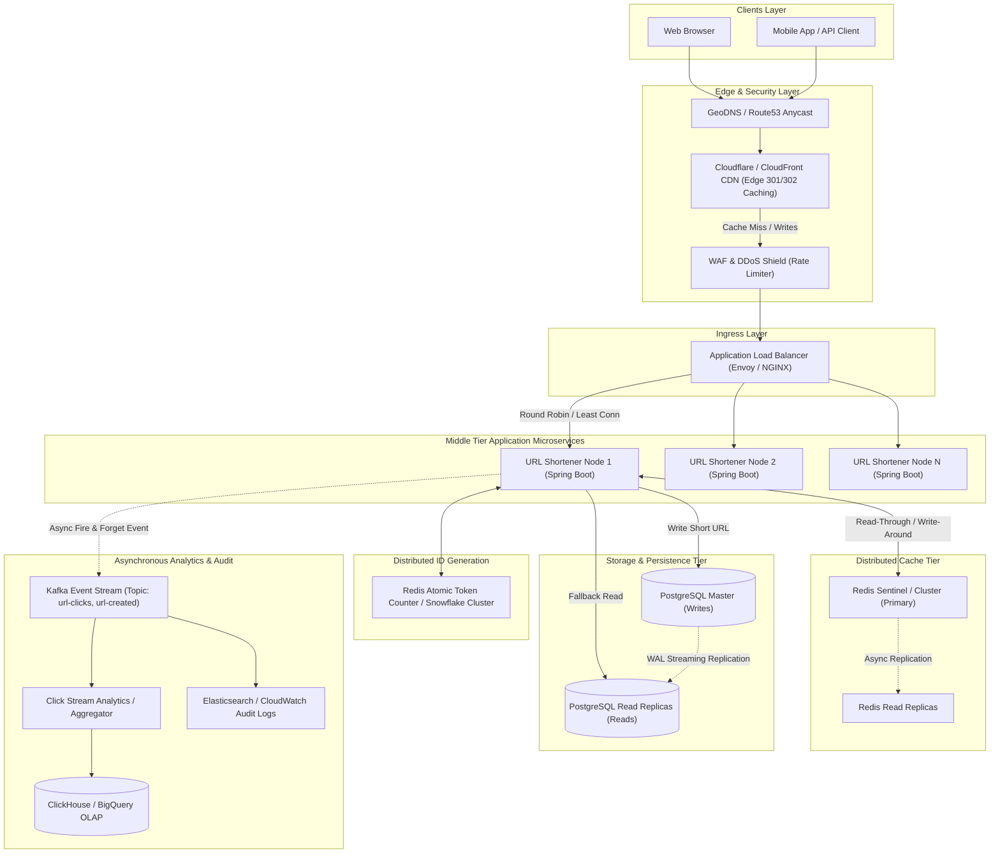

# System Design: Production-Grade Globally Distributed URL Shortener Service (TinyURL / Bitly)

---

## 1. Fundamentals & Technical Glossary

When communicating in high-level architectural reviews and staff/principal interviews, precision in terminology is vital:

- **Ingress**: All network traffic arriving from external clients into your data center or cloud boundary (e.g., HTTP POST requests to create a short link, payload bytes).
- **Egress**: All network traffic departing from your infrastructure back to clients or external systems (e.g., HTTP 302 Redirect headers, response bodies, analytical pings).
- **QPS (Queries Per Second) / TPS (Transactions Per Second)**: The rate of incoming requests processed per second. $QPS = \frac{\text{Total Requests}}{\text{Time in Seconds}}$.
- **Round-Robin Load Balancing**: A scheduling algorithm where requests are distributed sequentially across a pool of application instances without regard to instance load. Weighted round-robin assigns capacity weights per machine.
- **Consistent Hashing**: A distributed hashing scheme where changing the number of cache/database nodes results in only $K/N$ keys needing remapping (where $K$ is keys and $N$ is nodes), avoiding massive cache stampedes via a virtual hash ring (e.g., Ketama).
- **Lamport Timestamps / Logical Clocks**: A mechanism to establish a partial causal ordering of events in a distributed system without relying on synchronized physical clocks, where every node increments a local counter and tags messages with $\max(clock_{local}, clock_{msg}) + 1$.
- **Circuit Breaker**: A stability pattern (e.g., Resilience4j, Envoy) that monitors remote calls. If the error threshold is breached, the breaker trips to **OPEN**, failing fast and protecting downstream systems from cascade failures, before transitioning through **HALF-OPEN** for recovery probes.
- **Cache Stampede / Dogpiling**: When a popular cache key expires and thousands of concurrent requests miss the cache simultaneously, hitting the underlying database at the exact same millisecond. Mitigated by **XFetch probabilistic early expiration**, **Mutex locking**, or **singleflight** mechanisms.

---

## 2. Requirements & System Scope

### 2.1 Functional Requirements
1. **Shorten URL**: Given a long URL (e.g., `https://example.com/articles/2026/09/distributed-systems-at-scale`), generate a unique, highly compact alias (e.g., `https://sho.rt/aZ9k1Q`).
2. **Redirection**: When accessing `https://sho.rt/{alias}`, redirect the user to the original long URL with sub-10ms latency at the cache layer.
3. **Custom Vanity URLs**: Support optional custom aliases (e.g., `https://sho.rt/my-awesome-post`) up to 16 alphanumeric characters.
4. **Link Expiration / TTL**: Allow users to define an optional expiration time (default: 5 years; custom: 1 hour to 10 years).
5. **Basic Analytics**: Track redirect click counts, referrer headers, client geolocation, and user-agent asynchronously.

### 2.2 Non-Functional Requirements
1. **High Availability ($99.999\%$)**: The service must be highly available; read redirects should never fail even during database maintenance or regional failover.
2. **Ultra-Low Latency**: 
   - Read / Redirect path: $P99 < 15\text{ ms}$, $P50 < 3\text{ ms}$ (via Edge CDN / Local Redis).
   - Write path: $P99 < 100\text{ ms}$.
3. **Read-Heavy Workload**: Read-to-write ratio is typically skewed ($\ge 10:1$).
4. **Data Durability & Consistency**: Once generated, a mapping cannot be lost. Strongly consistent lookup for newly created aliases.
5. **Security & Abuse Prevention**: Protection against scraping, DDoS, phishing, and URL enumeration attacks.

### 2.3 Out of Scope
- Full enterprise multi-tenant RBAC platform (user teams, SSO, billing).
- Complex real-time BI dashboard analytics (deferred to asynchronous OLAP data warehouse / ClickHouse pipeline).

---

## 3. Back-of-the-Envelope Calculations & Capacity Planning

### 3.1 Baseline Assumptions
- **Baseline Write Traffic**: $1\text{ Million (1,000,000)}$ new URL shortening requests per month.
- **Read-to-Write Ratio**: $10:1$ (10 reads for every 1 write).
- **Retention Period**: $5\text{ Years}$ (with 10-year projection).
- **URL Character Set**: Base62 (`[a-z, A-Z, 0-9]`), 62 distinct characters.
- **Peak-to-Average Traffic Multiplier**: $3\times$.

```text
================================================================================
TIME CONVERSIONS & CONSTANTS
================================================================================
1 Month                  = 30 Days = 30 * 24 * 3600 Seconds = 2,592,000 Seconds
                         ≈ 2.592 * 10^6 Seconds
5 Years                  = 5 * 12 Months = 60 Months
10 Years                 = 10 * 12 Months = 120 Months

================================================================================
TRAFFIC ESTIMATION (QPS)
================================================================================
[1] Write Traffic:
    Monthly Writes       = 1,000,000 writes/month
    Average Write QPS    = 1,000,000 / 2,592,000 s
                         = 0.3858 writes/second (≈ 0.39 QPS)
    Peak Write QPS (3x)  = 0.3858 * 3
                         ≈ 1.16 writes/second

[2] Read Traffic (10:1 Ratio):
    Monthly Reads        = 1,000,000 * 10 = 10,000,000 reads/month
    Average Read QPS     = 10,000,000 / 2,592,000 s
                         = 3.858 reads/second (≈ 3.86 QPS)
    Peak Read QPS (3x)   = 3.858 * 3
                         ≈ 11.58 reads/second

[3] Total QPS (Read + Write):
    Average Total QPS    = 0.39 + 3.86 = 4.25 QPS
    Peak Total QPS       = 1.16 + 11.58 = 12.74 QPS

================================================================================
URL SPACE & CHARACTER LENGTH CALCULATION
================================================================================
Total Writes over 5 Years  = 1,000,000 * 12 * 5 = 60,000,000 (60 Million URLs)
Total Writes over 10 Years = 1,000,000 * 12 * 10 = 120,000,000 (120 Million URLs)

Base62 Permutations:
    62^6 = 56,800,235,584 ≈ 56.8 Billion unique URLs
    62^7 = 3,521,614,606,208 ≈ 3.52 Trillion unique URLs

Selection:
    A 7-character Base62 string yields > 3.5 Trillion URLs.
    For 60 Million records over 5 years, 7 characters consumes < 0.002% of key space,
    providing massive headroom against hash collisions and enumeration.

================================================================================
STORAGE CONSUMPTION ESTIMATION
================================================================================
Per Record Data Schema & Size Breakdown:
    - id (BIGINT / 64-bit int)          : 8 Bytes
    - short_key (VARCHAR(16), Base62)   : 16 Bytes
    - original_url (VARCHAR(2048))      : 512 Bytes (avg length)
    - user_id (UUID / BIGINT)           : 16 Bytes
    - created_at (TIMESTAMP WITH TZ)    : 8 Bytes
    - expires_at (TIMESTAMP WITH TZ)    : 8 Bytes
    - is_active (BOOLEAN)               : 1 Byte
    - DB Indexing & B-Tree Overhead     : ~100 Bytes
    -------------------------------------------------------
    Total Estimated Row Size            ≈ 569 Bytes ≈ 600 Bytes / record

[1] Storage over 1 Month:
    1,000,000 records * 600 Bytes       = 600,000,000 Bytes = 600 MB / month

[2] Storage over 5 Years:
    60,000,000 records * 600 Bytes      = 36,000,000,000 Bytes = 36 GB

[3] Storage over 10 Years:
    120,000,000 records * 600 Bytes     = 72,000,000,000 Bytes = 72 GB

Conclusion on Storage:
    The dataset is compact (~36 GB for 5 years). An indexed RDBMS (PostgreSQL/MySQL)
    with SSD/NVMe storage can comfortably fit the entire dataset and indices in memory.

================================================================================
MEMORY & CACHING REQUIREMENTS (80-20 PARETO RULE)
================================================================================
Assuming 20% of the active URLs generate 80% of read traffic.
Daily Read Volume:
    Daily Reads          = 10,000,000 / 30 = 333,333 reads/day
    Daily Unique URLs    = ~20% of daily reads = 66,666 unique URLs/day

Memory Cache Size:
    Cache Item Size (ShortKey + LongURL + metadata) ≈ 600 Bytes
    Daily Hot Cache Size = 66,666 * 600 Bytes
                         = 39,999,600 Bytes ≈ 40 MB / day

Weekly Hot Cache Size (with buffer):
    40 MB * 7 days       ≈ 280 MB
    Allocating a 4 GB - 8 GB Redis cluster provides >99% Cache Hit Ratio.

================================================================================
NETWORK BANDWIDTH ESTIMATION (INGRESS / EGRESS)
================================================================================
[1] Ingress (Incoming Traffic):
    - Write Ingress: 0.39 writes/sec * 600 Bytes/request = 234 Bytes/sec
      Peak Write Ingress (3x) = 702 Bytes/sec
    - Read Ingress: 3.86 reads/sec * 100 Bytes (HTTP GET headers) = 386 Bytes/sec
    Total Average Ingress Bandwidth = 234 + 386 = 620 Bytes/sec ≈ 0.005 Mbps
    Peak Ingress Bandwidth          ≈ 0.02 Mbps

[2] Egress (Outgoing Traffic):
    - Write Egress: 0.39 writes/sec * 300 Bytes (JSON response) = 117 Bytes/sec
    - Read Egress: 3.86 reads/sec * 600 Bytes (HTTP 302 Header + Location) = 2,316 Bytes/sec
    Total Average Egress Bandwidth  = 117 + 2,316 = 2,433 Bytes/sec ≈ 2.43 KB/s ≈ 0.02 Mbps
    Peak Egress Bandwidth           ≈ 0.06 Mbps
```

---

## 4. High-Level Architecture (HLD)



### Architectural Component Walkthrough:
1. **GeoDNS & Anycast Routing**: Routes traffic to the closest geographical edge point-of-presence (PoP).
2. **Edge CDN (Cloudflare/CloudFront)**: Caches high-traffic short URL redirects at the edge.
3. **Application Load Balancer (ALB)**: Performs SSL termination, health checking, and routes requests to healthy backend nodes.
4. **Middle Tier (Stateless Spring Boot Instances)**: Handles Base62 encoding, custom alias validation, TTL management, and circuit breaking.
5. **ID Allocation Strategy**: Uses partitioned range allocation or Snowflake 64-bit ID generation to avoid centralized DB bottlenecking.
6. **Distributed Cache (Redis Cluster)**: Implements Write-Around cache pattern with LRU eviction for hot links.
7. **Relational Database (PostgreSQL with Read Replicas)**: ACID-compliant durable store, partitioned by `created_at` or hash of `short_key`.
8. **Kafka & OLAP Stream**: Decouples click logging and geo-tracking from the latency-sensitive redirect execution path.

---

## 5. Low-Level Design (LLD) & Data Modeling

### 5.1 Database Schema (PostgreSQL DDL)

```sql
CREATE TABLE url_mappings (
    id BIGINT PRIMARY KEY,
    short_key VARCHAR(16) NOT NULL,
    original_url VARCHAR(2048) NOT NULL,
    user_id UUID,
    is_custom BOOLEAN DEFAULT FALSE NOT NULL,
    click_count BIGINT DEFAULT 0 NOT NULL,
    created_at TIMESTAMP WITH TIME ZONE DEFAULT CURRENT_TIMESTAMP NOT NULL,
    expires_at TIMESTAMP WITH TIME ZONE,
    is_active BOOLEAN DEFAULT TRUE NOT NULL
);

-- Unique index on short_key for fast B-Tree lookup
CREATE UNIQUE INDEX idx_url_mappings_short_key ON url_mappings (short_key);

-- Partial index for active unexpired links
CREATE INDEX idx_url_mappings_active_expiry ON url_mappings (expires_at) 
WHERE is_active = TRUE AND expires_at IS NOT NULL;
```

### 5.2 Key Encoding Algorithm: Base62 vs Hashing

| Strategy | Mechanism | Collision Risk | Pros | Cons |
| :--- | :--- | :--- | :--- | :--- |
| **MD5 / SHA-256 + Truncate** | Hash original URL and take first 7 chars | Moderate / High | Deterministic output | Requires collision detection loop in DB |
| **Auto-Increment ID + Base62** | Convert 64-bit globally unique sequence to Base62 | **Zero** | 100% collision-free, reversible, compact | Sequential IDs allow enumeration unless obfuscated |
| **Snowflake ID + Base62** | 64-bit time-ordered distributed ID to Base62 | **Zero** | Fully distributed, non-coordinating | IDs are slightly larger numbers |

**Optimal Selection**: Distributed Unique ID Generator (Range-based or Snowflake) encoded into **Base62**. To prevent URL enumeration attacks, IDs can be obfuscated using a pseudo-random permutation (e.g., Feistel cipher / Skip32 / Bit-shuffling).

---

## 6. Production Implementation

### 6.1 Backend Implementation (Java / Spring Boot)

#### `Base62Encoder.java`
```java
package com.shortener.engine.util;

import org.springframework.stereotype.Component;

@Component
public class Base62Encoder {
    private static final String BASE62_CHARS = "0123456789abcdefghijklmnopqrstuvwxyzABCDEFGHIJKLMNOPQRSTUVWXYZ";
    private static final int BASE = BASE62_CHARS.length();

    public String encode(long value) {
        if (value == 0) {
            return String.valueOf(BASE62_CHARS.charAt(0));
        }
        StringBuilder sb = new StringBuilder();
        while (value > 0) {
            int remainder = (int) (value % BASE);
            sb.append(BASE62_CHARS.charAt(remainder));
            value /= BASE;
        }
        return sb.reverse().toString();
    }

    public long decode(String str) {
        long result = 0;
        for (int i = 0; i < str.length(); i++) {
            char c = str.charAt(i);
            int index = BASE62_CHARS.indexOf(c);
            if (index == -1) {
                throw new IllegalArgumentException("Invalid Base62 character: " + c);
            }
            result = result * BASE + index;
        }
        return result;
    }
}
```

#### `UrlMappingEntity.java`
```java
package com.shortener.engine.entity;

import jakarta.persistence.*;
import lombok.*;
import java.time.Instant;
import java.util.UUID;

@Entity
@Table(name = "url_mappings")
@Getter
@Setter
@Builder
@NoArgsConstructor
@AllArgsConstructor
public class UrlMappingEntity {

    @Id
    private Long id;

    @Column(name = "short_key", nullable = false, unique = true, length = 16)
    private String shortKey;

    @Column(name = "original_url", nullable = false, length = 2048)
    private String originalUrl;

    @Column(name = "user_id")
    private UUID userId;

    @Column(name = "is_custom", nullable = false)
    private boolean custom;

    @Column(name = "created_at", nullable = false)
    private Instant createdAt;

    @Column(name = "expires_at")
    private Instant expiresAt;

    @Column(name = "is_active", nullable = false)
    private boolean active;
}
```

#### `UrlShortenerService.java`
```java
package com.shortener.engine.service;

import com.shortener.engine.entity.UrlMappingEntity;
import com.shortener.engine.repository.UrlMappingRepository;
import com.shortener.engine.util.Base62Encoder;
import io.github.resilience4j.circuitbreaker.annotation.CircuitBreaker;
import lombok.RequiredArgsConstructor;
import lombok.extern.slf4j.Slf4j;
import org.springframework.data.redis.core.StringRedisTemplate;
import org.springframework.kafka.core.KafkaTemplate;
import org.springframework.stereotype.Service;
import org.springframework.transaction.annotation.Transactional;

import java.time.Duration;
import java.time.Instant;
import java.util.Optional;
import java.util.concurrent.atomic.AtomicLong;

@Slf4j
@Service
@RequiredArgsConstructor
public class UrlShortenerService {

    private final UrlMappingRepository repository;
    private final Base62Encoder base62Encoder;
    private final StringRedisTemplate redisTemplate;
    private final KafkaTemplate<String, String> kafkaTemplate;

    private static final String CACHE_PREFIX = "url:short:";
    private static final String REDIS_COUNTER_KEY = "global:url:id:seq";
    private static final String KAFKA_TOPIC_CLICKS = "url-clicks-topic";

    @Transactional
    public String createShortUrl(String longUrl, String customAlias, Long ttlSeconds) {
        if (customAlias != null && !customAlias.isBlank()) {
            if (repository.existsByShortKey(customAlias)) {
                throw new IllegalArgumentException("Custom alias '" + customAlias + "' is already taken.");
            }
            long uniqueId = getNextDistributedId();
            return saveMapping(uniqueId, customAlias, longUrl, ttlSeconds, true);
        }

        long uniqueId = getNextDistributedId();
        String shortKey = base62Encoder.encode(uniqueId);
        return saveMapping(uniqueId, shortKey, longUrl, ttlSeconds, false);
    }

    @CircuitBreaker(name = "redisUrlFetch", fallbackMethod = "resolveFallback")
    public Optional<String> resolveShortUrl(String shortKey) {
        String cacheKey = CACHE_PREFIX + shortKey;
        String cachedUrl = redisTemplate.opsForValue().get(cacheKey);

        if (cachedUrl != null) {
            emitClickEvent(shortKey);
            return Optional.of(cachedUrl);
        }

        // Cache miss -> Query DB
        Optional<UrlMappingEntity> entityOpt = repository.findByShortKeyAndActiveTrue(shortKey);
        if (entityOpt.isPresent()) {
            UrlMappingEntity entity = entityOpt.get();
            if (entity.getExpiresAt() != null && entity.getExpiresAt().isBefore(Instant.now())) {
                return Optional.empty();
            }

            // Populate Cache with TTL
            Duration ttl = entity.getExpiresAt() != null 
                    ? Duration.between(Instant.now(), entity.getExpiresAt()) 
                    : Duration.ofDays(7);
            
            redisTemplate.opsForValue().set(cacheKey, entity.getOriginalUrl(), ttl);
            emitClickEvent(shortKey);
            return Optional.of(entity.getOriginalUrl());
        }

        return Optional.empty();
    }

    public Optional<String> resolveFallback(String shortKey, Throwable t) {
        log.warn("Redis circuit open. Fallback to DB query for key: {}. Reason: {}", shortKey, t.getMessage());
        return repository.findByShortKeyAndActiveTrue(shortKey)
                .filter(e -> e.getExpiresAt() == null || e.getExpiresAt().isAfter(Instant.now()))
                .map(UrlMappingEntity::getOriginalUrl);
    }

    private String saveMapping(long id, String shortKey, String longUrl, Long ttlSeconds, boolean isCustom) {
        Instant now = Instant.now();
        Instant expiresAt = (ttlSeconds != null && ttlSeconds > 0) ? now.plusSeconds(ttlSeconds) : null;

        UrlMappingEntity entity = UrlMappingEntity.builder()
                .id(id)
                .shortKey(shortKey)
                .originalUrl(longUrl)
                .custom(isCustom)
                .createdAt(now)
                .expiresAt(expiresAt)
                .active(true)
                .build();

        repository.save(entity);

        // Pre-warm Cache
        Duration cacheTtl = (expiresAt != null) ? Duration.between(now, expiresAt) : Duration.ofDays(7);
        redisTemplate.opsForValue().set(CACHE_PREFIX + shortKey, longUrl, cacheTtl);

        return shortKey;
    }

    private long getNextDistributedId() {
        Long next = redisTemplate.opsForValue().increment(REDIS_COUNTER_KEY, 1);
        if (next == null) {
            throw new IllegalStateException("Failed to generate distributed ID from Redis counter.");
        }
        return next;
    }

    private void emitClickEvent(String shortKey) {
        kafkaTemplate.send(KAFKA_TOPIC_CLICKS, shortKey, String.valueOf(System.currentTimeMillis()));
    }
}
```

#### `UrlRedirectController.java`
```java
package com.shortener.engine.controller;

import com.shortener.engine.service.UrlShortenerService;
import jakarta.servlet.http.HttpServletResponse;
import lombok.RequiredArgsConstructor;
import org.springframework.http.HttpHeaders;
import org.springframework.http.HttpStatus;
import org.springframework.http.ResponseEntity;
import org.springframework.web.bind.annotation.*;

import java.io.IOException;
import java.util.Map;

@RestController
@RequestMapping("/api/v1/urls")
@RequiredArgsConstructor
public class UrlRedirectController {

    private final UrlShortenerService shortenerService;

    @PostMapping("/shorten")
    public ResponseEntity<Map<String, String>> shortenUrl(@RequestBody Map<String, Object> request) {
        String originalUrl = (String) request.get("original_url");
        String customAlias = (String) request.get("custom_alias");
        Long ttl = request.get("ttl_seconds") != null ? Long.valueOf(request.get("ttl_seconds").toString()) : null;

        String shortKey = shortenerService.createShortUrl(originalUrl, customAlias, ttl);
        String domain = "https://sho.rt/";

        return ResponseEntity.ok(Map.of(
                "short_key", shortKey,
                "short_url", domain + shortKey,
                "original_url", originalUrl
        ));
    }

    @GetMapping("/{shortKey}")
    public void redirectUrl(@PathVariable String shortKey, HttpServletResponse response) throws IOException {
        var longUrlOpt = shortenerService.resolveShortUrl(shortKey);

        if (longUrlOpt.isPresent()) {
            // Using HTTP 302 (Found / Temporary Redirect) to ensure every click passes through server for analytics
            response.setStatus(HttpStatus.FOUND.value());
            response.setHeader(HttpHeaders.LOCATION, longUrlOpt.get());
            response.setHeader(HttpHeaders.CACHE_CONTROL, "no-cache, no-store, must-revalidate");
        } else {
            response.sendError(HttpStatus.NOT_FOUND.value(), "Short URL has expired or does not exist.");
        }
    }
}
```

---

### 6.2 Frontend Implementation (Modern JavaScript / ES6+)

```html
<!DOCTYPE html>
<html lang="en">
<head>
    <meta charset="UTF-8">
    <meta name="viewport" content="width=device-width, initial-scale=1.0">
    <title>Enterprise URL Shortener</title>
    <style>
        :root {
            --bg: #0f172a;
            --card-bg: #1e293b;
            --accent: #38bdf8;
            --text: #f8fafc;
            --text-dim: #94a3b8;
            --success: #22c55e;
            --error: #ef4444;
        }
        body {
            font-family: -apple-system, BlinkMacSystemFont, 'Segoe UI', Roboto, sans-serif;
            background: var(--bg);
            color: var(--text);
            display: flex;
            justify-content: center;
            align-items: center;
            min-height: 100vh;
            margin: 0;
            padding: 20px;
        }
        .container {
            background: var(--card-bg);
            padding: 2.5rem;
            border-radius: 16px;
            box-shadow: 0 10px 25px -5px rgba(0,0,0,0.5);
            max-width: 500px;
            width: 100%;
        }
        h1 { margin-top: 0; font-size: 1.8rem; text-align: center; }
        .form-group { margin-bottom: 1.2rem; }
        label { display: block; margin-bottom: 0.5rem; color: var(--text-dim); }
        input {
            width: 100%;
            padding: 0.75rem 1rem;
            background: #0f172a;
            border: 1px solid #334155;
            border-radius: 8px;
            color: #fff;
            box-sizing: border-box;
            font-size: 1rem;
        }
        input:focus { outline: none; border-color: var(--accent); }
        button.btn-primary {
            width: 100%;
            padding: 0.85rem;
            background: var(--accent);
            border: none;
            border-radius: 8px;
            font-size: 1rem;
            font-weight: 600;
            color: #0f172a;
            cursor: pointer;
            transition: opacity 0.2s;
        }
        button.btn-primary:hover { opacity: 0.9; }
        .result-box {
            display: none;
            margin-top: 1.5rem;
            padding: 1rem;
            background: #0f172a;
            border-radius: 8px;
            border: 1px dashed var(--accent);
            align-items: center;
            justify-content: space-between;
        }
        .result-link { color: var(--accent); font-weight: 600; word-break: break-all; }
        .copy-btn {
            background: #334155;
            border: none;
            color: #fff;
            padding: 0.5rem 0.8rem;
            border-radius: 6px;
            cursor: pointer;
            margin-left: 10px;
            white-space: nowrap;
        }
    </style>
</head>
<body>

<div class="container">
    <h1>🚀 Shorten URL</h1>
    <form id="shortenForm">
        <div class="form-group">
            <label for="longUrl">Destination Long URL *</label>
            <input type="url" id="longUrl" required placeholder="https://very-long-url.com/something">
        </div>
        <div class="form-group">
            <label for="customAlias">Custom Alias (Optional)</label>
            <input type="text" id="customAlias" placeholder="e.g. system-design">
        </div>
        <button type="submit" class="btn-primary" id="submitBtn">Generate Short Link</button>
    </form>

    <div class="result-box" id="resultBox">
        <a id="shortUrlLink" class="result-link" target="_blank" rel="noopener"></a>
        <button class="copy-btn" id="copyBtn">Copy</button>
    </div>
</div>

<script>
    const form = document.getElementById('shortenForm');
    const resultBox = document.getElementById('resultBox');
    const shortUrlLink = document.getElementById('shortUrlLink');
    const copyBtn = document.getElementById('copyBtn');
    const submitBtn = document.getElementById('submitBtn');

    form.addEventListener('submit', async (e) => {
        e.preventDefault();
        const original_url = document.getElementById('longUrl').value.trim();
        const custom_alias = document.getElementById('customAlias').value.trim();

        submitBtn.disabled = true;
        submitBtn.innerText = 'Shortening...';

        try {
            const response = await fetch('/api/v1/urls/shorten', {
                method: 'POST',
                headers: { 'Content-Type': 'application/json' },
                body: JSON.stringify({
                    original_url,
                    custom_alias: custom_alias || null
                })
            });

            if (!response.ok) {
                const errData = await response.json();
                throw new Error(errData.message || 'Failed to shorten URL');
            }

            const data = await response.json();
            shortUrlLink.href = data.short_url;
            shortUrlLink.innerText = data.short_url;
            resultBox.style.display = 'flex';
            copyBtn.innerText = 'Copy';
        } catch (err) {
            alert('Error: ' + err.message);
        } finally {
            submitBtn.disabled = false;
            submitBtn.innerText = 'Generate Short Link';
        }
    });

    copyBtn.addEventListener('click', async () => {
        try {
            await navigator.clipboard.writeText(shortUrlLink.href);
            copyBtn.innerText = 'Copied! ✓';
            copyBtn.style.background = 'var(--success)';
            setTimeout(() => {
                copyBtn.innerText = 'Copy';
                copyBtn.style.background = '#334155';
            }, 2500);
        } catch (err) {
            alert('Failed to copy to clipboard.');
        }
    });
</script>
</body>
</html>
```

---

### 6.3 Background Worker & Snowflake ID Generator (Python)

```python
"""
Distributed 64-bit Snowflake ID Generator & Expired URL Cleanup Worker
"""
import time
import threading

class SnowflakeIDGenerator:
    """
    Bits allocation:
    1 bit  : Unused sign bit
    41 bits: Epoch timestamp in ms (~69 years)
    10 bits: Machine / Worker ID (0-1023)
    12 bits: Sequence counter (0-4095 per ms per node)
    """
    def __init__(self, worker_id: int, epoch: int = 1704067200000): # Jan 1 2024
        if worker_id < 0 or worker_id > 1023:
            raise ValueError("Worker ID must be between 0 and 1023")
        self.worker_id = worker_id
        self.epoch = epoch
        self.sequence = 0
        self.last_timestamp = -1
        self.lock = threading.Lock()

    def _get_timestamp_ms(self) -> int:
        return int(time.time() * 1000)

    def next_id(self) -> int:
        with self.lock:
            timestamp = self._get_timestamp_ms()

            if timestamp < self.last_timestamp:
                raise RuntimeError("Clock moved backwards. Refusing to generate ID.")

            if timestamp == self.last_timestamp:
                self.sequence = (self.sequence + 1) & 4095
                if self.sequence == 0:
                    # Wait for next millisecond
                    while timestamp <= self.last_timestamp:
                        timestamp = self._get_timestamp_ms()
            else:
                self.sequence = 0

            self.last_timestamp = timestamp

            return ((timestamp - self.epoch) << 22) | (self.worker_id << 12) | self.sequence
```

---

## 7. Advanced Distributed Patterns & Reliability

### 7.1 Rate Limiting (Token Bucket via Redis Lua Script)
To protect against malicious script spamming and crawling, write endpoints use sliding window / token bucket rate limiting per IP or User ID.

```lua
-- keys: [1] rate:limit:<ip>
-- argv: [1] max_requests, [2] window_seconds
local key = KEYS[1]
local limit = tonumber(ARGV[1])
local current = tonumber(redis.call('get', key) or "0")

if current + 1 > limit then
    return 0 -- Rejected (HTTP 429 Too Many Requests)
else
    redis.call("INCRBY", key, 1)
    if current == 0 then
        redis.call("EXPIRE", key, tonumber(ARGV[2]))
    end
    return 1 -- Allowed
end
```

### 7.2 HTTP 301 vs 302/307 Redirects

```text
+------------------------------------+------------------------------------+
| 301 Moved Permanently              | 302 Found / 307 Temporary Redirect |
+------------------------------------+------------------------------------+
| Browser aggressively caches redirect| Browser ALWAYS hits shortener service|
| Significantly reduces backend load  | Accurate, real-time click tracking |
| Cannot track analytics after 1st hit| Enables dynamic routing / A-B tests|
| Recommended for cost minimization  | Recommended for business analytics |
+------------------------------------+------------------------------------+
```

### 7.3 Multi-Region Replication & Ordering (Lamport Timestamps & Vector Clocks)
In multi-region active-active deployments:
- Concurrent updates to the same vanity URL require deterministic conflict resolution.
- **Lamport Timestamps** establish causal order: $(T_i, Node_i) < (T_j, Node_j)$ if $T_i < T_j$ or ($T_i = T_j$ and $Node_i < Node_j$).
- **Last-Write-Wins (LWW)** with Hybrid Logical Clocks (HLC) prevents clock drift discrepancies.

---

## 8. Architectural Trade-offs & Corner Cases

### 8.1 CAP Theorem Evaluation
- **System Classification**: **AP (High Availability & Partition Tolerance)**.
- **Rationale**: If a cross-datacenter network partition occurs, serving cached redirects with eventual consistency is vastly superior to failing user redirects. Link creations can operate on local master nodes and replicate asynchronously.

### 8.2 Corner Cases & Solutions
1. **Duplicate URL Submissions**:
   - *Option A (Unique per submission)*: Generate distinct short aliases each time.
   - *Option B (Shared alias per URL)*: Compute hash of original URL. **Trade-off**: Increases DB lookup overhead on write and leaks vanity associations across users. **Recommended**: Generate distinct short aliases unless deduplication is explicitly demanded.
2. **Expired Link Clean-up**:
   - **Passive / Lazy Deletion**: When an alias is accessed, if `expires_at < NOW()`, return HTTP 404 and asynchronously delete from cache and DB.
   - **Active Batch Sweeper**: A lightweight cron worker runs during low-traffic off-peak hours executing indexed batch deletes:
     `DELETE FROM url_mappings WHERE id IN (SELECT id FROM url_mappings WHERE expires_at < NOW() LIMIT 5000);`
3. **Malicious & Phishing URLs**:
   - Integrate Google Safe Browsing API or Cloudflare Radar via async Kafka consumer before enabling link status (`is_active = TRUE`).

---

## 9. Deployment, CI/CD & Observability

### 9.1 GitHub Actions CI/CD Pipeline (`.github/workflows/deploy.yml`)

```yaml
name: Production CI/CD Pipeline

on:
  push:
    branches: [ main ]

jobs:
  build-and-test:
    runs-on: ubuntu-latest
    steps:
      - uses: actions/checkout@v4
      - name: Set up JDK 21
        uses: actions/setup-java@v4
        with:
          java-version: '21'
          distribution: 'temurin'
          cache: maven
      - name: Build with Maven
        run: mvn clean verify -DskipTests=false
      - name: Run Unit & Integration Tests
        run: mvn test

  docker-and-deploy:
    needs: build-and-test
    runs-on: ubuntu-latest
    steps:
      - uses: actions/checkout@v4
      - name: Log in to Container Registry
        uses: docker/login-action@v3
        with:
          registry: ghcr.io
          username: ${{ github.actor }}
          password: ${{ secrets.GITHUB_TOKEN }}
      - name: Build & Push Image
        run: |
          docker build -t ghcr.io/${{ github.repository }}/url-shortener:${{ github.sha }} .
          docker push ghcr.io/${{ github.repository }}/url-shortener:${{ github.sha }}
      - name: Deploy to Kubernetes Cluster (Rolling Update)
        run: |
          echo "Triggering helm rolling upgrade on prod cluster..."
```

---

## 10. Pros, Cons & Limitations

### Pros
- **Extreme Horizontal Scalability**: Stateless application tier scales effortlessly behind load balancers.
- **High Read Efficiency**: Multi-tier caching (CDN + Redis) handles 99%+ of reads in sub-10ms.
- **Zero Key Collision**: Deterministic Base62 encoding on unique 64-bit sequences avoids hash collision retry loops.

### Cons & Limitations
- **Single Point of Failure in Sequential Counter**: If relying solely on a single Redis counter without replication or Range Allocation, counter failure blocks writes.
- **Enumeration Vulnerability with Raw Incremental IDs**: Sequential Base62 strings allow malicious actors to crawl all links unless randomized or token-bucket restricted.
