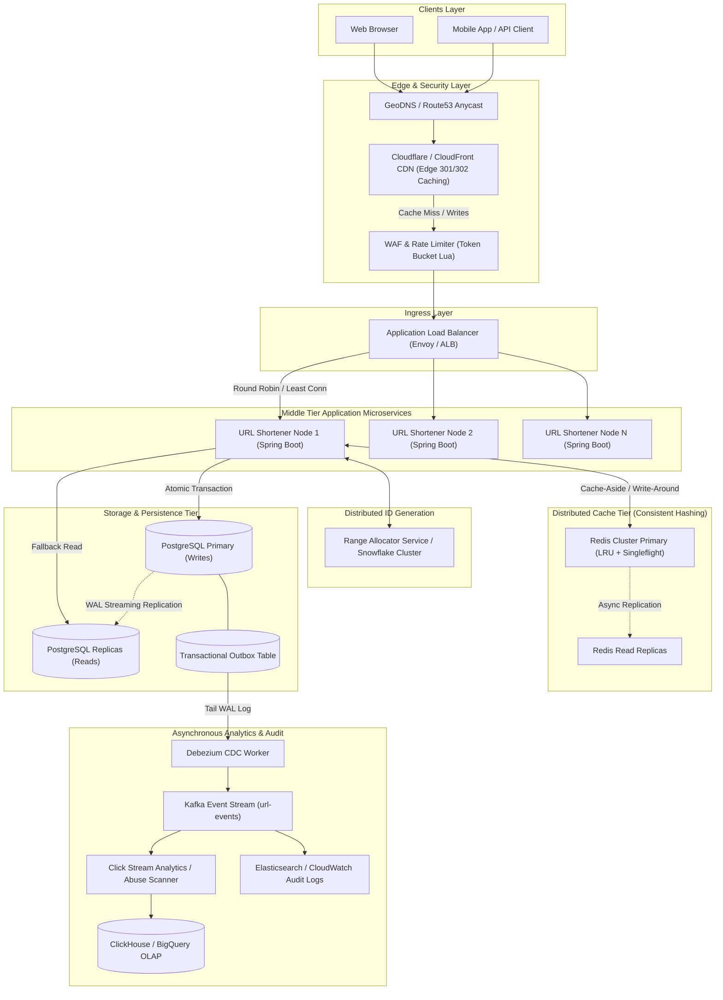

# Master System Design & Distributed Systems Engineering Knowledge Base

> An exhaustive, production-grade guide covering Distributed Systems Principles (CAP, PACELC, Consensus, Consistency Models), Capacity Planning & Cost Estimation, High-Availability & Resilience (Circuit Breakers, Exponential Backoff with Jitter, Sliding Window Rate Limiting), Databases & Storage Engines (B+Tree vs LSM-Tree, Sharding, Quorums), Caching Architectures (Write-Through, Write-Behind, SWR, XFetch, Bloom Filters), Messaging & Streaming (Kafka zero-copy, SQS, RabbitMQ, Event Sourcing, CQRS), Cloud-Native Infrastructure (Kubernetes control plane & services, Envoy sidecars, S3 Erasure Coding, Spanner TrueTime, BigQuery), Graph Algorithms (BFS/DFS, Dijkstra, PageRank, Topological Sort), Full-Text Search (Elasticsearch Inverted Index, BM25), and Top FAANG Case Studies (WhatsApp, Twitter Newsfeed, Uber H3 Geospatial, YouTube Transcoding, TinyURL, Snowflake).

---

## 📑 Table of Contents

1. [Capacity Planning & Cost Estimation Framework](file:///Volumes/Workspace/dev/github/personal/balasus1/leetcode/system-design/00_capacity_planning_and_cost_estimation_framework.md)
2. [Global URL Shortener Service (TinyURL)](file:///Volumes/Workspace/dev/github/personal/balasus1/leetcode/system-design/01_url_shortener_service.md)
3. [Scalability, Load Balancing & Consistent Hashing](file:///Volumes/Workspace/dev/github/personal/balasus1/leetcode/system-design/02_scalability_load_balancing_and_consistent_hashing.md)
4. [Reliability, Fault Tolerance & Resilience Patterns](file:///Volumes/Workspace/dev/github/personal/balasus1/leetcode/system-design/03_reliability_fault_tolerance_and_resilience_patterns.md)
5. [Databases, Storage Engines & Partitioning](file:///Volumes/Workspace/dev/github/personal/balasus1/leetcode/system-design/04_databases_storage_engines_and_partitioning.md)
6. [Distributed Systems: CAP, PACELC, Consensus & Transactions](file:///Volumes/Workspace/dev/github/personal/balasus1/leetcode/system-design/05_distributed_systems_cap_pacelc_consensus_and_transactions.md)
7. [Caching Architectures, Eviction Policies & Recency Mechanisms](file:///Volumes/Workspace/dev/github/personal/balasus1/leetcode/system-design/06_caching_architectures_eviction_and_recency.md)
8. [Messaging, Streaming & Event-Driven Architectures](file:///Volumes/Workspace/dev/github/personal/balasus1/leetcode/system-design/07_messaging_streaming_and_event_driven_architectures.md)
9. [Cloud-Native Infrastructure, Kubernetes & Object Storage](file:///Volumes/Workspace/dev/github/personal/balasus1/leetcode/system-design/08_cloud_native_kubernetes_and_storage_infrastructure.md)
10. [Graph Systems, Distributed Graph Algorithms & Search Engines](file:///Volumes/Workspace/dev/github/personal/balasus1/leetcode/system-design/09_graph_systems_algorithms_and_search_engines.md)
11. [Top FAANG System Design Case Studies & Production Architectures](file:///Volumes/Workspace/dev/github/personal/balasus1/leetcode/system-design/10_top_faang_system_design_case_studies.md)

---


<!-- FILE_START: 00_capacity_planning_and_cost_estimation_framework.md -->

# Master Capacity Planning, Scaling & Distributed Architecture Framework
### The 20-Year Principal Distributed Systems Architect's Universal Blueprint

---

## 1. Executive Philosophy: How to Lead Capacity Planning in Interviews

When evaluating staff and principal engineering candidates, interviewers do not look for memorized numbers; they look for **systematic thought process, dimensional analysis, sanity-checking instincts, and production intuition**.

```
+--------------------------------------------------------------------------------------------------+
| THE 6-STEP CAPACITY PLANNING PIPELINE                                                            |
|                                                                                                  |
| [1] Traffic QPS       -->  [2] Storage Sizing   -->  [3] Memory & Cache (80/20)                  |
|     (Read/Write, Peak)     (Payload + Indexes +      (Hot Working Set in RAM)                    |
|                             Replication + Snapshots)                                             |
|                                     │                                                            |
|                                     ▼                                                            |
| [4] Network Bandwidth -->  [5] Compute Sizing   -->  [6] Cloud Cost Model                        |
|     (Ingress/Egress Gbps)  (Little's Law Cores,      (Compute, Storage, RAM,                     |
|                             Pod Replicas, ThreadPool) Egress Network Tolls)                      |
+--------------------------------------------------------------------------------------------------+
```

### Interview Dialogue Framework (How to Start Small & Explain)
1. **State Baseline & Conversions First**: "Before designing the components, let's establish our traffic baseline, compute read/write ratios, and translate monthly volume into per-second transactional throughput."
2. **Separate Reads from Writes**: Never lump reads and writes together. Writes dictate storage growth, ACID contention, and write-ahead-log (WAL) disk IOPS; reads dictate cache sizing, CDN offload, and read-replica scaling.
3. **Apply the 3x Peak Multiplier**: Real-world traffic is diurnal (peaks during midday, valleys at night). Standard production sizing accounts for at least a $3\times$ peak-to-average ratio (or $5\times - 10\times$ for flash sales/breaking news).
4. **Account for the "Hidden Multipliers"**:
   - **Replication Factor**: Data is rarely stored once; production databases use at least $3\times$ replication across Availability Zones (AZs).
   - **Indexing Overhead**: B-Tree indices, primary keys, and metadata add $20\% - 30\%$ on top of raw payload bytes.
   - **Network Egress Tolls**: Cloud providers (AWS, GCP, Azure) charge heavily for outbound internet egress ($~0.08 - 0.09 per GB); this is often the single highest line item on high-traffic systems.

---

## 2. Universal Constants & Conversions Cheatsheet

```text
================================================================================
TIME CONSTANTS & POWER-OF-10 CONVERSIONS
================================================================================
1 Minute                 = 60 Seconds
1 Hour                   = 3,600 Seconds ≈ 3.6 * 10^3 Seconds
1 Day                    = 24 * 3,600 = 86,400 Seconds ≈ 8.64 * 10^4 Seconds
                         (Rule of thumb for mental math: ≈ 10^5 Seconds)
1 Month (30 Days)        = 30 * 86,400 = 2,592,000 Seconds ≈ 2.592 * 10^6 Seconds
                         (Rule of thumb: ≈ 2.6 Million Seconds)
1 Year (365 Days)        = 365 * 86,400 = 31,536,000 Seconds ≈ 3.15 * 10^7 Seconds
                         (Rule of thumb: ≈ 31.5 Million Seconds)
5 Years                  = 5 * 31.536M = 157,680,000 Seconds ≈ 1.58 * 10^8 Seconds
10 Years                 = 10 * 31.536M = 315,360,000 Seconds ≈ 3.15 * 10^8 Seconds

================================================================================
DATA STORAGE & BANDWIDTH CONVERSIONS
================================================================================
1 Byte (B)               = 8 bits (b)
1 Kilobyte (KB)          = 1,000 Bytes (10^3 B)
1 Megabyte (MB)          = 1,000 KB = 10^6 Bytes
1 Gigabyte (GB)          = 1,000 MB = 10^9 Bytes
1 Terabyte (TB)          = 1,000 GB = 10^12 Bytes
1 Petabyte (PB)          = 1,000 TB = 10^15 Bytes

Bandwidth Conversion Rule:
  Throughput in Mbps     = (Throughput in Bytes/sec * 8) / 1,000,000
================================================================================
```

---

## 3. Latency Numbers Every Systems Architect Must Know

```text
================================================================================
LATENCY REFERENCE SHEET (Peter Norvig / Jeff Dean Scale)
================================================================================
Operation                                       Latency (Real Time)
--------------------------------------------------------------------------------
L1 CPU Cache Reference                          0.5 ns
Branch Mispredict                               5.0 ns
L2 CPU Cache Reference                          7.0 ns
Mutex Lock / Unlock                             25.0 ns
Main Memory (DRAM) Reference                    100.0 ns  (0.1 µs)
Compress 1 KB with Zstandard                    2.0 µs
Read 1 MB sequentially from Memory (RAM)        3.0 µs
Read 1 MB sequentially from NVMe SSD            50.0 µs   (0.05 ms)
Read 1 MB randomly from NVMe SSD                100.0 µs  (0.1 ms)
Round-trip in same Data Center (LAN)            500.0 µs  (0.5 ms)
Disk Seek (Traditional Mechanical HDD)          10,000.0 µs (10 ms)
Read 1 MB sequentially from HDD                 20,000.0 µs (20 ms)
Cross-Continent WAN Round-Trip (US East to West)40,000.0 µs (40 ms)
Transatlantic WAN (US East to Europe)           80,000.0 µs (80 ms)
================================================================================
```

---

## 4. Scaling Complex System Archetypes

Scaling differs drastically depending on whether the system is **High-Contention Checkout**, **Search-to-Booking Asymmetry**, or **High-Throughput Ingestion**.

---

### 4.1 Archetype 1: E-Commerce & Flash Sales (Amazon / Shopify / Flipkart)

```
+-----------------------------------------------------------------------------------------------------+
| E-COMMERCE ARCHITECTURE: THE DUAL-SPEED ENGINE                                                      |
|                                                                                                     |
| [Browsing Path: Read-Heavy, Eventual Consistency]                                                   |
| User ---> Cloudflare CDN (Edge HTML/Static) ---> Redis Cluster (Product Catalog) ---> ElasticSearch |
|                                                                                                     |
| [Checkout Path: High-Contention, Strict Serializability]                                            |
| User ---> Virtual Waiting Room (Queue-it) ---> Token Bucket API ---> Redis Atomic Lua Inventory     |
|                                                                      │ (Stock Hold with 10-min TTL) |
|                                                                      ▼                              |
|                                                     Transactional Outbox -> Kafka -> Saga Engine    |
|                                                                      │                              |
|                                                                      ▼                              |
|                                                     PostgreSQL Partitioned Order Database           |
+-----------------------------------------------------------------------------------------------------+
```

#### Core Challenges & Architectural Solutions:
1. **The Hot-Item Inventory Contention (The "100 iPhones for 1 Million Buyers" Problem)**:
   - *Anti-Pattern*: `SELECT stock FROM inventory WHERE item_id = 123 FOR UPDATE;` (Database row lock blocks all threads, causing connection pool exhaustion and crash).
   - *Production Solution (Atomic In-Memory Reservation)*: Maintain item stock inside **Redis using an Atomic Lua Script**:
     ```lua
     -- Atomic Inventory Decrement with Auto-Sold-Out Flag
     local stock = tonumber(redis.call('get', KEYS[1]) or '0')
     if stock > 0 then
         redis.call('decr', KEYS[1])
         redis.call('sadd', KEYS[2], ARGV[1]) -- Track User Reservation
         return 1 -- Success (Reserve 10-minute hold)
     else
         return 0 -- Sold Out
     end
     ```
2. **Virtual Waiting Rooms (Fair Queueing)**:
   - When traffic spikes $100\times$ during flash sales, incoming users are assigned a signed HMAC cryptographic queue token (e.g. Cloudflare Waiting Room or Redis Sorted Set `ZADD waiting_room <timestamp> <user_id>`).
   - Only a metered batch of $N$ users per second are admitted to the checkout microservice.
3. **Saga Pattern for Distributed Checkouts**:
   - Order creation touches: `Inventory Service` $\rightarrow$ `Payment Service` $\rightarrow$ `Reward Points Service` $\rightarrow$ `Shipping Service`.
   - Use **Choreographed or Orchestrated Sagas (Temporal / Cadence)** with compensating transactions (e.g., if payment fails, automatically trigger `CompensateInventory` to restore reserved stock).

---

### 4.2 Archetype 2: Travel & Flight Booking Platforms (Airbnb / Booking.com / Kayak)

```
+-----------------------------------------------------------------------------------------------------+
| TRAVEL BOOKING ARCHITECTURE: SEARCH-TO-BOOK ASYMMETRY (10,000 : 1 RATIO)                            |
|                                                                                                     |
| [Flight/Hotel Search Pipeline]                                                                      |
| User ---> Global Search API ---> Multi-Tier Fare Cache (Redis + Varnish)                            |
|                                        │ (Cache Miss)                                               |
|                                        ▼                                                            |
|                           Async GDS / Airline Partner Aggregator (Circuit Breakers / Resilient Pool)|
|                                                                                                     |
| [Seat/Room Reservation Pipeline]                                                                    |
| User ---> Hold Lease Engine (Redis Key with 15-Minute TTL + Redlock) ---> Stripe / Payment Gateway  |
|                                        │                                                            |
|                                        ▼ (Confirmed)                                                |
|                           Commit Booking & Generate PNR in RDBMS                                    |
+-----------------------------------------------------------------------------------------------------+
```

#### Core Challenges & Architectural Solutions:
1. **Extreme Search-to-Booking Asymmetry ($10,000:1$ to $50,000:1$)**:
   - Searching for flights/hotels requires querying hundreds of third-party Global Distribution Systems (GDS: Sabre, Amadeus) and partner APIs. Third-party APIs are slow ($1 - 3\text{ seconds}$) and expensive per query.
   - *Solution*: **Multi-tier Hierarchical Fare Caching**:
     - **L1 Cache (Edge CDN / Redis)**: Caches popular route price estimates (e.g., `NYC -> LON` on `2026-10-15`) with a 15-minute TTL.
     - **Cache Warming / Proactive Crawlers**: Background workers pre-fetch fares for top $10,000$ global city pairs.
2. **Temporary Hold Leases (The 15-Minute Seat Lock)**:
   - When a user selects a flight seat or hotel room, the item cannot be sold to others, but cannot be permanently committed until payment finishes.
   - *Solution*: **Distributed Lock with TTL Lease**:
     ```text
     Lock Key: "lease:flight:BA104:seat:14B"
     Value   : "<user_id>:<uuid>"
     TTL     : 900 seconds (15 minutes)
     ```
   - If the user abandons payment, the Redis TTL automatically expires the key, making the seat immediately available without manual database rollback jobs.
3. **Partner API Circuit Breaking**:
   - External airline GDS endpoints frequently experience brownouts. Wrap every external partner integration in a **Resilience4j Circuit Breaker** with fallbacks to cached/stale fare indicators.

---

## 5. Comprehensive Caching Architectures & Mechanisms

```
+-----------------------------------------------------------------------------------------------------+
| MULTI-TIER CACHE TAXONOMY                                                                           |
|                                                                                                     |
| [Tier 1: Client / Browser]       --> Local Storage / HTTP Cache Headers (Cache-Control, ETag)       |
| [Tier 2: Edge CDN]               --> Cloudflare / CloudFront (HTML Pages, Static Assets, Edge 302)  |
| [Tier 3: Reverse Proxy Gateway]  --> Varnish / NGINX Micro-caching                                  |
| [Tier 4: In-Process L1 Cache]    --> Java Caffeine / Go BigCache / Guava (Sub-microsecond RAM)      |
| [Tier 5: Distributed L2 Cache]   --> Redis Cluster / Memcached (Sub-millisecond Shared Store)       |
| [Tier 6: Database Buffer Pool]   --> PostgreSQL shared_buffers / InnoDB Buffer Pool                 |
+-----------------------------------------------------------------------------------------------------+
```

### 5.1 Cache Write Strategies

```text
+-----------------------------------------------------------------------------------------------------+
| COMPARISON OF CACHE WRITE PATTERNS                                                                 |
+----------------------+--------------------+---------------------+-----------------+-----------------+
| Strategy             | Write Latency      | Consistency         | Risk of Data    | Best Used For   |
|                      |                    |                     | Loss on Crash   |                 |
+----------------------+--------------------+---------------------+-----------------+-----------------+
| 1. Cache-Aside       | Fast (DB only)     | Eventual (Lazy Load)| Zero            | Read-heavy,     |
|    (Lazy Loading)    |                    |                     |                 | general apps    |
| 2. Read-Through /    | Moderate (App ->   | Strong              | Zero            | Reference data, |
|    Write-Through     | Cache -> DB sync)  |                     |                 | User profiles   |
| 3. Write-Behind      | Ultra-Fast (Writes | Eventual            | High (If cache  | Click counters, |
|    (Write-Back)      | to RAM; async DB)  |                     | crashes pre-DB) | IoT telemetries |
| 4. Write-Around      | Fast (Writes direct| Eventual            | Zero            | Infrequently    |
|                      | to DB; skips cache)|                     |                 | read logs/files |
| 5. Refresh-Ahead     | Proactive (Auto-   | High (Always warm)  | Zero            | Viral news,     |
|                      | refresh on TTL)    |                     |                 | Top flight fares|
+----------------------+--------------------+---------------------+-----------------+-----------------+
```

### 5.2 Cache Failure Modes & Defense Matrix

```text
+-----------------------------------------------------------------------------------------------------+
| CACHE FAILURE MODES & HARDENING STRATEGIES                                                          |
+----------------------+-----------------------------------+------------------------------------------+
| Failure Mode         | Description                       | Production Solution                      |
+----------------------+-----------------------------------+------------------------------------------+
| 1. Cache Stampede    | Hot key expires; 50,000 requests  | • Singleflight Request Coalescing        |
|    (Thundering Herd) | miss cache simultaneously and hit | • XFetch Probabilistic Early Refresh     |
|                      | database at the same millisecond. | • Mutex Locking (Redlock)                |
+----------------------+-----------------------------------+------------------------------------------+
| 2. Cache Penetration | Malicious requests query keys that| • Bloom Filter in front of cache         |
|                      | DO NOT exist in cache OR database | • Cache Null Objects with short TTL (60s)|
|                      | (e.g. `user_id = -999999`).       |                                          |
+----------------------+-----------------------------------+------------------------------------------+
| 3. Cache Breakdown   | A single viral super-hot key      | • Multi-level Local L1 Cache (Caffeine)  |
|    (Hot-Key Overheat)| exceeds single Redis node NIC/CPU | • Key Replication with Random Suffixes   |
|                      | bandwidth (e.g. `item:iphone16`). |   (`item:iphone16_1`, `item:iphone16_2`) |
+----------------------+-----------------------------------+------------------------------------------+
| 4. Cache Avalanche   | Thousands of keys are saved with  | • Add Random Jitter to TTL:              |
|                      | the exact same TTL (e.g. 1 hour)  |   `TTL = Base_TTL + rand(-300, 300)`     |
|                      | and expire at the exact same sec. |                                          |
+----------------------+-----------------------------------+------------------------------------------+
```

---

## 6. Circuit Breakers, Fault Tolerance & Error Processing

Distributed systems must be designed for **graceful degradation** under partial failure.

```
+-----------------------------------------------------------------------------------------------------+
| CIRCUIT BREAKER STATE MACHINE (Resilience4j / Envoy)                                                |
|                                                                                                     |
|              ┌───────────────────────────┐                                                          |
|              │          CLOSED           │ (Normal Operation: All calls pass through)               |
|              └─────────────┬─────────────┘                                                          |
|                            │ Failure Rate Exceeds Threshold (e.g. > 50% errors in 10s)              |
|                            ▼                                                                        |
|              ┌───────────────────────────┐                                                          |
|              │           OPEN            │ (Tripped: Fast-fail immediately with Fallback)           |
|              └─────────────┬─────────────┘                                                          |
|                            │ Wait Duration Expires (e.g. 30s cooldown)                              |
|                            ▼                                                                        |
|              ┌───────────────────────────┐                                                          |
|              │         HALF-OPEN         │ (Probing: Allow 10 trial requests)                       |
|              └──────┬─────────────┬──────┘                                                          |
|      Probes Succeed │             │ Probes Fail                                                     |
|                     ▼             ▼                                                                 |
|                 (CLOSED)        (OPEN)                                                              |
+-----------------------------------------------------------------------------------------------------+
```

### 6.1 Retry with Exponential Backoff + Full Jitter
Never retry immediately in a tight loop (which causes a self-inflicted DDoS retry storm).

$$\text{Sleep Time} = \text{random}(0, \min(\text{Max\_Sleep}, \text{Base\_Sleep} \times 2^{\text{attempt}}))$$

```java
public class ResilientRetry {
    private static final int BASE_SLEEP_MS = 100;
    private static final int MAX_SLEEP_MS = 3000;

    public static long calculateFullJitter(int attempt) {
        long exponentialBackoff = Math.min(MAX_SLEEP_MS, BASE_SLEEP_MS * (1L << attempt));
        return ThreadLocalRandom.current().nextLong(0, exponentialBackoff);
    }
}
```

### 6.2 Dead Letter Queues (DLQ) & Poison Pills
When a consumer encounters a malformed payload (poison pill) or unrecoverable business error:
1. **Immediate Retry (3x)** with exponential backoff.
2. If all retries fail, publish message to a **Dead Letter Queue (DLQ)** along with error headers (`x-exception-message`, `x-original-topic`, `x-retry-count`).
3. Ack the original queue so the pipeline is not blocked.
4. Alerts trigger on DLQ depth $> 0$; engineers inspect and replay messages via a DLQ Redrive worker once bug is fixed.

---

## 7. Leader Election, Consensus & Distributed Coordination

When multiple microservice instances need to coordinate single-leader tasks (e.g., cron jobs, shard leaders, ID range allocators):

```
+-----------------------------------------------------------------------------------------------------+
| COMPARISON OF LEADER ELECTION & CONSENSUS MECHANISMS                                                |
+----------------------+-------------------+-----------------------+--------------------+-------------+
| Mechanism            | Consensus Protocol| Partition Tolerance   | Split-Brain Defense| Best Used For|
+----------------------+-------------------+-----------------------+--------------------+-------------+
| 1. Raft (etcd)       | Quorum $(N/2 + 1)$| Strict Consistency    | Pre-vote + Lease   | Kubernetes, |
|                      |                   | (CP in CAP)           | Heartbeats         | Config mgmt |
| 2. ZAB (ZooKeeper)   | Multi-Paxos variant| Strict Consistency   | Quorum Ephemeral   | Kafka KRaft,|
|                      |                   | (CP in CAP)           | Znodes             | Hadoop, Solr|
| 3. Redis Redlock     | Non-consensus TTL | High Availability     | Fencing Tokens     | Lightweight |
|                      | (Time-based lock) | (AP in CAP)           | (Weak lease)       | App Locks   |
| 4. Database Locking  | ACID Row Lock     | DB Single Primary     | DB Primary Lock    | Low scale   |
|    (`FOR UPDATE`)    |                   |                       |                    | monoliths   |
+----------------------+-------------------+-----------------------+--------------------+-------------+
```

### The Split-Brain Problem & Fencing Tokens
In asynchronous networks, GC pauses or network partitions can make a node *think* it is still leader when a new leader has already been elected.

* **Fencing Token Solution**: The consensus cluster issues a strictly monotonically increasing **Epoch / Generation ID** with every lease.
  1. Old Leader (paused by GC) wakes up and writes to storage with Token `Epoch = 41`.
  2. Storage layer has already processed an update from New Leader with Token `Epoch = 42`.
  3. Storage layer **rejects Token 41** with `FencingTokenRejectedException`, preventing split-brain data corruption.

---

## 8. Message Queues vs Event Streams: When to Use What

```
+-----------------------------------------------------------------------------------------------------+
| DECISION MATRIX: KAFKA vs RABBITMQ vs AWS SQS vs APACHE PULSAR                                      |
+----------------------+-----------------------+-----------------------+------------------------------+
| Dimension            | Apache Kafka          | RabbitMQ (AMQP)       | AWS SQS / Azure ServiceBus   |
+----------------------+-----------------------+-----------------------+------------------------------+
| 1. Core Model        | Append-Only Log       | Smart Broker /        | Cloud-Managed Distributed    |
|                      | (Pull-based)          | Dumb Consumer (Push)  | Queue (Pull-based)           |
| 2. Throughput        | 1M+ msgs/sec per node | ~50K - 100K msgs/sec  | Virtually Unlimited          |
|                      | (Zero-Copy OS buffer) |                       | (Auto-scaled by AWS)         |
| 3. Message Retention | Long-term (Days/Years)| Ephemeral (Deleted    | 14 Days Max                  |
|                      | Replay from offset 0  | immediately after ACK)| (Deleted on ACK)             |
| 4. Ordering          | Strict per Partition  | Total order in queue  | FIFO SQS (3000 QPS max);     |
|                      | Key (`hash(key)%N`)   | (Breaks on retries)   | Standard SQS has best-effort |
| 5. Routing Complexity| Basic (Topic/Partition| Advanced (Exchange,   | Basic (Topic to Queue)       |
|                      | key based)            | Direct, Topic, Fanout)|                              |
| 6. Backpressure      | Inherent (Pull model; | Broker memory buffers | Invisible (Consumer controls |
|                      | Consumer polls speed) | can overflow/choke    | poll batch size)             |
+----------------------+-----------------------+-----------------------+------------------------------+
```

### Architectural Decision Tree: "When to Use What?"

```
                       [ Do you need to stream/process events? ]
                                          │
                    ┌─────────────────────┴─────────────────────┐
                    ▼                                           ▼
          [ High-Throughput (>100k/s) ]                [ Complex Routing, Task Queues, ]
          [ Event Sourcing & Analytics]                [ Delayed / Priority Messages   ]
          [ Multiple Consumer Groups  ]                [ Fast ACK & Pop Semantics      ]
          [ Replayability Needed      ]                         │
                    │                                           ▼
                    ▼                                   [ Cloud Managed? ]
             ★ APACHE KAFKA ★                          ┌────────┴────────┐
             (or Apache Pulsar)                        ▼                 ▼
                                                 ★ AWS SQS ★       ★ RABBITMQ ★
                                                 (Zero-Ops)        (Custom AMQP Routing)
```

---

## 9. End-to-End Latency Budget Allocation (P99 Strategy)

```
+--------------------------------------------------------------------------------------------------+
| P99 LATENCY BUDGET BREAKDOWN (Total SLA: 100 ms)                                                 |
|                                                                                                  |
| [1] DNS & Client Network RTT (Anycast / 5G / Fiber)                : 30 ms                       |
| [2] TLS Handshake & Edge CDN Termination (Cloudflare WAF)          : 15 ms                       |
| [3] Application Load Balancer & Routing (Envoy)                    :  5 ms                       |
| [4] API Gateway Auth & Rate Limiting (Redis Token Bucket)          :  5 ms                       |
| [5] Microservice Internal Compute & JSON Serialization             : 10 ms                       |
| [6] Internal Fan-out (Hedged Redis Cache / DB Read)                : 15 ms                       |
| [7] Outbound Network Egress Serialization                          : 10 ms                       |
| [8] Headroom Buffer (Garbage Collection / Jitter)                  : 10 ms                       |
| --------------------------------------------------------------------------                       |
| TOTAL P99 LATENCY BUDGET                                           = 100 ms                      |
+--------------------------------------------------------------------------------------------------+
```

---

## 10. Universal 6-Step Capacity & Cloud Cost Calculation Template

```text
================================================================================
STEP 1: TRAFFIC & QPS FORMULAE
================================================================================
[1] Write Traffic:
    QPS_write_avg = N_write / 2,592,000
    QPS_write_peak = QPS_write_avg * 3  (Use 5x to 10x for Flash Sales)

[2] Read Traffic:
    N_read = N_write * R
    QPS_read_avg = N_read / 2,592,000
    QPS_read_peak = QPS_read_avg * 3

================================================================================
STEP 2: STORAGE CONSUMPTION (5-YEAR & 10-YEAR)
================================================================================
Per-Row Effective Size (with 25% B-Tree Index & Metadata Overhead):
  S_effective = S_raw * 1.25

5-Year Storage Total:
  Storage_5yr = N_write * S_effective * 12 * 5

10-Year Storage Total:
  Storage_10yr = N_write * S_effective * 12 * 10

Production Replicated Storage (3x Multi-AZ + 50% Snapshot Backups):
  Total_Usable_Storage = (Storage_5yr * 3) + (Storage_5yr * 0.5)

================================================================================
STEP 3: DISTRIBUTED CACHE SIZING (80/20 PARETO)
================================================================================
Daily Read Volume:
  Daily_reads = N_read / 30

Daily Unique Active Working Set:
  Hot_objects_daily = Daily_reads * 0.20

Active Memory Cache:
  Cache_RAM = Hot_objects_daily * S_effective * 7 days (Buffer) * 1.20 (Metadata)

================================================================================
STEP 4: NETWORK BANDWIDTH (INGRESS / EGRESS)
================================================================================
Ingress Bandwidth (Mbps) = ((QPS_write_avg * S_raw + QPS_read_avg * 100) * 8) / 1,000,000
Egress Bandwidth (Mbps)  = ((QPS_read_avg * S_response + QPS_write_avg * 200) * 8) / 1,000,000

================================================================================
STEP 5: COMPUTE SIZING VIA LITTLE'S LAW
================================================================================
Formula: L = λ * W
  Concurrent In-Flight Requests (L) = Peak_QPS * Avg_Latency_Seconds
  Required Node Count = ceil((Peak_QPS * Latency_sec) / (Throughput_per_core * Cores_per_node)) * 2

================================================================================
STEP 6: CLOUD COST ESTIMATION WORKSHEET (AWS BASELINE)
================================================================================
[1] Compute Pods: Instances * Cost/mo (c6i.xlarge = $124.10/mo)
[2] Distributed Cache: Cache Nodes * Cost/mo (cache.m6g.large = $99.28/mo)
[3] Database Tier: RDS PostgreSQL Multi-AZ + Replicas ($560.64 + $280.32/mo)
[4] Block & Object Storage: EBS ($0.08/GB-mo) + S3 ($0.023/GB-mo)
[5] Outbound Egress: Egress_TB * $90.00/TB
[6] Surcharge: 15% Managed Services & Observability
================================================================================
```


---


<!-- FILE_START: 01_url_shortener_service.md -->

# System Design: Production-Grade Globally Distributed URL Shortener Service (TinyURL / Bitly)

> **Architectural Reference Baseline**:
> This system design strictly adopts the dimensional capacity equations, hardware latency thresholds, and cost modeling defined in the master [Capacity Planning & Cloud Cost Estimation Framework (00_capacity_planning_and_cost_estimation_framework.md)](file:///Volumes/Workspace/dev/github/personal/balasus1/leetcode/system-design/00_capacity_planning_and_cost_estimation_framework.md).

---

## 1. Fundamentals, Latency Metrics & Technical Glossary

When communicating in high-level architectural reviews and staff/principal interviews, precision in terminology and metric definition is vital:

### 1.1 Understanding Percentiles (P50, P90, P95, P99, P99.9) & The Flaw of Averages
- **Why "Average (Mean) Latency" is a Trap**: 
  Average latency hides extreme tail outliers. For example, if $99$ requests take $2\text{ ms}$ and $1$ request encounters a stop-the-world JVM Garbage Collection pause taking $2000\text{ ms}$, the average is:
  $$\text{Average Latency} = \frac{(99 \times 2\text{ ms}) + 2000\text{ ms}}{100} = 21.98\text{ ms}$$
  While the dashboard shows a seemingly healthy $\approx 22\text{ ms}$ average, $1$ out of every $100$ users experienced an unacceptable $2\text{-second}$ freeze.
- **P50 (Median)**: $50\%$ of user requests are served within this time. Represents the experience of the typical user.
- **P90**: $90\%$ of requests are faster than this duration ($1$ in $10$ requests is slower).
- **P95**: $95\%$ of requests are faster than this duration ($1$ in $20$ requests is slower). Common service-level objective (SLO) threshold for customer-facing web tiers.
- **P99**: $99\%$ of requests are faster than this duration ($1$ in $100$ requests is slower). The gold standard SLA metric in modern low-latency distributed systems.
- **P99.9 (Three Nines Tail)**: $99.9\%$ of requests are faster than this duration ($1$ in $1000$ is slower). At scale (e.g., $100,000\text{ QPS}$), a P99.9 latency affects $100\text{ requests every single second}$.

### 1.2 Cascading Tail Latency in Microservices Fan-Out
When a user request fans out to $N$ independent downstream microservices or database shards in parallel, the probability that the composite user request experiences a tail latency is:
$$\text{Probability of slow user response} = 1 - (1 - p)^N$$
Where $p$ is the probability of an individual microservice being slow (e.g., $p = 0.01$ for P99):

| Downstream Services ($N$) | Risk of Composite User Request Hitting P99 Slowness |
| :--- | :--- |
| **$N = 1$ service** | $1 - (0.99)^1 = \mathbf{1.0\%}$ |
| **$N = 10$ services** | $1 - (0.99)^{10} \approx \mathbf{9.56\%}$ |
| **$N = 50$ services** | $1 - (0.99)^{50} \approx \mathbf{39.5\%}$ |
| **$N = 100$ services** | $1 - (0.99)^{100} \approx \mathbf{63.4\%}$ |

*Key Takeaway: In a large fan-out system ($100$ microservice calls), over $63\%$ of your composite requests will be bottlenecked by the slowest tail response unless active tail-mitigation techniques (hedged requests, strict deadlines, singleflight) are enforced.*

### 1.3 Technical Glossary
- **Ingress**: All network traffic arriving from external clients into your cloud boundary (e.g., HTTP POST requests to create a short link, payload bytes).
- **Egress**: All network traffic departing from your infrastructure back to clients (e.g., HTTP 302 Redirect headers, response bodies, analytical pings).
- **QPS (Queries Per Second) / TPS (Transactions Per Second)**: The rate of incoming requests processed per second:
  $$QPS = \frac{\text{Total Requests}}{\text{Time in Seconds}}$$
- **Round-Robin Load Balancing**: A scheduling algorithm where requests are distributed sequentially across a pool of application instances without regard to instance load. Weighted round-robin assigns capacity weights per machine.
- **Consistent Hashing**: A distributed hashing scheme (e.g., Ketama) on a virtual $2^{32}-1$ integer ring where changing the number of cache/database nodes results in only $\frac{K}{N}$ keys needing remapping (where $K$ is keys and $N$ is nodes), avoiding massive cache stampedes.
- **Lamport Timestamps / Logical Clocks**: A mechanism to establish a partial causal ordering of events in a distributed system without relying on synchronized physical clocks, where every node increments a local counter and tags messages with $\max(clock_{\text{local}}, clock_{\text{msg}}) + 1$.
- **Circuit Breaker**: A stability pattern (e.g., Resilience4j, Envoy) that monitors remote calls. If the error threshold is breached, the breaker trips to **OPEN**, failing fast and protecting downstream systems from cascade failures, before transitioning through **HALF-OPEN** for recovery probes.
- **Singleflight / Request Coalescing**: When a cache key expires and thousands of concurrent requests miss the cache simultaneously, Singleflight ensures only **one** upstream query hits the database while the remaining requests wait and share the single result, eliminating the Thundering Herd / Cache Stampede problem.
- **Transactional Outbox Pattern**: An architectural pattern where database mutations and outgoing event messages are saved atomically within the same local DB transaction. A separate Change Data Capture (CDC) worker asynchronously reads the outbox table and publishes events to Kafka, guaranteeing *At-Least-Once* delivery without 2-Phase Commit (2PC).

---

## 2. Requirements & System Scope

### 2.1 Functional Requirements
1. **Shorten URL**: Given a long URL (e.g., `https://example.com/articles/2026/09/distributed-systems-at-scale`), generate a unique, highly compact alias (e.g., `https://sho.rt/aZ9k1Q`).
2. **Redirection**: When accessing `https://sho.rt/{alias}`, redirect the user to the original long URL with sub-10ms latency at the cache layer.
3. **Custom Vanity URLs**: Support optional custom aliases (e.g., `https://sho.rt/system-design`) up to 16 alphanumeric characters.
4. **Link Expiration / TTL**: Allow users to define an optional expiration time (default: 5 years; custom: 1 hour to 10 years).
5. **Basic Analytics**: Track redirect click counts, referrer headers, client geolocation, and user-agent asynchronously.

### 2.2 Non-Functional Requirements & Latency Budgets (SLA / SLO)
1. **High Availability ($99.999\%$ / Five Nines)**: $\le 5.26\text{ minutes}$ of downtime per year. Read redirects must never fail.
2. **Latency Budget**:
   - **Read / Redirect Path**: $\text{P50} < 3\text{ ms}$, $\text{P95} < 8\text{ ms}$, $\text{P99} < 15\text{ ms}$ (via Edge CDN / Local Redis).
   - **Write / Creation Path**: $\text{P50} < 20\text{ ms}$, $\text{P95} < 50\text{ ms}$, $\text{P99} < 100\text{ ms}$.
3. **Read-Heavy Workload**: Read-to-write ratio is typically skewed ($\ge 10:1$).
4. **Data Durability & Consistency**: Zero data loss for generated mappings. Read-after-write strong consistency for newly created aliases.
5. **Security & Abuse Prevention**: Token-bucket rate limiting per IP, phishing URL scanning, and ID obfuscation to prevent sequential link enumeration.

### 2.3 Out of Scope
- Full enterprise multi-tenant RBAC platform (user teams, SSO, billing).
- Complex real-time BI dashboard analytics (deferred to asynchronous OLAP data warehouse / ClickHouse pipeline).

---

## 3. Back-of-the-Envelope Calculations & Capacity Planning

*(Referencing mathematical formulas from `00_capacity_planning_and_cost_estimation_framework.md`)*

### 3.1 Baseline Assumptions
- **Baseline Write Traffic**: $1\text{ Million (1,000,000)}$ new URL shortening requests per month.
- **Read-to-Write Ratio**: $10:1$ (10 reads for every 1 write).
- **Retention Period**: $5\text{ Years}$ (with 10-year projection).
- **URL Character Set**: Base62 (`[0-9, a-z, A-Z]`), 62 distinct characters.
- **Peak-to-Average Multiplier**: $3\times$.

```text
================================================================================
TIME CONVERSIONS & CONSTANTS
================================================================================
1 Day                    = 24 * 3600 = 86,400 Seconds ≈ 8.64 * 10^4 Seconds
1 Month                  = 30 Days = 30 * 24 * 3600 Seconds = 2,592,000 Seconds
                         ≈ 2.592 * 10^6 Seconds
1 Year                   = 365 Days = 31,536,000 Seconds ≈ 3.15 * 10^7 Seconds
5 Years                  = 5 * 12 Months = 60 Months = 155,520,000 Seconds
                         ≈ 1.555 * 10^8 Seconds
10 Years                 = 10 * 12 Months = 120 Months = 311,040,000 Seconds
                         ≈ 3.11 * 10^8 Seconds

================================================================================
TRAFFIC ESTIMATION (QPS)
================================================================================
[1] Write Traffic:
    Monthly Writes       = 1,000,000 writes/month
    Average Write QPS    = 1,000,000 / 2,592,000 s
                         = 0.3858 writes/second (≈ 0.39 QPS)
    Peak Write QPS (3x)  = 0.3858 * 3
                         ≈ 1.16 writes/second

[2] Read Traffic (10:1 Ratio):
    Monthly Reads        = 1,000,000 * 10 = 10,000,000 reads/month
    Average Read QPS     = 10,000,000 / 2,592,000 s
                         = 3.858 reads/second (≈ 3.86 QPS)
    Peak Read QPS (3x)   = 3.858 * 3
                         ≈ 11.58 reads/second

[3] Total QPS (Read + Write):
    Average Total QPS    = 0.39 + 3.86 = 4.25 QPS
    Peak Total QPS       = 1.16 + 11.58 = 12.74 QPS

================================================================================
URL SPACE & CHARACTER LENGTH CALCULATION
================================================================================
Total Writes over 5 Years  = 1,000,000 * 12 * 5 = 60,000,000 (60 Million URLs)
Total Writes over 10 Years = 1,000,000 * 12 * 10 = 120,000,000 (120 Million URLs)

Base62 Permutations:
    62^6 = 56,800,235,584 ≈ 56.8 Billion unique URLs
    62^7 = 3,521,614,606,208 ≈ 3.52 Trillion unique URLs

Selection:
    A 7-character Base62 string yields > 3.52 Trillion URLs.
    For 60 Million records over 5 years, 7 characters uses < 0.002% of key space,
    providing immense headroom against key collisions and brute-force guessing.

================================================================================
STORAGE CONSUMPTION ESTIMATION
================================================================================
Per Record Schema Breakdown:
    - id (BIGINT / 64-bit int)          : 8 Bytes
    - short_key (VARCHAR(16), Base62)   : 16 Bytes
    - original_url (VARCHAR(2048))      : 512 Bytes (avg length)
    - user_id (UUID / BIGINT)           : 16 Bytes
    - created_at (TIMESTAMP WITH TZ)    : 8 Bytes
    - expires_at (TIMESTAMP WITH TZ)    : 8 Bytes
    - is_active, is_custom (BOOLEAN)    : 2 Bytes
    - DB Indexing & B-Tree Overhead     : ~100 Bytes
    -------------------------------------------------------
    Total Estimated Row Size            ≈ 570 Bytes ≈ 600 Bytes / record

[1] Storage over 1 Month:
    1,000,000 records * 600 Bytes       = 600,000,000 Bytes = 600 MB / month

[2] Storage over 5 Years:
    60,000,000 records * 600 Bytes      = 36,000,000,000 Bytes = 36 GB

[3] Storage over 10 Years:
    120,000,000 records * 600 Bytes     = 72,000,000,000 Bytes = 72 GB

[4] Replicated Production Storage (3x Multi-AZ + 50% Backup Snapshots):
    36 GB * 3 (Replicas) + 18 GB (Snapshots) = 126 GB Usable Storage

================================================================================
MEMORY & CACHING REQUIREMENTS (80-20 PARETO PRINCIPLE)
================================================================================
Assuming 20% of the active URLs generate 80% of read traffic.
Daily Read Volume:
    Daily Reads          = 10,000,000 / 30 = 333,333 reads/day
    Daily Unique Hot URLs= 20% of 333,333 = 66,666 unique URLs/day

Memory Cache Size:
    Cache Item Size (ShortKey + LongURL + metadata) ≈ 600 Bytes
    Daily Hot Cache Size = 66,666 * 600 Bytes
                         = 39,999,600 Bytes ≈ 40 MB / day

Weekly Hot Cache Size (with buffer):
    40 MB * 7 days       ≈ 280 MB
    Allocating a 4 GB - 8 GB Redis cluster provides >99% Cache Hit Ratio.

================================================================================
NETWORK BANDWIDTH ESTIMATION (INGRESS / EGRESS)
================================================================================
[1] Ingress (Incoming Traffic):
    - Write Ingress: 0.39 writes/sec * 600 Bytes/request = 234 Bytes/sec
      Peak Write Ingress (3x) = 702 Bytes/sec
    - Read Ingress: 3.86 reads/sec * 100 Bytes (HTTP GET headers) = 386 Bytes/sec
    Total Average Ingress Bandwidth = 234 + 386 = 620 Bytes/sec ≈ 0.005 Mbps
    Peak Ingress Bandwidth          ≈ 0.02 Mbps

[2] Egress (Outgoing Traffic):
    - Write Egress: 0.39 writes/sec * 300 Bytes (JSON response) = 117 Bytes/sec
    - Read Egress: 3.86 reads/sec * 600 Bytes (HTTP 302 Header + Location) = 2,316 Bytes/sec
    Total Average Egress Bandwidth  = 117 + 2,316 = 2,433 Bytes/sec ≈ 2.43 KB/s ≈ 0.02 Mbps
    Peak Egress Bandwidth           ≈ 0.06 Mbps

================================================================================
MONTHLY CLOUD COST ESTIMATION (AWS US-EAST PRODUCTION DEPLOYMENT)
================================================================================
[1] Compute Tier:
    - 2 x AWS c6i.large (2 vCPU, 4 GB RAM) for App Pods ($62.05/mo each) = $124.10 / mo
[2] Database Tier:
    - AWS RDS PostgreSQL db.t4g.medium Multi-AZ (2 vCPU, 4 GB RAM)      = $105.12 / mo
[3] Cache Tier:
    - AWS ElastiCache Redis cache.t4g.micro (0.5 GB RAM) Primary + Replica = $26.28 / mo
[4] Storage & Snapshots:
    - 150 GB EBS gp3 SSD ($12.00) + 100 GB S3 Snapshots ($2.30)        = $14.30 / mo
[5] Network Egress & Edge CDN (Cloudflare Pro Plan):
    - Base Plan + Bandwidth Tolls                                       = $25.00 / mo
--------------------------------------------------------------------------------
TOTAL ESTIMATED MONTHLY CLOUD SPEND                                     ≈ $294.80 / month
TOTAL ESTIMATED ANNUAL CLOUD SPEND                                      ≈ $3,537.60 / year
================================================================================
```

---

## 4. Architectural Alternatives Deep-Dive (Trade-offs & Blast Radius)

This section systematically breaks down every architectural decision point, comparing competing approaches, outlining their Pros & Cons, explaining **Why NOT to choose them**, and evaluating their **consequences and failure impact**.

---

### 4.1 Decision 1: Short Key Generation Strategy

```text
+-----------------------------------------------------------------------------------------------------+
| COMPARISON MATRIX: KEY GENERATION STRATEGIES                                                        |
+----------------------+-------------------+-----------------------+--------------------+-------------+
| Approach             | Collision Risk    | Coordination Overhead | Security / Enum    | Scalability |
+----------------------+-------------------+-----------------------+--------------------+-------------+
| 1. Hash + Truncation | Moderate / High   | High (DB Retry Loop)  | High (Randomized)  | Low-Medium  |
| 2. Central DB AutoInc| Zero              | Bottleneck (Single DB)| Poor (Sequential)  | Low         |
| 3. Offline KGS       | Zero              | Moderate (Zookeeper)  | High (Pre-shuffled)| Very High   |
| 4. Range Allocator   | Zero              | Low (Per-instance lock| High (With Obfusc.)| Extremely Hi|
| 5. Snowflake + Feistel| Zero (Guaranteed)| Zero (Clock-dependent)| High (Cryptographic| Maximum     |
+----------------------+-------------------+-----------------------+--------------------+-------------+
```

#### Approach A: MD5 / SHA-256 Hashing with Truncation
* **How it Works**: Compute $\text{MD5}(\text{original\_url})$, take the first 43 bits (7 Base62 chars). If a collision occurs in the database, append a counter or timestamp and re-hash.
* **Pros**: Deterministic; identical URLs can yield identical short keys if deduplication is required.
* **Cons**: Hash collisions are mathematically inevitable (Birthday Paradox). Requires an expensive database lookup query for *every* write to detect collisions.
* **Why NOT**: As data grows to billions of rows, the collision probability increases, triggering multiple cascading DB round-trips for a single write, causing P99 write latency spikes.
* **Blast Radius / Impact**: Write amplification and database CPU saturation under burst traffic due to retry loops.

#### Approach B: Centralized Database Auto-Increment Sequence
* **How it Works**: Use PostgreSQL `BIGSERIAL` or MySQL `AUTO_INCREMENT`, convert the 64-bit ID to Base62.
* **Pros**: Simple to implement; zero hash collisions; compact key size.
* **Cons**: Single Point of Failure (SPOF); multi-master write replication causes ID collisions unless odd/even step offsets are used; sequential URLs are vulnerable to crawler enumeration attacks (e.g., `sho.rt/0001` $\rightarrow$ `sho.rt/0002`).
* **Why NOT**: The primary database becomes a write serialization bottleneck. Auto-increment cannot be scaled horizontally across multiple active-active write regions.
* **Blast Radius / Impact**: A primary DB failure halts all URL creation across the entire organization.

#### Approach C: Offline Key Generation Service (KGS)
* **How it Works**: A background cluster pre-generates billions of unique random 7-character strings in advance and stores them in a `keys` table with two states: `USED` and `UNUSED`. Application servers pull batches of keys into local memory.
* **Pros**: URL creation is lightning fast ($O(1)$ key lookup with no hash computation). Zero runtime collision risk.
* **Cons**: Additional infrastructure to manage (KGS cluster + synchronization service like ZooKeeper/etcd); keys loaded into server RAM are lost if the server crashes unexpectedly.
* **Why NOT**: High operational complexity. Managing data synchronization and preventing duplicate key distribution across distributed worker instances requires distributed locking.
* **Blast Radius / Impact**: If KGS fails or loses state, all incoming writes fail immediately.

#### Approach D: Partitioned Range Allocator (Recommended for Enterprise)
* **How it Works**: A central coordination service (etcd or Redis) assigns large sequential ID blocks (e.g., 1,000,000 IDs per batch) to each application instance. Node 1 gets $[1\text{M} - 2\text{M}]$, Node 2 gets $[2\text{M} - 3\text{M}]$. Each node increments its local counter in memory with zero network latency.
* **Pros**: Zero database coordination per write request; 100% collision-free; instances survive temporary coordinator outages until their local range is exhausted.
* **Cons**: If a node restarts, unused IDs in its local allocation buffer are skipped (creating small gaps in the ID sequence).
* **Why NOT (Trade-off)**: Gaps in the sequence are completely harmless because the 7-character Base62 space ($3.52\text{ Trillion}$) easily absorbs millions of lost IDs.
* **Blast Radius / Impact**: Minimal. Loss of coordinator only affects nodes needing a *new* range allocation (once every few days).

#### Approach E: Distributed 64-bit Snowflake ID + Feistel Permutation (Recommended for Cloud-Native)
* **How it Works**: Each instance generates time-ordered 64-bit IDs independently using timestamp + worker ID + sequence counter. Before Base62 encoding, the ID is permuted using a reversible Feistel cipher to scramble sequence patterns without collision.
* **Pros**: Truly decentralized; zero network calls for ID generation; cryptographically non-enumerable.
* **Cons**: Susceptible to NTP clock backwards drift (mitigated by rejecting requests if clock moves backward).
* **Blast Radius / Impact**: Node-level NTP desynchronization stops only the affected node while peer nodes continue serving traffic.

---

### 4.2 Decision 2: Storage & Database Tier

```text
+-----------------------------------------------------------------------------------------------------+
| COMPARISON MATRIX: DATABASE ENGINE SELECTION                                                        |
+----------------------+-------------------+-----------------------+--------------------+-------------+
| Database Type        | Latency (Read/Wr) | ACID Transactions     | Horizontal Sharding| Operational |
+----------------------+-------------------+-----------------------+--------------------+-------------+
| 1. PostgreSQL/MySQL  | 2ms / 15ms        | Full (Strong)         | Moderate (B-Tree)  | Low-Medium  |
| 2. Cassandra/Scylla  | 5ms / 2ms         | Eventual / Tunable    | Native Linear      | High        |
| 3. DynamoDB / NoSQL  | 4ms / 8ms         | Single-row ACID       | Fully Managed      | Very Low    |
| 4. Redis Only (RAM)  | <1ms / <1ms       | In-Memory (AOF/RDB)   | Cluster Sharding   | Medium      |
+----------------------+-------------------+-----------------------+--------------------+-------------+
```

#### Approach A: Relational Database (PostgreSQL / MySQL) — **Selected Primary Store**
* **Why Chosen**: 
  1. Our 5-year dataset is only $\approx 36\text{ GB}$ (very compact).
  2. B-Tree index on `short_key` guarantees $O(\log N) \approx O(1)$ in-memory lookups.
  3. ACID compliance guarantees immediate consistency when checking custom vanity URL uniqueness.
  4. Outbox table supports transactional CDC event streams into Kafka.
* **When NOT to Choose**: If write volume exceeds $50,000\text{ writes/sec}$ (our baseline is $\approx 1.16\text{ QPS}$ peak).

#### Approach B: Wide-Column NoSQL (Apache Cassandra / ScyllaDB)
* **Pros**: Linearly scalable writes; masterless architecture with no single point of failure.
* **Cons**: No native support for unique constraints on secondary columns (checking if a custom vanity alias already exists requires a lightweight transaction or separate partition lookup, which is slow).
* **Why NOT**: Overkill for a $36\text{ GB}$ dataset; adds massive operational complexity (compaction tuning, tombstone management, JVM garbage collection).
* **Blast Radius / Impact**: High operational burden and complex backup/restore mechanics.

#### Approach C: Pure In-Memory Database (Redis with Disk Persistence)
* **Pros**: Sub-millisecond reads and writes.
* **Cons**: RAM is significantly more expensive than SSD storage; AOF/RDB persistence can lose recent transactions during hard power-off crashes.
* **Why NOT**: Violates durability non-functional requirements. Data must survive cold restarts without risk of memory truncation.

---

### 4.3 Decision 3: HTTP Redirect Code: 301 vs 302/307

```text
+-----------------------------------------------------------------------------------------------------+
| TRADE-OFF COMPARISON: HTTP REDIRECT STATUS CODES                                                    |
+------------------------------------+----------------------------------------------------------------+
| HTTP 301 (Moved Permanently)       | HTTP 302 (Found) / HTTP 307 (Temporary Redirect)               |
+------------------------------------+----------------------------------------------------------------+
| - Browser caches redirect locally  | - Browser NEVER caches redirect permanently                    |
| - Origin server gets 0 traffic on  | - Every click reaches your service or edge CDN                 |
|   subsequent clicks from same user | - Enables 100% accurate, real-time click & geolocation telemetry|
| - Severe loss of analytics metrics | - Allows instant URL destination updates or link disabling     |
| - Cannot revoke malicious links    | - Slightly higher egress bandwidth and server load             |
+------------------------------------+----------------------------------------------------------------+
```

* **Architectural Verdict**: Use **HTTP 302 (Found)** or **HTTP 307 (Temporary Redirect)**.
* **Why**: The entire business value of a URL shortener relies on click telemetry (attribution, fraud detection, referrer tracking) and the ability to instantly revoke phishing/malicious links. HTTP 301 permanently binds the browser, rendering telemetry impossible.

---

### 4.4 Decision 4: Cache Eviction & Stampede Protection

```text
+-----------------------------------------------------------------------------------------------------+
| COMPARISON: CACHE STAMPEDE MITIGATION TECHNIQUES                                                    |
+----------------------+-------------------+-----------------------+--------------------+-------------+
| Technique            | Complexity        | DB Protection Under   | Latency Spike on   | Memory      |
|                      |                   | Cache Expiry Spike    | Expiration         | Overhead    |
+----------------------+-------------------+-----------------------+--------------------+-------------+
| 1. Standard TTL Exp. | Trivial           | Zero (Thundering Herd)| High (DB Stall)    | Minimal     |
| 2. Distributed Lock  | Moderate (Redlock)| High (1 query to DB)  | Moderate (Waiters) | Minimal     |
| 3. Singleflight      | Low (In-Process)  | High (1 query per app)| Zero (Coalesced)   | Low         |
| 4. XFetch Probabil.  | Moderate (Math)   | Perfect (Background)  | Zero (Pre-warmed)  | Low         |
+----------------------+-------------------+-----------------------+--------------------+-------------+
```

#### The XFetch Algorithm (Probabilistic Early Refresh)
To guarantee that high-traffic viral links never experience cache miss spikes, the application uses **XFetch**:

$$\Delta - \beta \times \ln(\text{rand}()) > \text{TTL}$$

Where $\Delta$ is the execution time to compute/fetch the value from DB, $\beta > 0$ is an aggressiveness factor, and $\text{rand}() \in (0, 1]$. As TTL approaches zero, the probability of a background thread proactively refreshing the cache before expiration approaches $1.0$.

---

## 5. High-Level Architecture (HLD)



---

## 6. Low-Level Design (LLD) & Data Modeling

### 6.1 Database Schema (PostgreSQL DDL)

```sql
CREATE TABLE url_mappings (
    id BIGINT PRIMARY KEY,
    short_key VARCHAR(16) NOT NULL,
    original_url VARCHAR(2048) NOT NULL,
    user_id UUID,
    is_custom BOOLEAN DEFAULT FALSE NOT NULL,
    click_count BIGINT DEFAULT 0 NOT NULL,
    created_at TIMESTAMP WITH TIME ZONE DEFAULT CURRENT_TIMESTAMP NOT NULL,
    expires_at TIMESTAMP WITH TIME ZONE,
    is_active BOOLEAN DEFAULT TRUE NOT NULL,
    version INT DEFAULT 1 NOT NULL -- Optimistic Concurrency Control (OCC)
);

-- Unique index on short_key for O(1) B-Tree lookup
CREATE UNIQUE INDEX idx_url_mappings_short_key ON url_mappings (short_key);

-- Partial index for active unexpired links
CREATE INDEX idx_url_mappings_active_expiry ON url_mappings (expires_at) 
WHERE is_active = TRUE AND expires_at IS NOT NULL;

-- Transactional Outbox table for atomic event emission
CREATE TABLE outbox_events (
    event_id UUID PRIMARY KEY,
    aggregate_type VARCHAR(64) NOT NULL,
    aggregate_id VARCHAR(64) NOT NULL,
    event_type VARCHAR(64) NOT NULL,
    payload JSONB NOT NULL,
    created_at TIMESTAMP WITH TIME ZONE DEFAULT CURRENT_TIMESTAMP NOT NULL,
    processed BOOLEAN DEFAULT FALSE NOT NULL
);
```

### 6.2 Key Encoding: Base62 + Feistel Permutation (Clipboard Code)

```java
package com.shortener.engine.util;

import org.springframework.stereotype.Component;

/**
 * Reversible 32-bit Feistel Cipher for ID Obfuscation + Base62 Encoding
 */
@Component
public class ObfuscatedBase62Encoder {
    private static final String BASE62_CHARS = "0123456789abcdefghijklmnopqrstuvwxyzABCDEFGHIJKLMNOPQRSTUVWXYZ";
    private static final int BASE = BASE62_CHARS.length();
    private static final int ROUNDS = 4;
    private static final int KEY = 0x5A17E9B3;

    public String encode(long sequentialId) {
        long obfuscatedId = obfuscate(sequentialId);
        return toBase62(obfuscatedId);
    }

    public long decode(String base62Str) {
        long obfuscatedId = fromBase62(base62Str);
        return deobfuscate(obfuscatedId);
    }

    private String toBase62(long value) {
        if (value == 0) return String.valueOf(BASE62_CHARS.charAt(0));
        StringBuilder sb = new StringBuilder();
        while (value > 0) {
            sb.append(BASE62_CHARS.charAt((int) (value % BASE)));
            value /= BASE;
        }
        return sb.reverse().toString();
    }

    private long fromBase62(String str) {
        long result = 0;
        for (int i = 0; i < str.length(); i++) {
            char c = str.charAt(i);
            int index = BASE62_CHARS.indexOf(c);
            if (index == -1) throw new IllegalArgumentException("Invalid Base62 character: " + c);
            result = result * BASE + index;
        }
        return result;
    }

    private long obfuscate(long id) {
        int l = (int) (id >> 16) & 0xFFFF;
        int r = (int) (id & 0xFFFF);
        for (int i = 0; i < ROUNDS; i++) {
            int nextL = r;
            int nextR = l ^ (roundFunction(r, KEY ^ i) & 0xFFFF);
            l = nextL;
            r = nextR;
        }
        return (((long) l) << 16) | (r & 0xFFFF);
    }

    private long deobfuscate(long obfuscatedId) {
        int l = (int) (obfuscatedId >> 16) & 0xFFFF;
        int r = (int) (obfuscatedId & 0xFFFF);
        for (int i = ROUNDS - 1; i >= 0; i--) {
            int prevR = l;
            int prevL = r ^ (roundFunction(l, KEY ^ i) & 0xFFFF);
            l = prevL;
            r = prevR;
        }
        return (((long) l) << 16) | (r & 0xFFFF);
    }

    private int roundFunction(int val, int key) {
        return ((val * 0x45A3) ^ key) >>> 3;
    }
}
```

---

## 7. Production Code Implementations

### 7.1 Spring Boot Service Layer with Circuit Breaker (Java)

```java
package com.shortener.engine.service;

import com.shortener.engine.entity.UrlMappingEntity;
import com.shortener.engine.repository.UrlMappingRepository;
import com.shortener.engine.util.ObfuscatedBase62Encoder;
import io.github.resilience4j.circuitbreaker.annotation.CircuitBreaker;
import lombok.RequiredArgsConstructor;
import lombok.extern.slf4j.Slf4j;
import org.springframework.data.redis.core.StringRedisTemplate;
import org.springframework.kafka.core.KafkaTemplate;
import org.springframework.stereotype.Service;
import org.springframework.transaction.annotation.Transactional;

import java.time.Duration;
import java.time.Instant;
import java.util.Optional;

@Slf4j
@Service
@RequiredArgsConstructor
public class UrlShortenerService {

    private final UrlMappingRepository repository;
    private final ObfuscatedBase62Encoder encoder;
    private final StringRedisTemplate redisTemplate;
    private final KafkaTemplate<String, String> kafkaTemplate;

    private static final String CACHE_PREFIX = "url:short:";
    private static final String REDIS_COUNTER_KEY = "global:url:id:seq";
    private static final String KAFKA_TOPIC_CLICKS = "url-clicks-topic";

    @Transactional
    public String createShortUrl(String longUrl, String customAlias, Long ttlSeconds) {
        if (customAlias != null && !customAlias.isBlank()) {
            if (repository.existsByShortKey(customAlias)) {
                throw new IllegalArgumentException("Custom alias '" + customAlias + "' is already in use.");
            }
            long uniqueId = getNextDistributedId();
            return saveMapping(uniqueId, customAlias, longUrl, ttlSeconds, true);
        }

        long uniqueId = getNextDistributedId();
        String shortKey = encoder.encode(uniqueId);
        return saveMapping(uniqueId, shortKey, longUrl, ttlSeconds, false);
    }

    @CircuitBreaker(name = "redisUrlFetch", fallbackMethod = "resolveFallback")
    public Optional<String> resolveShortUrl(String shortKey) {
        String cacheKey = CACHE_PREFIX + shortKey;
        String cachedUrl = redisTemplate.opsForValue().get(cacheKey);

        if (cachedUrl != null) {
            emitClickEvent(shortKey);
            return Optional.of(cachedUrl);
        }

        // Cache miss -> Query DB
        return repository.findByShortKeyAndActiveTrue(shortKey)
                .filter(entity -> entity.getExpiresAt() == null || entity.getExpiresAt().isAfter(Instant.now()))
                .map(entity -> {
                    Duration ttl = entity.getExpiresAt() != null 
                            ? Duration.between(Instant.now(), entity.getExpiresAt()) 
                            : Duration.ofDays(7);
                    redisTemplate.opsForValue().set(cacheKey, entity.getOriginalUrl(), ttl);
                    emitClickEvent(shortKey);
                    return entity.getOriginalUrl();
                });
    }

    public Optional<String> resolveFallback(String shortKey, Throwable t) {
        log.warn("Redis Circuit OPEN. Direct DB fallback for key: {}. Reason: {}", shortKey, t.getMessage());
        return repository.findByShortKeyAndActiveTrue(shortKey)
                .filter(entity -> entity.getExpiresAt() == null || entity.getExpiresAt().isAfter(Instant.now()))
                .map(UrlMappingEntity::getOriginalUrl);
    }

    private String saveMapping(long id, String shortKey, String longUrl, Long ttlSeconds, boolean isCustom) {
        Instant now = Instant.now();
        Instant expiresAt = (ttlSeconds != null && ttlSeconds > 0) ? now.plusSeconds(ttlSeconds) : null;

        UrlMappingEntity entity = UrlMappingEntity.builder()
                .id(id)
                .shortKey(shortKey)
                .originalUrl(longUrl)
                .custom(isCustom)
                .createdAt(now)
                .expiresAt(expiresAt)
                .active(true)
                .build();

        repository.save(entity);

        Duration cacheTtl = (expiresAt != null) ? Duration.between(now, expiresAt) : Duration.ofDays(7);
        redisTemplate.opsForValue().set(CACHE_PREFIX + shortKey, longUrl, cacheTtl);

        return shortKey;
    }

    private long getNextDistributedId() {
        Long next = redisTemplate.opsForValue().increment(REDIS_COUNTER_KEY, 1);
        if (next == null) {
            throw new IllegalStateException("Failed to generate distributed ID from Redis counter.");
        }
        return next;
    }

    private void emitClickEvent(String shortKey) {
        kafkaTemplate.send(KAFKA_TOPIC_CLICKS, shortKey, String.valueOf(System.currentTimeMillis()));
    }
}
```

---

### 7.2 Frontend Web Component & Clipboard Integration (JavaScript)

```html
<!DOCTYPE html>
<html lang="en">
<head>
    <meta charset="UTF-8">
    <title>URL Shortener</title>
    <style>
        body { font-family: -apple-system, sans-serif; background: #0f172a; color: #fff; display: flex; justify-content: center; align-items: center; min-height: 100vh; margin: 0; }
        .card { background: #1e293b; padding: 2rem; border-radius: 12px; width: 400px; box-shadow: 0 10px 25px rgba(0,0,0,0.5); }
        input { width: 100%; padding: 0.75rem; margin: 0.5rem 0 1rem; background: #0f172a; border: 1px solid #334155; border-radius: 6px; color: #fff; box-sizing: border-box; }
        button { width: 100%; padding: 0.75rem; background: #38bdf8; border: none; border-radius: 6px; font-weight: 600; cursor: pointer; color: #0f172a; }
        .result { display: none; margin-top: 1rem; padding: 0.75rem; background: #0f172a; border-radius: 6px; justify-content: space-between; align-items: center; }
        .copy-btn { width: auto; padding: 0.4rem 0.8rem; background: #334155; color: #fff; }
    </style>
</head>
<body>
<div class="card">
    <h2>🚀 URL Shortener</h2>
    <input type="url" id="longUrl" placeholder="https://example.com/very-long-url" required>
    <input type="text" id="customAlias" placeholder="Custom alias (optional)">
    <button id="submitBtn" onclick="shortenUrl()">Generate Link</button>
    <div class="result" id="resultBox">
        <a id="shortLink" target="_blank" style="color: #38bdf8; word-break: break-all;"></a>
        <button class="copy-btn" id="copyBtn" onclick="copyLink()">Copy</button>
    </div>
</div>

<script>
    async function shortenUrl() {
        const longUrl = document.getElementById('longUrl').value.trim();
        const customAlias = document.getElementById('customAlias').value.trim();
        const submitBtn = document.getElementById('submitBtn');
        if (!longUrl) return alert('Please enter a destination URL');

        submitBtn.disabled = true;
        submitBtn.innerText = 'Shortening...';

        try {
            const res = await fetch('/api/v1/urls/shorten', {
                method: 'POST',
                headers: { 'Content-Type': 'application/json' },
                body: JSON.stringify({ original_url: longUrl, custom_alias: customAlias || null })
            });
            const data = await res.json();
            if (!res.ok) throw new Error(data.message || 'Error shortening URL');

            document.getElementById('shortLink').href = data.short_url;
            document.getElementById('shortLink').innerText = data.short_url;
            document.getElementById('resultBox').style.display = 'flex';
        } catch (e) {
            alert('Error: ' + e.message);
        } finally {
            submitBtn.disabled = false;
            submitBtn.innerText = 'Generate Link';
        }
    }

    async function copyLink() {
        const link = document.getElementById('shortLink').href;
        await navigator.clipboard.writeText(link);
        const copyBtn = document.getElementById('copyBtn');
        copyBtn.innerText = 'Copied! ✓';
        copyBtn.style.background = '#22c55e';
        setTimeout(() => {
            copyBtn.innerText = 'Copy';
            copyBtn.style.background = '#334155';
        }, 2000);
    }
</script>
</body>
</html>
```

---

### 7.3 Rate Limiting via Redis Lua Script (Sliding Window Token Bucket)

```lua
-- KEYS[1]: rate:limit:<ip_or_user_id>
-- ARGV[1]: capacity (e.g., 100 requests)
-- ARGV[2]: refill_rate_per_sec (e.g., 10)
-- ARGV[3]: current_timestamp (in seconds)
-- ARGV[4]: requested_tokens (e.g., 1)

local key = KEYS[1]
local capacity = tonumber(ARGV[1])
local refill_rate = tonumber(ARGV[2])
local now = tonumber(ARGV[3])
local requested = tonumber(ARGV[4])

local data = redis.call("HMGET", key, "tokens", "last_updated")
local tokens = tonumber(data[1])
local last_updated = tonumber(data[2])

if tokens == nil then
    tokens = capacity
    last_updated = now
else
    local delta = math.max(0, now - last_updated)
    tokens = math.min(capacity, tokens + delta * refill_rate)
    last_updated = now
end

if tokens >= requested then
    tokens = tokens - requested
    redis.call("HMSET", key, "tokens", tokens, "last_updated", last_updated)
    redis.call("EXPIRE", key, math.ceil(capacity / refill_rate))
    return 1 -- Allowed
else
    return 0 -- Rejected (HTTP 429 Too Many Requests)
end
```

---

## 8. Deployment, CI/CD & Observability

### 8.1 GitHub Actions CI/CD Pipeline (`.github/workflows/deploy.yml`)

```yaml
name: Production CI/CD Pipeline

on:
  push:
    branches: [ main ]

jobs:
  build-and-test:
    runs-on: ubuntu-latest
    steps:
      - uses: actions/checkout@v4
      - name: Set up JDK 21
        uses: actions/setup-java@v4
        with:
          java-version: '21'
          distribution: 'temurin'
          cache: maven
      - name: Build with Maven
        run: mvn clean verify -DskipTests=false
      - name: Run Unit & Integration Tests
        run: mvn test

  docker-and-deploy:
    needs: build-and-test
    runs-on: ubuntu-latest
    steps:
      - uses: actions/checkout@v4
      - name: Log in to Container Registry
        uses: docker/login-action@v3
        with:
          registry: ghcr.io
          username: ${{ github.actor }}
          password: ${{ secrets.GITHUB_TOKEN }}
      - name: Build & Push Image
        run: |
          docker build -t ghcr.io/${{ github.repository }}/url-shortener:${{ github.sha }} .
          docker push ghcr.io/${{ github.repository }}/url-shortener:${{ github.sha }}
      - name: Deploy to Kubernetes Cluster (Rolling Update)
        run: |
          echo "Triggering helm rolling upgrade on prod cluster..."
```

---

## 9. Pros, Cons & System Limitations

### Pros
- **Deterministic Key Space**: 7-character Base62 supports $3.52 \text{ Trillion}$ keys without hash collisions.
- **Sub-10ms Latency**: 2-tier caching (Edge CDN + In-Memory Redis) offloads $99\%+$ of database traffic.
- **Stateless Middle Tier**: Easily scalable horizontally via container orchestrators (Kubernetes/ECS).

### Cons & Limitations
- **Sequential ID Enumeration**: Pure sequential IDs allow automated crawlers to discover short links. *Mitigation*: Feistel cipher or Skip32 ID shuffling before Base62 encoding.
- **Single Point of Failure in Redis Token Dispenser**: *Mitigation*: Partitioned ID range allocation or distributed Snowflake workers.


---


<!-- FILE_START: 02_scalability_load_balancing_and_consistent_hashing.md -->

# Scalability, Load Balancing & Consistent Hashing
### Master Architecture Guide for Senior & Principal Interviews

---

## 1. Scalability Fundamentals: Scaling Dimensions & Elasticity

Scalability is the ability of a system to handle increasing load without degrading performance (latency, throughput, error rate) by adding hardware or compute resources.

```
+---------------------------------------------------------------------------------------------------+
| THE 3 DIMENSIONS OF SCALING (THE SCALE CUBE - AKF PARTNERS)                                       |
|                                                                                                   |
|              Y-Axis: Functional Decomposition & Microservices                                     |
|                     ▲ (Split by verb/noun: Auth, Billing, Orders, Feed)                           |
|                     │                                                                             |
|                     │         / Z-Axis: Data Partitioning / Customer Sharding                     |
|                     │        /  (Split by Tenant ID, Geo Region, Hash Ring)                       |
|                     │       /                                                                     |
|                     │      /                                                                      |
|                     │     /                                                                       |
|                     │    /                                                                        |
|                     │   /                                                                         |
|                     │  /                                                                          |
|                     └─/────────────────────────► X-Axis: Horizontal Duplication                  |
|                                                  (Stateless Nginx/Pod Replicas behind L4/L7 LB)  |
+---------------------------------------------------------------------------------------------------+
```

### Vertical Scaling (Scale-Up) vs Horizontal Scaling (Scale-Out)

| Dimension | Vertical Scaling (Scale-Up) | Horizontal Scaling (Scale-Out) |
| :--- | :--- | :--- |
| **Mechanism** | Upgrading CPU cores, RAM, NVMe IOPS on a single instance (e.g., `r6i.32xlarge` with 128 vCPUs, 1TB RAM). | Adding more commodity compute instances/pods across availability zones. |
| **Upper Ceiling** | Hard hardware limit; extreme exponential cost at the high end. | Virtually unlimited theoretical capacity. |
| **Fault Tolerance** | Single Point of Failure (SPOF). Machine crash = total outage. | High redundancy. Dead nodes are automatically replaced by orchestrator. |
| **Data Consistency** | Simple ACID transactions on single-node shared memory/disk. | Requires distributed consensus, eventual consistency, or 2PC/Sagas. |
| **When to Use** | Small datasets, early MVPs, initial relational database engines. | High-traffic distributed SaaS, petabyte storage, high-availability tiers. |

---

## 2. Load Balancing Architectures: L4 vs L7 & Anycast

A Load Balancer distributes incoming network traffic across multiple backend servers to prevent overload, maximize throughput, and ensure zero-downtime failovers.

```
                                      [ Internet Clients ]
                                                │
                                                ▼ Anycast BGP Routing
                                   [ Global Edge Anycast IP ]
                                                │
                      ┌─────────────────────────┴─────────────────────────┐
                      ▼ Region: US-East                                   ▼ Region: EU-West
          [ Layer 4 LB: Maglev / IPVS ]                       [ Layer 4 LB: Maglev / IPVS ]
          (Direct Server Return / TCP Flow)                   (Direct Server Return / TCP Flow)
                      │                                                   │
         ┌────────────┴────────────┐                         ┌────────────┴────────────┐
         ▼                         ▼                         ▼                         ▼
   [ Layer 7 Envoy ]         [ Layer 7 Envoy ]         [ Layer 7 Envoy ]         [ Layer 7 Envoy ]
   (TLS Termination,         (TLS Termination,         (TLS Termination,         (TLS Termination,
    Path/Header Routing,      Path/Header Routing,      Path/Header Routing,      Path/Header Routing,
    Rate Limit, gRPC)         Rate Limit, gRPC)         Rate Limit, gRPC)         Rate Limit, gRPC)
         │                         │                         │                         │
   ┌─────┴─────┐             ┌─────┴─────┐             ┌─────┴─────┐             ┌─────┴─────┐
   ▼           ▼             ▼           ▼             ▼           ▼             ▼           ▼
[App Pod]  [App Pod]      [App Pod]  [App Pod]      [App Pod]  [App Pod]      [App Pod]  [App Pod]
```

### Layer 4 (Transport Layer) vs Layer 7 (Application Layer) Load Balancers

```
+---------------------------------------------------------------------------------------------------+
| L4 vs L7 PACKET INSPECTION                                                                        |
|                                                                                                   |
| Layer 4 (TCP/UDP):                                                                                |
| [ IP Header | TCP Header (Src Port, Dest Port) | Encrypted Payload ...                          ] |
|  --> Inspects ONLY IP & Port. Does NOT decrypt TLS. Blazing fast (millions of pkts/sec).         |
|                                                                                                   |
| Layer 7 (HTTP/gRPC/WebSocket):                                                                    |
| [ IP Header | TCP Header | TLS Decrypted | HTTP Header (Host, Path, Cookies, JWT) | JSON Body ]  |
|  --> Terminates TLS, inspects URL path (/api/v1/checkout vs /static), parses headers, gRPC.       |
+---------------------------------------------------------------------------------------------------+
```

| Metric / Capability | Layer 4 (L4) Load Balancing | Layer 7 (L7) Load Balancing |
| :--- | :--- | :--- |
| **OSI Layer** | Layer 4 (TCP, UDP, SCTP). | Layer 7 (HTTP, HTTPS, HTTP/2, HTTP/3, gRPC, WebSockets). |
| **TLS / SSL Handling** | Passthrough; backend servers or downstream L7 proxies handle decryption. | Terminates TLS at the LB boundary using hardware acceleration / modern ciphers. |
| **Routing Granularity** | IP address + Port tuple ($5\text{-tuple}$ flow hash). | URL paths (`/orders` vs `/catalog`), HTTP headers, Cookies, JWT claims, gRPC methods. |
| **Throughput & Latency** | Extreme throughput ($10\text{M}+$ PPS), sub-millisecond latency. | Higher CPU overhead due to TLS crypto and HTTP header buffer parsing. |
| **Key Technologies** | Google Maglev, Linux IPVS, AWS NLB, DPDK, HAProxy (TCP mode). | Envoy Proxy, Nginx, AWS ALB, Traefik, Cloudflare / Fastly reverse proxy. |
| **Direct Server Return (DSR)** | **Supported**. Request goes via LB, response bypasses LB directly to client. | **Not Supported**. Both request and response must flow through L7 proxy. |

---

## 3. Direct Server Return (DSR) & Kernel Bypass (Maglev / DPDK)

In traditional reverse proxy architectures, asymmetric web traffic (small requests $\sim 1\text{KB}$, huge responses $\sim 1\text{MB}$) causes the load balancer's egress network interface to bottleneck.

```
+---------------------------------------------------------------------------------------------------+
| DIRECT SERVER RETURN (DSR) FLOW                                                                   |
|                                                                                                   |
|    1. Client (IP: C) sends Request (Dst: VIP)                                                     |
|       │                                                                                           |
|       ▼                                                                                           |
|    [ L4 Maglev LB ] ─── 2. Encapsulates Generic UDP/GRE (Dst: Backend Real IP) ───► [ Backend Node ] |
|                                                                                         │         |
|                                3. Response sent directly to Client IP                    │         |
|                                   (Src: VIP, Dst: Client IP)                            │         |
|    Client ◄─────────────────────────────────────────────────────────────────────────────┘         |
+---------------------------------------------------------------------------------------------------+
```

1. **Client Request**: Client sends TCP packet with destination = Virtual IP (`VIP`).
2. **L4 Balancer Forwarding**: L4 Balancer chooses backend node via consistent hash and encapsulates the packet in Generic Routing Encapsulation (GRE) or Geneve tunnel **without modifying the original IP header**.
3. **Loopback Interface on Backend**: Backend node has `VIP` configured on its `lo` (loopback) interface (configured with `arp_ignore`). It decapsulates the packet and processes it locally as if it received it directly.
4. **Direct Response**: Backend node transmits response directly to client's public IP using `Src IP = VIP`. The load balancer never sees egress traffic, scaling egress bandwidth to hundreds of gigabits.

---

## 4. Load Balancing Algorithms: Deep Dive & Trade-offs

```
+---------------------------------------------------------------------------------------------------+
| LOAD BALANCING ALGORITHMS                                                                         |
|                                                                                                   |
| [ Round Robin ]         ──► Rotates sequentially: S1 -> S2 -> S3 -> S1.                           |
| [ Weighted Round Robin] ──► Accounts for machine capacity: S1(w=3), S2(w=1) -> S1,S1,S1,S2.       |
| [ Least Connections ]   ──► Routes to server with fewest active TCP sockets (ideal for websockets)|
| [ Weighted Response ]   ──► Dynamically routes to server with lowest rolling p99 latency (EMA).   |
| [ IP Hash / 5-Tuple ]   ──► Hash(SrcIP, DstIP, SrcPort, DstPort, Protocol) % N.                   |
| [ Consistent Hashing ]  ──► Virtual node ring; minimizing key reshuffling when servers scale.     |
| [ Power of Two Choices] ──► Picks 2 random servers, selects the one with lower active load.       |
+---------------------------------------------------------------------------------------------------+
```

### The "Power of Two Random Choices" Algorithm (Mitigating Hotspots)

In large-scale distributed clusters ($1,000+$ pods), centralized least-connections tracking requires synchronized global state, creating high lock contention.

- **Naive Random Routing**: Leads to maximum queue load of $\Theta(\frac{\log n}{\log \log n})$.
- **Power of Two Choices (P2C)**: Pick two worker nodes completely at random. Query their queue depth/active connection count, and dispatch the request to the less loaded node.
- **Result**: Drastically drops maximum queue length to $\Theta(\log \log n)$, providing near-optimal load distribution with zero centralized lock contention. Used natively in **Envoy**, **Nginx Plus**, and **Finagle**.

---

## 5. Consistent Hashing: Virtual Nodes & Ring Partitions

When distributing cache keys or sharding database state across $N$ servers, naive modular hashing (`hash(key) % N`) is disastrous when $N$ changes:

$$\text{Rehashed Keys Percentage} = \frac{N - 1}{N} \approx 99.9\% \quad (\text{for large } N)$$

Every cache server misses simultaneously, resulting in a **Cache Avalanche** and database collapse.

```
+---------------------------------------------------------------------------------------------------+
| CONSISTENT HASHING RING WITH VIRTUAL NODES                                                        |
|                                                                                                   |
|                                  0 / 2^32 - 1                                                     |
|                                   Node A (VN1)                                                    |
|                                     [ 0x00 ]                                                      |
|                                ┌───────▲───────┐                                                  |
|                      Node C   /                 \   Node B                                        |
|                      (VN2)   │                   │  (VN1)                                         |
|                             │                     │                                               |
|                    Key_101  │      2^32 Space     │  Key_42                                       |
|                    ───────► │    Clockwise Search │ ◄──────                                       |
|                             │                     │                                               |
|                      Node B  \                   /   Node C                                       |
|                      (VN2)    \                 /    (VN1)                                        |
|                                └───────▼───────┘                                                  |
|                                   Node A (VN2)                                                    |
|                                                                                                   |
+---------------------------------------------------------------------------------------------------+
```

### Mathematical Principle of Consistent Hashing

1. **Map Ring Range**: Map the hash output space to an integer range $[0, 2^{32} - 1]$ arranged in a continuous circular ring.
2. **Hash Servers onto Ring**: Hash server identifiers (e.g., `hash("server-1-ip")`) to place servers at discrete points on the ring.
3. **Hash Keys onto Ring**: Hash object keys (e.g., `hash("user:98741")`) to points on the same ring.
4. **Locate Server (Clockwise Traversal)**: Move clockwise from the key's position until encountering the first server node. That node owns the key.
5. **Node Addition/Removal**: When a node is added or removed, **only $\frac{K}{N}$ keys are remapped** on average ($K = \text{total keys}$, $N = \text{number of nodes}$).

### Why Virtual Nodes (Vnodes) are Essential in Production

- **Problem without Vnodes (Non-Uniform Distribution)**: Hash functions do not distribute 5 physical servers evenly around a $2^{32}$ ring. One server may end up with $60\%$ of the ring arc, creating massive hotspots and OOM crashes.
- **Solution (Virtual Nodes)**: Map each physical machine to $V$ virtual positions on the ring (e.g., $V = 256$ virtual nodes: `server1#0`, `server1#1`, ..., `server1#255`).
- **Benefits**:
  1. **Standard Deviation Reduction**: Load distribution variance drops to $\sigma \approx \frac{1}{\sqrt{V}}$.
  2. **Heterogeneous Hardware Sizing**: A powerful server with 64 cores and 256GB RAM can be assigned 512 virtual nodes, while an 8-core server receives 64 virtual nodes.
  3. **Graceful Failover Rebalancing**: When a physical node dies, its $V$ virtual nodes disappear from $V$ distinct ring locations. Its traffic is evenly absorbed across **all remaining nodes**, rather than dumping 100% of its load onto a single immediate downstream neighbor.

---

## 6. Production TypeScript Implementation: Consistent Hash Ring

```typescript
import crypto from 'node:crypto';

export class ConsistentHashRing {
  private readonly virtualNodesPerServer: number;
  private readonly ring: Map<number, string> = new Map(); // Hash -> Server Node ID
  private sortedKeys: number[] = []; // Sorted array of ring hash positions

  constructor(virtualNodesPerServer: number = 150) {
    this.virtualNodesPerServer = virtualNodesPerServer;
  }

  // Murmur3 or 32-bit FNV-1a Hash for high speed and uniform dispersion
  private hashKey(key: string): number {
    const hash = crypto.createHash('md5').update(key).digest();
    return hash.readUInt32BE(0); // 32-bit unsigned integer (0 to 4,294,967,295)
  }

  public addServer(serverId: string): void {
    for (let i = 0; i < this.virtualNodesPerServer; i++) {
      const vNodeKey = `${serverId}#vn_${i}`;
      const hash = this.hashKey(vNodeKey);
      this.ring.set(hash, serverId);
      this.sortedKeys.push(hash);
    }
    this.sortedKeys.sort((a, b) => a - b);
  }

  public removeServer(serverId: string): void {
    for (let i = 0; i < this.virtualNodesPerServer; i++) {
      const vNodeKey = `${serverId}#vn_${i}`;
      const hash = this.hashKey(vNodeKey);
      this.ring.delete(hash);
    }
    this.sortedKeys = this.sortedKeys.filter(key => this.ring.has(key));
  }

  // O(log(N * V)) Binary Search for closest clockwise node
  public getNode(key: string): string | null {
    if (this.sortedKeys.length === 0) return null;

    const hash = this.hashKey(key);
    let low = 0;
    let high = this.sortedKeys.length - 1;

    // If key hash is greater than all nodes on ring, wrap around to first node (Index 0)
    if (hash > this.sortedKeys[high]) {
      return this.ring.get(this.sortedKeys[0]) ?? null;
    }

    // Binary search (lower_bound)
    let targetIndex = 0;
    while (low <= high) {
      const mid = Math.floor((low + high) / 2);
      if (this.sortedKeys[mid] >= hash) {
        targetIndex = mid;
        high = mid - 1; // Look for smaller candidate on left
      } else {
        low = mid + 1;
      }
    }

    const matchedHash = this.sortedKeys[targetIndex];
    return this.ring.get(matchedHash) ?? null;
  }
}
```

---

## 7. Global Traffic Management: Anycast BGP & GeoDNS

```
+---------------------------------------------------------------------------------------------------+
| ANYCAST ROUTING (SAME IP ANNOUNCED GLOBALLY ACROSS MULTIPLE DATA CENTERS)                         |
|                                                                                                   |
|                       Client in London ──► (Anycast IP: 198.51.100.1) ──► London Edge POP         |
|                       Client in Tokyo  ──► (Anycast IP: 198.51.100.1) ──► Tokyo Edge POP          |
|                       Client in NYC    ──► (Anycast IP: 198.51.100.1) ──► NYC Edge POP            |
|                                                                                                   |
|  * Routed at Layer 3/BGP via Autonomous Systems (AS).                                             |
|  * Shortest AS-Path routing automatically directs users to closest edge without DNS latency.     |
|  * Absorbs massive DDoS attacks locally at the edge without flooding origin data centers.         |
+---------------------------------------------------------------------------------------------------+
```

| Strategy | Anycast BGP Routing | GeoDNS (Latency-based DNS) |
| :--- | :--- | :--- |
| **Layer** | Layer 3 (Network Routing Protocol). | Layer 7 / Application (DNS Nameserver Resolution). |
| **Failover Speed** | **Sub-second**. BGP withdraws dead path routes instantly. | **Slow (Minutes/Hours)**. Bounded by DNS TTL and recursive resolver caches. |
| **DDoS Absorption** | Absorbs multi-terabit volumetric DDoS by dispersing traffic across 300+ global edge POPs. | Vulnerable to direct IP target attacks; DNS cache poisoning. |
| **TCP State Handling** | Route changes mid-TCP connection can cause TCP resets if edge servers do not synchronize connection tables. | Stable per resolved IP address during session life. |
| **Best-Practice Architecture** | Deploy Anycast at the Edge for L4/L7 DDoS & TLS Termination $\rightarrow$ Proxy to regional backends over dedicated private cloud backbone. |


---


<!-- FILE_START: 03_reliability_fault_tolerance_and_resilience_patterns.md -->

# Reliability, Fault Tolerance & Resilience Patterns
### Master Architecture Guide for Senior & Principal Interviews

---

## 1. Reliability Metrics: SLAs, SLOs, SLIs & The High-Availability Math

In production distributed systems:
- **SLI (Service Level Indicator)**: The quantitative measurement of service behavior (e.g., $99.95\%$ of HTTP requests return status $< 500$ within $200\text{ms}$).
- **SLO (Service Level Objective)**: The target reliability agreed upon by engineering and product (e.g., $99.99\%$ monthly availability).
- **SLA (Service Level Agreement)**: The legal/contractual commitment to customers with financial penalties for breach.

```
+---------------------------------------------------------------------------------------------------+
| THE DOWNTIME TOLERANCE PER AVAILABILITY TIER                                                      |
|                                                                                                   |
| Availability "Nines" | Monthly Downtime  | Yearly Downtime   | Typical Architecture Archetype     |
| -------------------- | ----------------- | ----------------- | ---------------------------------- |
| 99.0%  (2 Nines)     | 7.31 Hours        | 3.65 Days         | Single VM, local MySQL, no backup  |
| 99.9%  (3 Nines)     | 43.83 Minutes     | 8.77 Hours        | Multi-AZ VMs, Read Replicas, Auto-scale |
| 99.99% (4 Nines)     | 4.38 Minutes      | 52.60 Minutes     | Multi-AZ Active-Active, Auto Failover|
| 99.999%(5 Nines)     | 26.30 Seconds     | 5.26 Minutes      | Multi-Region Active-Active, Spanner|
+---------------------------------------------------------------------------------------------------+
```

### Composite Availability in Distributed Topologies

When multiple components interact in a distributed path:

1. **Components in Series (Dependent Chains)**:
   Overall system availability is the **product** of individual component availabilities. It is always **lower** than the least reliable component.
   $$A_{\text{series}} = A_1 \times A_2 \times A_3 \times \dots \times A_n$$
   *Example*: Service ($99.9\%$), Cache ($99.9\%$), Database ($99.9\%$):
   $$A_{\text{series}} = 0.999 \times 0.999 \times 0.999 = 0.9970 \quad (99.70\% \text{ Availability})$$

2. **Components in Parallel (Redundant Replicas)**:
   Overall availability increases because failure requires **all** redundant nodes to fail simultaneously.
   $$A_{\text{parallel}} = 1 - (1 - A_1) \times (1 - A_2) \times \dots \times (1 - A_n)$$
   *Example*: Two redundant database replicas, each $99.0\%$ available:
   $$A_{\text{parallel}} = 1 - (1 - 0.99)^2 = 1 - (0.01)^2 = 1 - 0.0001 = 0.9999 \quad (99.99\% \text{ Availability})$$

---

## 2. Circuit Breaker Pattern: State Machine & Failure Isolation

When a downstream dependency (e.g., third-party payment gateway, recommendation service) fails or experiences high latency, upstream callers blocking on timeouts will exhaust their own thread pools, causing **Cascading Failures** across the entire microservice mesh.

```
+---------------------------------------------------------------------------------------------------+
| THE CIRCUIT BREAKER FINITE STATE MACHINE (FSM)                                                    |
|                                                                                                   |
|                       ┌──────────────────────────────────────────────┐                            |
|                       │                                              │                            |
|                       ▼                                              │ Success Rate > Threshold   |
|               ┌───────────────┐     Failure Rate > Limit    ┌─────────────────┐                   |
|               │    CLOSED     │ ──────────────────────────► │      OPEN       │                   |
|               │ (Normal Flow) │                             │ (Fail Fast 0ms) │                   |
|               └───────────────┘                             └─────────────────┘                   |
|                       ▲                                              │                            |
|                       │                                              │ Sleep Window Expired       |
|                       │                                              ▼ (e.g. 10 seconds)          |
|                       │                                     ┌─────────────────┐                   |
|                       │                                     │    HALF-OPEN    │                   |
|                       └──────────────────────────────────── │ (Canary Probes) │                   |
|                                                             └─────────────────┘                   |
|                                                                      │                            |
|                                                                      │ Canary Probe Failed        |
|                                                                      └────────────────────────────┘
+---------------------------------------------------------------------------------------------------+
```

### State Transitions & Implementation Mechanics

1. **Closed (Healthy)**: Requests pass through normally. A sliding window (time-based or count-based, e.g., last 100 requests) records successes and failures.
2. **Open (Fault Detected)**: When failure rate exceeds threshold (e.g., $> 50\%$ errors or $> 2000\text{ms}$ latency), the breaker trips to `OPEN`. All incoming calls immediately **fail fast (0ms latency)** without making a network call, returning a cached fallback or error.
3. **Half-Open (Canary Testing)**: After a sleep duration (e.g., 10 seconds), the breaker transitions to `HALF-OPEN`. It permits a small bounded number of trial requests (e.g., 5 probe requests).
   - If trial requests succeed, the breaker returns to `CLOSED`.
   - If any trial request fails, it immediately returns to `OPEN` for another sleep cycle.

---

## 3. Exponential Backoff & Jitter: Mitigating the Thundering Herd

When a downstream database recovers after a temporary outage, millions of waiting clients retrying at identical fixed intervals create a destructive **Retry Storm** (Thundering Herd) that knocks the service back down.

```
+---------------------------------------------------------------------------------------------------+
| RETRY POLICIES COMPARISON                                                                         |
|                                                                                                   |
| 1. Naive Fixed Retry:                                                                             |
|    Retry at: t=1s, 2s, 3s, 4s  --> Synchronized spikes crash recovering database.                 |
|                                                                                                   |
| 2. Exponential Backoff:                                                                           |
|    Interval = Base * 2^(Attempt)                                                                  |
|    Retry at: t=1s, 2s, 4s, 8s, 16s                                                                |
|                                                                                                   |
| 3. Full Jitter (AWS Recommended Algorithm):                                                       |
|    Sleep = Random_Between(0, Min(Max_Sleep, Base * 2^(Attempt)))                                  |
|    Spreads requests uniformly across time spectrum, eliminating synchronized traffic peaks.       |
+---------------------------------------------------------------------------------------------------+
```

### Mathematical Jitter Formulas (AWS Architecture Research)

```typescript
export class RetryPolicy {
  public static calculateFullJitter(attempt: number, baseMs: number = 100, maxMs: number = 10000): number {
    const exponentialCap = Math.min(maxMs, baseMs * Math.pow(2, attempt));
    return Math.floor(Math.random() * exponentialCap); // Uniform distribution [0, exponentialCap]
  }

  public static calculateDecorrelatedJitter(previousSleep: number, baseMs: number = 100, maxMs: number = 10000): number {
    const sleep = Math.min(maxMs, Math.random() * (previousSleep * 3 - baseMs) + baseMs);
    return Math.floor(sleep);
  }
}
```

---

## 4. Bulkhead Pattern: Thread & Resource Isolation

Named after the watertight bulkheads in naval ships (which prevent a hull breach in one compartment from sinking the entire vessel).

```
+---------------------------------------------------------------------------------------------------+
| BULKHEAD RESOURCE ISOLATION                                                                       |
|                                                                                                   |
| [ Global Service ThreadPool (100 Threads) ] -- NAIVE SPOF:                                        |
| If /analytics becomes slow, it consumes all 100 threads. /checkout and /auth are starved and die! |
|                                                                                                   |
| [ BULKHEAD ISOLATION (Dedicated Thread Pools per critical path) ]:                                |
| ┌─────────────────────────┐  ┌─────────────────────────┐  ┌─────────────────────────┐             |
| │  Auth & Identity Pool   │  │  Checkout & Order Pool  │  │  Analytics & Recs Pool  │             |
| │  (30 Dedicated Threads) │  │  (50 Dedicated Threads) │  │  (20 Dedicated Threads) │             |
| └─────────────────────────┘  └─────────────────────────┘  └─────────────────────────┘             |
|  * If Analytics degrades, its 20 threads fill up and reject with HTTP 429.                        |
|  * Checkout & Auth continue operating at 100% throughput and zero impact.                         |
+---------------------------------------------------------------------------------------------------+
```

---

## 5. Rate Limiting Algorithms: Architectural Comparison & Redis Lua

Rate limiting protects APIs from denial-of-service, abusive scraping, brute-force attacks, and cascading queue overflows.

```
+---------------------------------------------------------------------------------------------------+
| RATE LIMITING ALGORITHMS                                                                          |
|                                                                                                   |
| 1. Token Bucket: Tokens added at constant rate. Burst allowed up to bucket capacity.             |
| 2. Leaky Bucket: Requests enter FIFO queue; processed at smooth constant leak rate. Zero bursts.  |
| 3. Fixed Window: Counts requests per discrete minute. Flaw: 2x burst across window boundaries.    |
| 4. Sliding Window Log: Stores timestamp per request in Sorted Set. High memory: O(Requests).      |
| 5. Sliding Window Counter: Approximates rate using weighted sum of previous & current window.     |
+---------------------------------------------------------------------------------------------------+
```

### Sliding Window Counter (Weighted Interpolation Formula)

Given window size $W = 60\text{s}$, previous window count $C_{\text{prev}}$, current window count $C_{\text{curr}}$, and current time offset into current window $t_{\text{offset}}$:

$$\text{Estimated Requests} = C_{\text{prev}} \times \left( \frac{W - t_{\text{offset}}}{W} \right) + C_{\text{curr}}$$

If $\text{Estimated Requests} \ge \text{Limit}$, reject with `HTTP 429 Too Many Requests`. Memory footprint is constant: **$O(1)$ space (2 integers per user)**.

```
+---------------------------------------------------------------------------------------------------+
| SLIDING WINDOW INTERPOLATION DIAGRAM                                                              |
|                                                                                                   |
|  [ Previous Window: 12:00 - 12:01 ]      [ Current Window: 12:01 - 12:02 ]                        |
|  Count = 80 Requests                     Count = 30 Requests                                      |
|                                          Current Time = 12:01:18 (Offset = 18s / 30% of window)   |
|                                                                                                   |
|  Weight of Previous Window = 70% (100% - 30%)                                                     |
|  Estimated Requests = (80 * 0.70) + 30 = 56 + 30 = 86 Requests                                    |
|  If Limit = 100: PASS (86 < 100). Increment current counter to 31.                               |
+---------------------------------------------------------------------------------------------------+
```

### Production Distributed Rate Limiter in Redis (Atomic Lua Script)

```lua
-- KEYS[1]: Rate limit key (e.g., "ratelimit:user_45892:1201")
-- KEYS[2]: Previous window key (e.g., "ratelimit:user_45892:1200")
-- ARGV[1]: Max limit per window (e.g., 100)
-- ARGV[2]: Current window elapsed percentage (0.0 to 1.0, e.g., 0.30)
-- ARGV[3]: Window TTL in seconds (e.g., 120)

local current_count = tonumber(redis.call('get', KEYS[1]) or '0')
local previous_count = tonumber(redis.call('get', KEYS[2]) or '0')
local limit = tonumber(ARGV[1])
local elapsed_percent = tonumber(ARGV[2])
local ttl = tonumber(ARGV[3])

local estimated_requests = math.floor(previous_count * (1.0 - elapsed_percent) + current_count)

if estimated_requests >= limit then
    return 0 -- REJECT (HTTP 429)
else
    redis.call('incr', KEYS[1])
    redis.call('expire', KEYS[1], ttl)
    return 1 -- ALLOW
end
```

---

## 6. Health Checks & Kubernetes Probes: Liveness vs Readiness vs Startup

```
+---------------------------------------------------------------------------------------------------+
| KUBERNETES PROBE LIFE CYCLE                                                                       |
|                                                                                                   |
| 1. Startup Probe:                                                                                 |
|    - Runs on container launch until initialization completes (DB schema migrations, JVM warmup).  |
|    - Disables liveness/readiness probes until it passes, preventing premature kill cycles.        |
|                                                                                                   |
| 2. Readiness Probe (/health/ready):                                                               |
|    - Validates if pod can accept live traffic (e.g., DB pool connected, cache primed).            |
|    - If FAIL: Removes pod IP from K8s Service / Ingress endpoints. DOES NOT RESTART CONTAINER.     |
|                                                                                                   |
| 3. Liveness Probe (/health/live):                                                                 |
|    - Validates if container process is deadlocked or in a fatal unrecoverable loop.               |
|    - If FAIL: Kubelet immediately sends SIGKILL and restarts the container.                       |
|    * CRITICAL RULE: NEVER check downstream external dependencies (DB/Redis) in Liveness probes.   |
|      If DB goes down, every pod's liveness probe fails, restarting all pods in a catastrophic      |
|      global crash loop!                                                                           |
+---------------------------------------------------------------------------------------------------+
```


---


<!-- FILE_START: 04_databases_storage_engines_and_partitioning.md -->

# Databases, Storage Engines & Partitioning
### Master Architecture Guide for Senior & Principal Interviews

---

## 1. Database Taxonomy: SQL vs NoSQL vs NewSQL

```
+---------------------------------------------------------------------------------------------------+
| THE DATABASE TAXONOMY SPECTRUM                                                                    |
|                                                                                                   |
| Relational (SQL)              NoSQL (Document/Key-Value/Wide-Column)      NewSQL (Distributed SQL)|
| [ PostgreSQL / MySQL ]        [ DynamoDB / Cassandra / MongoDB ]          [ Spanner / CockroachDB ]|
|  - Strict ACID Transactions    - Highly Partitioned Horizontal Scale       - Global Distributed ACID|
|  - Normalized Schemas          - Denormalized JSON / Key-Value             - Multi-Region Consensus|
|  - Complex Multi-Table JOINs   - Tunable Eventual Consistency              - TrueTime / Raft Sync  |
|  - Scale-Up Primary + Replicas - Massive Write Throughput ($1M+$ QPS)      - No Sharding Pain      |
+---------------------------------------------------------------------------------------------------+
```

### Comprehensive Comparison Matrix

| Dimension | Relational (RDBMS) | Key-Value / Wide-Column | Document Store | Distributed NewSQL |
| :--- | :--- | :--- | :--- | :--- |
| **Examples** | PostgreSQL, MySQL 8, MariaDB | DynamoDB, Apache Cassandra, ScyllaDB | MongoDB, Couchbase | Google Cloud Spanner, CockroachDB, YugabyteDB |
| **Primary Data Model** | Tables with typed columns & foreign keys. | Key $\rightarrow$ Binary Blob, or Row-Key $\rightarrow$ Column Family. | Hierarchical BSON/JSON documents. | Relational tables with distributed sharding. |
| **Transaction Guarantee** | Full ACID (Serializable / Read Committed). | Single-row ACID; multi-row transactions costly. | Single-document ACID; multi-doc transactions limited. | Globally distributed serializable ACID. |
| **Scaling Architecture** | Single write primary + read replicas. | Multi-master decentralized ring (Leaderless). | Primary-secondary replica sets with mongos routers. | Raft/Paxos consensus groups per shard. |
| **Best Fit Use Cases** | Core financial ledgers, inventory, complex relational reporting. | High-throughput telemetry, user sessions, chat message history. | Dynamic catalogs, user profiles, content management. | Global banking, multi-region SaaS requiring strong ACID. |

---

## 2. Storage Engine Internals: B+Tree vs LSM-Tree vs WAL

The underlying storage engine dictates whether a database is optimized for **blazing reads** (B+Trees) or **massive sequential write throughput** (LSM-Trees).

```
+---------------------------------------------------------------------------------------------------+
| B+TREE (READ-OPTIMIZED) vs LSM-TREE (WRITE-OPTIMIZED)                                             |
|                                                                                                   |
| B+TREE (Used in Postgres, MySQL InnoDB, SQLite):                                                  |
| ┌─────────────────────────────────────────────────────────────┐                                   |
| │                      [ Root Page: 100, 200 ]                │                                   |
| │                       /         |          \                │  * O(log N) point & range reads.  |
| │            [ 10, 50 ]       [ 120, 160 ]     [ 220, 300 ]   │  * Random in-place page writes    |
| │             /    \           /      \         /      \      │    cause random disk I/O & write  |
| │          [Data]◄─►[Data]◄──►[Data]◄──►[Data]◄─►[Data]◄──►[Data]   │    amplification.                 |
| └─────────────────────────────────────────────────────────────┘                                   |
|                                                                                                   |
| LSM-TREE (Used in Cassandra, RocksDB, LevelDB, DynamoDB):                                         |
| ┌─────────────────────────────────────────────────────────────┐                                   |
| │ 1. Write -> WAL (Disk Append-Only) + MemTable (RAM SkipList)│  * O(1) in-memory writes.         |
| │ 2. Flush -> Immutable SSTables on Disk (Sorted String Table)│  * Zero random in-place writes.   |
| │ 3. Background Compaction -> Merges sorted SSTables         │  * Reads require Bloom filters &  |
| │ 4. Bloom Filter -> Fast O(1) probe before disk lookup       │    probing multiple SSTable levels|
| └─────────────────────────────────────────────────────────────┘                                   |
+---------------------------------------------------------------------------------------------------+
```

### Deep Dive: Log-Structured Merge-Tree (LSM-Tree) Write & Read Path

1. **Write Path ($O(1)$ RAM + Sequential Disk)**:
   - Incoming write is appended sequentially to the **Write-Ahead Log (WAL)** on disk for crash durability ($O(1)$ sequential I/O).
   - The key-value pair is inserted into an in-memory sorted structure called the **MemTable** (implemented via Concurrent SkipList).
   - Once MemTable reaches threshold size ($\sim 64\text{MB}$), it becomes immutable and is flushed to disk as an immutable **SSTable (Sorted String Table)** at Level 0 ($L_0$).
2. **Read Path (Multi-Level Probe)**:
   - Check MemTable in RAM. If found, return.
   - Check Immutable MemTables flushing to disk.
   - For disk SSTables: Query **Bloom Filter** in memory for each SSTable. If Bloom filter says *no*, the key is guaranteed not in that SSTable (zero disk read). If *yes*, perform binary search on SSTable sparse index.
3. **Compaction (Size-Tiered vs Leveled)**:
   - Background threads continuously merge smaller SSTables into larger sorted runs at higher levels ($L_1, L_2, \dots$), eliminating duplicate overwritten keys and deleted items marked with **Tombstones**.

---

## 3. Database Indexing: Mechanics & Query Optimization

```
+---------------------------------------------------------------------------------------------------+
| INDEX TYPES AND TRADE-OFFS                                                                        |
|                                                                                                   |
| [ Clustered Index ]     ──► The physical order of data rows on disk matches index order.          |
|                             (Only 1 per table; e.g. InnoDB Primary Key).                          |
| [ Non-Clustered Index ] ──► Separate B+Tree whose leaf nodes point to the Clustered Key.          |
|                             Requires 2-step lookup ("Index Double Hop" / Bookmark Lookup).        |
| [ Covering Index ]      ──► Non-clustered index containing ALL columns requested in SELECT query. |
|                             Avoids reading table heap entirely ("Index Only Scan").               |
| [ Inverted Index ]      ──► Maps Term/Word -> Posting List of Doc IDs (Elasticsearch/Lucene).     |
| [ GIN / GiST Index ]    ──► Generalized Inverted/Search Trees for JSONB, Arrays, PostGIS Geo.     |
+---------------------------------------------------------------------------------------------------+
```

### The Leftmost Prefix Rule for Composite Indexes

If you create a composite index on `(tenant_id, status, created_at)`:
- `WHERE tenant_id = 'A' AND status = 'ACTIVE'` $\rightarrow$ **FULL INDEX SCAN USED** (High efficiency).
- `WHERE tenant_id = 'A' AND created_at > '2026-01-01'` $\rightarrow$ **PARTIAL SCAN** (Uses index for `tenant_id`, filters `created_at` in memory).
- `WHERE status = 'ACTIVE'` $\rightarrow$ **INDEX UNUSABLE** (Breaks leftmost prefix; triggers full table scan).

---

## 4. Partitioning & Sharding Strategies

When database size exceeds a single machine's storage capacity or write IOPS, data must be partitioned across $N$ physical database nodes.

```
+---------------------------------------------------------------------------------------------------+
| SHARDING STRATEGIES                                                                               |
|                                                                                                   |
| 1. Range-Based Sharding:                                                                          |
|    - Shard 1: [A - G], Shard 2: [H - P], Shard 3: [Q - Z]                                         |
|    - Flaw: Extreme hotspotting on monotonically increasing keys (e.g. timestamp primary keys).    |
|                                                                                                   |
| 2. Hash-Based / Key-Based Sharding:                                                               |
|    - Shard ID = MurmurHash(user_id) % Total_Shards                                                |
|    - Uniform traffic distribution. Cross-shard range queries require scatter-gather broadcast.    |
|                                                                                                   |
| 3. Directory-Based / Lookup Sharding:                                                             |
|    - Centralized routing service (backed by ZooKeeper/etcd/Redis) maps Tenant_ID -> Shard_Node.   |
|    - High flexibility; enables moving a high-volume VIP tenant to a dedicated physical shard.     |
+---------------------------------------------------------------------------------------------------+
```

### Cross-Shard Joins & Scatter-Gather Query Overhead

- **Single-Shard Query**: `SELECT * FROM orders WHERE user_id = 42;` $\rightarrow$ Router hashes `user_id`, sends request to **exactly 1 shard**. Latency: $\sim 2\text{ms}$.
- **Cross-Shard (Scatter-Gather)**: `SELECT * FROM orders WHERE status = 'PENDING';` $\rightarrow$ Router must broadcast query to **all 100 shards simultaneously**, await all responses, and merge results in memory. Latency: **P99 of the slowest shard in the fleet**.

---

## 5. Replication Models: Single-Leader vs Multi-Leader vs Leaderless

```
+---------------------------------------------------------------------------------------------------+
| REPLICATION TOPOLOGIES                                                                             |
|                                                                                                   |
| 1. Single-Leader (Primary-Replica):                                                               |
|    [ Primary (Writes) ] ─── Async / Semi-Sync WAL Stream ───► [ Replica 1 ]  [ Replica 2 ] (Reads)|
|    - Clean serialization. Failover requires election (Split-Brain risk if network partitions).    |
|                                                                                                   |
| 2. Multi-Leader (Active-Active Multi-Region):                                                      |
|    [ Region US Leader ] ◄──── Bi-directional Asynchronous Sync ────► [ Region EU Leader ]         |
|    - High write availability. Requires conflict resolution: Last-Write-Wins (LWW) or CRDTs.     |
|                                                                                                   |
| 3. Leaderless (Dynamo / Cassandra):                                                               |
|    Client writes directly to multiple replica nodes (Quorum R + W > N).                           |
+---------------------------------------------------------------------------------------------------+
```

### Quorum Consensus Mechanics in Leaderless Systems ($R + W > N$)

Let:
- $N$ = Total replication factor (e.g., $N = 3$).
- $W$ = Number of successful write acknowledgments required to consider a write committed.
- $R$ = Number of nodes queried for a read.

$$\text{Strong Consistency Condition:} \quad W + R > N$$

```
+---------------------------------------------------------------------------------------------------+
| QUORUM OVERLAP PROOF (N=3, W=2, R=2)                                                              |
|                                                                                                   |
| Node 1: [ Version 2 (Latest Write) ] ◄── Write Ack 1                                             |
| Node 2: [ Version 2 (Latest Write) ] ◄── Write Ack 2 & Read Query 1 (OVERLAP NODE)                |
| Node 3: [ Version 1 (Stale)        ] ◄── Read Query 2                                             |
|                                                                                                   |
| * Because W + R = 4 > 3, at least ONE node in the read set (Node 2) is guaranteed to contain      |
|   the latest write. The client compares vector clocks or timestamps and returns Version 2.        |
+---------------------------------------------------------------------------------------------------+
```

### Anti-Entropy with Merkle Trees & Read Repair

1. **Read Repair**: When a client performs a quorum read ($R=2$) and detects Node 3 has stale data, the client or coordinator asynchronously pushes the latest version to Node 3.
2. **Anti-Entropy with Merkle Trees**: Background synchronization processes compare cryptographic Merkle Trees (Hash Trees) representing key ranges. Nodes only transfer ranges where tree root hashes differ, reducing replica sync bandwidth by $99.9\%$.


---


<!-- FILE_START: 05_distributed_systems_cap_pacelc_consensus_and_transactions.md -->

# Distributed Systems: CAP, PACELC, Consensus & Transactions
### Master Architecture Guide for Senior & Principal Interviews

---

## 1. CAP Theorem & PACELC: The Real Architectural Trade-Offs

The **CAP Theorem (Eric Brewer / Seth Gilbert & Nancy Lynch proof)** states that in any asynchronous network subject to network partitions ($P$), a distributed system can guarantee at most **two** of the following three properties:

```
+---------------------------------------------------------------------------------------------------+
| THE CAP THEOREM TRIANGLE                                                                          |
|                                                                                                   |
|                              Consistency (C)                                                      |
|                             /               \                                                     |
|                            /                 \                                                    |
|                           /                   \                                                   |
|                          /                     \                                                  |
|                  CP Systems                   CA Systems (Non-distributed)                        |
|            (Spanner, HBase, ZooKeeper)         (Single-node Postgres/MySQL)                       |
|                        /                         \                                                |
|                       /                           \                                               |
|                      /                             \                                              |
|      Partition Tolerance (P) ───────────────────── Availability (A)                               |
|                                   AP Systems                                                      |
|                          (DynamoDB, Cassandra, CouchDB)                                           |
+---------------------------------------------------------------------------------------------------+
```

### Why "CA" Does Not Exist in Real Distributed Systems

In real physical networks, fiber cuts, router crashes, and packet drops make network partitions ($P$) **inevitable**. Therefore, the choice in distributed systems is never between $C, A,$ and $P$; the real choice is:

$$\textbf{When a network partition occurs, do you choose Consistency (CP) or Availability (AP)?}$$

- **CP (Consistency / Partition Tolerant)**: If Node 1 cannot talk to Node 2, reject writes or return errors. Preserves strict consistency at the cost of availability (e.g., Banking, Stock Exchanges, etcd).
- **AP (Availability / Partition Tolerant)**: Both nodes accept local reads/writes, returning potentially stale data. Preserves availability at the cost of eventual consistency (e.g., Social Feeds, Shopping Carts, DNS).

---

### PACELC Theorem (Daniel Abadi): Extending CAP for Normal Operation

CAP only describes behavior **during a failure (Partition)**. What happens during the **$99.99\%$ of time when the network is healthy**?

$$\text{If } \mathbf{P} \text{ (Partition): Choose } \mathbf{A} \text{ or } \mathbf{C}; \quad \text{Else } (\mathbf{E}): \text{ Choose } \mathbf{L} \text{ (Latency) or } \mathbf{C} \text{ (Consistency)}$$

```
+---------------------------------------------------------------------------------------------------+
| PACELC CLASSIFICATION OF MODERN SYSTEMS                                                           |
|                                                                                                   |
| Database / System         | Classification | Trade-off Description                                |
| ------------------------- | -------------- | ---------------------------------------------------- |
| Google Cloud Spanner      | PC/EC          | Consistent during partitions; Consistent over Latency|
| MongoDB (Majority Write)  | PC/EC          | High consistency at expense of write latency         |
| Apache Cassandra          | PA/EL          | Available during partitions; Low Latency over Consist |
| DynamoDB (Default)        | PA/EL          | Eventual consistency & sub-10ms latency              |
+---------------------------------------------------------------------------------------------------+
```

---

## 2. Consistency Models: From Linearizable to Eventual

```
+---------------------------------------------------------------------------------------------------+
| CONSISTENCY HIERARCHY (STRONGEST TO WEAKEST)                                                      |
|                                                                                                   |
| [ Linearizable / Strict Serializable ]                                                            |
|   ▲  * Real-time global clock ordering (TrueTime). Operations appear atomic instantaneously.      |
|   │                                                                                               |
| [ Sequential Consistency ]                                                                        |
|   ▲  * Operations order consistent across all observers, but may lag behind real-time clock.      |
|   │                                                                                               |
| [ Causal Consistency ]                                                                            |
|   ▲  * Causally related events (Comment -> Post) ordered correctly; concurrent events unordered.  |
|   │                                                                                               |
| [ Read-Your-Writes Consistency ]                                                                  |
|   ▲  * A user always sees updates made by themselves (Sticky session to write primary).           |
|   │                                                                                               |
| [ Eventual Consistency ]                                                                          |
|      * If no further updates occur, all replicas will eventually converge to the same state.      |
+---------------------------------------------------------------------------------------------------+
```

---

## 3. Distributed Consensus: Raft vs Paxos

Consensus is the process of getting a cluster of distributed nodes to agree on a sequence of state machine transitions (a shared log) in the presence of node failures.

```
+---------------------------------------------------------------------------------------------------+
| RAFT CONSENSUS PROTOCOL OVERVIEW                                                                  |
|                                                                                                   |
|              ┌─────────────────────────────────────────────────────────────┐                      |
|              ▼                                                             │                      |
|      ┌───────────────┐   Election Timeout Expired    ┌─────────────────┐   │ Discovers Leader     |
|      │   FOLLOWER    │ ────────────────────────────► │    CANDIDATE    │   │ with higher term     |
|      └───────────────┘                               └─────────────────┘   │                      |
|              ▲                                                │            │                      |
|              │                                                │ Receives   │                      |
|              │                                                ▼ Majority   │                      |
|              │                                       ┌─────────────────┐   │                      |
|              └────────────────────────────────────── │     LEADER      │ ──┘                      |
|                       Steps down if heartbeat fails  └─────────────────┘                          |
+---------------------------------------------------------------------------------------------------+
```

### Raft Protocol Stages

1. **Leader Election**:
   - Nodes start as `Follower`. If a follower receives no heartbeat within a randomized election timeout ($150\text{ms} - 300\text{ms}$), it increments term number and becomes `Candidate`.
   - Candidate requests votes (`RequestVote RPC`). If it collects votes from a **majority (Quorum $= \lfloor \frac{N}{2} \rfloor + 1$)**, it becomes the `Leader`.
2. **Log Replication**:
   - Client sends command to Leader. Leader appends entry to its local log.
   - Leader sends `AppendEntries RPC` to all followers.
   - Once a majority of followers acknowledge writing the log entry to non-volatile disk, the entry is **committed**.
   - Leader executes command on its state machine and returns result to client.
3. **Safety Invariants**:
   - **Election Restriction**: A follower will reject a candidate's vote request if the candidate's log is less up-to-date than its own (`Candidate.LastLogTerm < Follower.LastLogTerm` or shorter log). This guarantees a new leader already contains **all committed entries** from previous terms.

---

## 4. Distributed Transactions: 2PC vs Saga Pattern

In microservice architectures with separate databases per service, classical database ACID transactions across network boundaries are impractical.

```
+---------------------------------------------------------------------------------------------------+
| SAGA PATTERN: ORCHESTRATION vs CHOREOGRAPHY                                                       |
|                                                                                                   |
| 1. CHOREOGRAPHY (Event-Driven / Pub-Sub):                                                          |
|    [ Order Service ] ──(OrderCreated Event)──► [ Payment Service ] ──(PaymentSuccess)──► [Inventory]|
|    * Problem: Complex cyclic dependencies; difficult to visualize and trace distributed rollbacks.|
|                                                                                                   |
| 2. ORCHESTRATION (Central State Machine Engine via Temporal / Cadence / Step Functions):          |
|                                                                                                   |
|                                 ┌─────────────────────────┐                                       |
|                                 │     SAGA ORCHESTRATOR   │                                       |
|                                 │ (Tracks State & Retries)│                                       |
|                                 └─┬─────────┬─────────┬───┘                                       |
|                                   │         │         │                                           |
|                  1. Create Order  │         │         │ 3. Reserve Stock                          |
|                                   ▼         ▼         ▼                                           |
|                           [Order Svc]  [Payment Svc]  [Inventory Svc]                             |
|                                             ▲                                                     |
|                                             │ 2. Authorize Card (If FAILS: Trigger               |
|                                             └─ Compensating Transaction "Cancel Order")          |
+---------------------------------------------------------------------------------------------------+
```

### Two-Phase Commit (2PC) vs Saga Comparison

| Attribute | Two-Phase Commit (2PC) | Saga Pattern (Orchestration) |
| :--- | :--- | :--- |
| **Consistency Model** | Strict ACID (Immediate Consistency). | Eventual Consistency (Compensating actions). |
| **Resource Locking** | Locks database rows across all nodes during phase 1 & 2. | Zero distributed locking. Each local service commits locally. |
| **Failure Mode** | **Blocking**. If coordinator crashes during phase 2, participants hold locks indefinitely. | **Non-blocking**. Failures trigger backward compensating transactions. |
| **Throughput** | Low throughput; high latency ($P99 > 1000\text{ms}$). | Extreme throughput ($100\text{k}+$ QPS). |
| **Production Fit** | Legacy single-datacenter relational clusters. | Modern distributed microservices & cloud architectures. |

---

## 5. Transactional Outbox Pattern & Change Data Capture (CDC)

How do you atomically update a database and publish an event to Kafka without dual-write inconsistency?

```
+---------------------------------------------------------------------------------------------------+
| TRANSACTIONAL OUTBOX PATTERN WITH DEBEZIUM CDC                                                    |
|                                                                                                   |
|  [ Order Service ]                                                                                |
|         │                                                                                         |
|         │ 1. Atomic Local ACID Transaction                                                        |
|         ▼                                                                                         |
|  ┌──────────────────────────────────────────────────┐                                             |
|  │ PostgreSQL Database                              │                                             |
|  │  - INSERT INTO orders (id, amount, status);      │                                             |
|  │  - INSERT INTO outbox_events (event_id, payload);│                                             |
|  └──────────────────────┬───────────────────────────┘                                             |
|                         │                                                                         |
|                         │ 2. Reads WAL (Write-Ahead Log) Stream                                   |
|                         ▼                                                                         |
|            [ Debezium CDC Engine ]                                                                |
|                         │                                                                         |
|                         │ 3. Guaranteed Exactly-Once Publishing                                   |
|                         ▼                                                                         |
|             [ Apache Kafka Cluster ]                                                              |
|                         │                                                                         |
|            ┌────────────┴────────────┐                                                            |
|            ▼                         ▼                                                            |
|     [ Payment Consumer ]     [ Notification Consumer ]                                            |
+---------------------------------------------------------------------------------------------------+
```

---

## 6. Distributed Unique ID Generators: Snowflake vs UUIDv7

Distributed systems require globally unique, 64-bit/128-bit identifiers that are **k-sortable** (ordered roughly by generation timestamp for high B+Tree index write performance).

```
+---------------------------------------------------------------------------------------------------+
| TWITTER SNOWFLAKE ID BIT LAYOUT (64 BITS TOTAL)                                                   |
|                                                                                                   |
|  1 Bit      41 Bits (Timestamp in Milliseconds)         10 Bits (Worker Node ID)    12 Bits (Seq) |
| [ 0 ] [ 10100101101010010101010100101010101010101 ]   [ 0101010101 ]              [ 000000000001 ]|
|                                                                                                   |
|  - Bit 0: Sign bit (always 0 for positive integer).                                               |
|  - 41 Bits Timestamp: 2^41 ms ≈ 69.7 Years from custom epoch.                                     |
|  - 10 Bits Worker ID: Supports 1,024 unique generator servers (5-bit Datacenter + 5-bit Worker).  |
|  - 12 Bits Sequence: Supports 4,096 unique IDs per millisecond per node (4.096M IDs/sec/node).     |
+---------------------------------------------------------------------------------------------------+
```

```typescript
// Production Snowflake ID Generator in TypeScript
export class SnowflakeIdGenerator {
  private readonly epoch: bigint = 1704067200000n; // Custom Epoch: 2024-01-01T00:00:00.000Z
  private readonly workerIdBits = 10n;
  private readonly sequenceBits = 12n;
  private readonly maxWorkerId = (1n << this.workerIdBits) - 1n; // 1023
  private readonly maxSequence = (1n << this.sequenceBits) - 1n; // 4095

  private readonly workerIdShift = this.sequenceBits; // 12
  private readonly timestampLeftShift = this.sequenceBits + this.workerIdBits; // 22

  private sequence = 0n;
  private lastTimestamp = -1n;
  private readonly workerId: bigint;

  constructor(workerId: number) {
    if (workerId < 0 || BigInt(workerId) > this.maxWorkerId) {
      throw new Error(`Worker ID must be between 0 and ${this.maxWorkerId}`);
    }
    this.workerId = BigInt(workerId);
  }

  public nextId(): string {
    let timestamp = BigInt(Date.now());

    if (timestamp < this.lastTimestamp) {
      throw new Error(`Clock moved backwards! Refusing to generate ID for ${this.lastTimestamp - timestamp}ms`);
    }

    if (timestamp === this.lastTimestamp) {
      this.sequence = (this.sequence + 1n) & this.maxSequence;
      if (this.sequence === 0n) {
        // Sequence exhausted in current millisecond; spin-wait for next millisecond
        while (timestamp <= this.lastTimestamp) {
          timestamp = BigInt(Date.now());
        }
      }
    } else {
      this.sequence = 0n;
    }

    this.lastTimestamp = timestamp;

    const id = ((timestamp - this.epoch) << this.timestampLeftShift) |
               (this.workerId << this.workerIdShift) |
               this.sequence;

    return id.toString();
  }
}
```


---


<!-- FILE_START: 06_caching_architectures_eviction_and_recency.md -->

# Caching Architectures, Eviction Policies & Recency Mechanisms
### Master Architecture Guide for Senior & Principal Interviews

---

## 1. Multi-Tier Caching Topology

A resilient distributed architecture deploys multi-tier caching at every layer of the request pipeline to maximize cache hit ratio ($> 99\%$) and insulate the database layer.

```
+---------------------------------------------------------------------------------------------------+
| THE MULTI-TIER CACHE HIERARCHY                                                                    |
|                                                                                                   |
| [ Client Browser / Mobile App ] (L0: Memory / Disk Cache, HTTP ETag)                              |
|               │                                                                                   |
|               ▼ Latency: 5ms - 15ms                                                               |
| [ Global Anycast CDN: Cloudflare / CloudFront ] (L1 Edge Cache: Static Assets, ISR Pages)         |
|               │                                                                                   |
|               ▼ Latency: 20ms - 50ms                                                              |
| [ API Gateway / Reverse Proxy: Nginx / Varnish ] (L2 Gateway Cache: Whole Response JSON)          |
|               │                                                                                   |
|               ▼ Latency: 100 microseconds                                                         |
| [ App Server Process: In-Memory Caffeine / LRU ] (L3 L1-App Cache: Hot Deserialized Objects)      |
|               │                                                                                   |
|               ▼ Latency: 1ms - 3ms                                                                |
| [ Distributed Cache Cluster: Redis Cluster ] (L4 Central Cache: Sessions, Shared Entities)        |
|               │                                                                                   |
|               ▼ Latency: 10ms - 100ms                                                             |
| [ Persistent Database: Postgres / Cassandra / Spanner ] (Primary Storage Tier)                    |
+---------------------------------------------------------------------------------------------------+
```

---

## 2. Caching Strategies: Write-Through vs Write-Behind vs Cache-Aside

```
+---------------------------------------------------------------------------------------------------+
| CACHE READ & WRITE STRATEGIES                                                                     |
|                                                                                                   |
| 1. CACHE-ASIDE (Lazy Loading - Application coordinates):                                          |
|    - Read: App checks Cache. If Miss: Reads DB -> Writes to Cache -> Returns.                     |
|    - Write: App writes to DB -> Invalidate / Delete Key from Cache.                               |
|                                                                                                   |
| 2. READ-THROUGH / WRITE-THROUGH (Cache coordinates):                                              |
|    - App treats Cache as main store. Cache layer synchronously writes to DB before returning.     |
|                                                                                                   |
| 3. WRITE-BEHIND (Write-Back - Asynchronous batching):                                             |
|    - App writes to Cache immediately. Cache asynchronously flushes batch writes to DB via worker. |
|    - Extreme write throughput; risk of data loss if cache node crashes before flush.               |
+---------------------------------------------------------------------------------------------------+
```

### Invalidation Dilemma: Update Cache vs Invalidate Cache on Write?

In distributed high-concurrency environments, **always Invalidate (Delete) the cache key upon database update**, rather than updating the cache with the new value.

```
+---------------------------------------------------------------------------------------------------+
| RACE CONDITION IN "UPDATE CACHE" PATTERN                                                          |
|                                                                                                   |
| Thread 1 (Update User to "Alice")    Thread 2 (Update User to "Bob")                              |
| │                                     │                                                           |
| 1. Writes DB: "Alice"                 │                                                           |
| │                                     2. Writes DB: "Bob"                                         |
| │                                     3. Writes Cache: "Bob"                                      |
| 4. Writes Cache: "Alice" (STALE OVERWRITE!) ──► DB is "Bob", but Cache is permanently "Alice"!   |
|                                                                                                   |
| SOLUTION (CACHE INVARIATION / DELETE):                                                            |
| Both threads delete the key. The subsequent read cleanly repopulates from DB with latest version.  |
+---------------------------------------------------------------------------------------------------+
```

---

## 3. Cache Eviction Policies: LRU vs LFU vs ARC vs TinyLFU

```
+---------------------------------------------------------------------------------------------------+
| CACHE EVICTION ALGORITHMS COMPARISON                                                              |
|                                                                                                   |
| 1. LRU (Least Recently Used):                                                                     |
|    - Evicts items unaccessed for longest duration.                                                |
|    - Implementation: Hash Map + Doubly Linked List (O(1) get & put).                              |
|    - Flaw: Vulnerable to "Scan Pollution" (a batch query touches 1M keys, flushing all hot items).|
|                                                                                                   |
| 2. LFU (Least Frequently Used):                                                                   |
|    - Evicts items with lowest access count.                                                       |
|    - Flaw: Old historical items accumulate huge counters and stay forever even if no longer hot. |
|                                                                                                   |
| 3. ARC (Adaptive Replacement Cache - IBM Nimrod Megiddo):                                         |
|    - Dynamically balances two queues: T1 (Recency) and T2 (Frequency) based on hit/miss feedback.|
|    - Self-tuning in real-time; immune to scan pollution.                                          |
|                                                                                                   |
| 4. Window TinyLFU (Used in Java Caffeine Cache / Go Ristretto):                                   |
|    - Employs Count-Min Sketch (probabilistic frequency tracking) + 1% Window LRU admission filter.|
|    - Achieves theoretical optimal hit ratios with 8x lower memory footprint than standard LFU.    |
+---------------------------------------------------------------------------------------------------+
```

---

## 4. Cache Anomalies & Production Solutions

```
+---------------------------------------------------------------------------------------------------+
| THE 4 CRITICAL CACHE FAILURE PATTERNS                                                             |
|                                                                                                   |
| Anomaly          | Root Cause                              | Production Solution                  |
| ---------------- | --------------------------------------- | ------------------------------------ |
| Cache Stampede   | Hot key expires; 10,000 concurrent reqs | XFetch Algorithm / Mutex Singleflight|
| (Thundering Herd)| simultaneously query DB to recalculate. |                                      |
| ---------------- | --------------------------------------- | ------------------------------------ |
| Cache            | Malicious requests for non-existent     | Bloom Filters + Null Value Caching   |
| Penetration      | keys (ID: -999) bypass cache to DB.     | with short TTL.                      |
| ---------------- | --------------------------------------- | ------------------------------------ |
| Cache Avalanche  | Millions of keys expire at same second  | TTL Jitter (TTL = Base + Random Jitter|
|                  | (e.g. at midnight). DB gets crushed.    | [0 to 300s]).                        |
| ---------------- | --------------------------------------- | ------------------------------------ |
| Cache Breakdown  | Specific ultra-hot VIP key deleted or   | Early Background Refresh / Dual-key  |
| (Hot Key)        | invalidated. Heavy read volume hits DB. | replication across Redis nodes.       |
+---------------------------------------------------------------------------------------------------+
```

### The Optimal Solution for Cache Stampede: XFetch Probabilistic Algorithm

Instead of waiting for a hot key to expire (which guarantees a race condition), the **XFetch algorithm** causes a single lucky background worker to probabilistically recompute the cache **shortly before expiry**:

$$\text{Recompute If:} \quad -\beta \times \delta \times \ln(\text{random}(0, 1)) > \text{Expiry} - \text{Now}$$

Where:
- $\delta$ = Computation time taken to compute the key (e.g., $200\text{ms}$).
- $\beta > 0$ = Aggressiveness factor (default $\beta = 1.0$).
- $\text{random}(0, 1)$ = Uniform floating point random number $(0, 1]$.

As time approaches expiration ($\text{Expiry} - \text{Now} \rightarrow 0$), the probability of triggering early recompute smoothly approaches $100\%$. **Only 1 thread performs the compute** while all other $9,999$ threads continue reading the existing valid cache value with zero latency.

---

## 5. Production TypeScript Implementation: Bloom Filter

A Bloom Filter is a space-efficient probabilistic data structure used to test whether an element is a member of a set:
- If Bloom filter says **"False"**: The element is **guaranteed NOT in the set** (Zero DB read needed).
- If Bloom filter says **"True"**: The element is **likely in the set** (Small false positive probability $p$).

```typescript
import crypto from 'node:crypto';

export class BloomFilter {
  private readonly size: number; // m: bit array size
  private readonly hashCount: number; // k: number of hash functions
  private readonly bitArray: Uint8Array;

  constructor(expectedElements: number, falsePositiveRate: number = 0.01) {
    // Optimal bit array size m = - (n * ln(p)) / (ln(2)^2)
    this.size = Math.ceil(- (expectedElements * Math.log(falsePositiveRate)) / (Math.LN2 ** 2));
    // Optimal number of hash functions k = (m / n) * ln(2)
    this.hashCount = Math.ceil((this.size / expectedElements) * Math.LN2);
    this.bitArray = new Uint8Array(Math.ceil(this.size / 8));
  }

  // Kirsch-Mitzenmacher optimization: generate k hashes using only 2 hash invocations
  private getHashIndices(item: string): number[] {
    const hash1 = crypto.createHash('sha256').update(item).digest().readUInt32BE(0);
    const hash2 = crypto.createHash('md5').update(item).digest().readUInt32BE(0);
    const indices: number[] = [];

    for (let i = 0; i < this.hashCount; i++) {
      const combinedHash = (hash1 + i * hash2) >>> 0;
      indices.push(combinedHash % this.size);
    }
    return indices;
  }

  public add(item: string): void {
    const indices = this.getHashIndices(item);
    for (const bitIndex of indices) {
      const byteIndex = Math.floor(bitIndex / 8);
      const bitOffset = bitIndex % 8;
      this.bitArray[byteIndex] |= (1 << bitOffset);
    }
  }

  public mightContain(item: string): boolean {
    const indices = this.getHashIndices(item);
    for (const bitIndex of indices) {
      const byteIndex = Math.floor(bitIndex / 8);
      const bitOffset = bitIndex % 8;
      if ((this.bitArray[byteIndex] & (1 << bitOffset)) === 0) {
        return false; // DEFINITELY NOT IN SET (100% Certainty)
      }
    }
    return true; // PROBABLY IN SET (Within false-positive probability p)
  }
}
```


---


<!-- FILE_START: 07_messaging_streaming_and_event_driven_architectures.md -->

# Messaging, Streaming & Event-Driven Architectures
### Master Architecture Guide for Senior & Principal Interviews

---

## 1. Message Queues (RabbitMQ / SQS) vs Distributed Streaming (Kafka / Kinesis)

Understanding when to choose a point-to-point **Message Queue** versus an append-only **Distributed Event Stream** is a core distinction tested in distributed system interviews.

```
+---------------------------------------------------------------------------------------------------+
| MESSAGE QUEUE (RABBITMQ / SQS) vs DISTRIBUTED EVENT STREAM (KAFKA / KINESIS)                      |
|                                                                                                   |
| MESSAGE QUEUE (Smart Broker, Dumb Consumer):                                                      |
| [ Producer ] ──► [ Queue Router ] ──► [ Msg 1 | Msg 2 | Msg 3 ] ──► [ Worker 1 ] [ Worker 2 ]     |
|  * Messages deleted immediately upon Consumer ACK.                                                |
|  * Broker tracks individual consumer acknowledgments and redeliveries.                            |
|  * Best for: Transient asynchronous job processing, individual task routing, delayed tasks.      |
|                                                                                                   |
| DISTRIBUTED STREAM (Dumb Broker, Smart Consumer):                                                 |
| [ Producer ] ──► [ Partition Log: (Offset 0)(1)(2)(3)(4)(5)(6)... (Disk Append-Only) ]             |
|                                     ▲                     ▲                                       |
|                                     │ Offset: 2           │ Offset: 5                             |
|                           [ Analytics Consumer ]    [ Billing Consumer ]                          |
|  * Messages immutable and retained on disk for days/months (Replayable).                          |
|  * Consumers independently track their own read offset pointers.                                  |
|  * Best for: High-throughput event streaming, CDC pipelines, event sourcing, replayability.       |
+---------------------------------------------------------------------------------------------------+
```

### Architectural Comparison Matrix

| Dimension | Message Queue (RabbitMQ / SQS) | Event Stream (Apache Kafka / Kinesis) |
| :--- | :--- | :--- |
| **Ordering Guarantee** | Guaranteed strictly on single queue; lost if multiple competing consumers. | Guaranteed strictly **per partition** (by partition key hash). |
| **Throughput Capacity** | $10\text{k} - 50\text{k}$ msgs/sec per broker. | **$1\text{M}+$ msgs/sec** via zero-copy sequential disk I/O. |
| **Message Retention** | Deleted after successful consumer acknowledgement. | Retained for configurable time (e.g. 7 days) or compacted indefinitely. |
| **Replayability** | **No**. Cannot rewind time to reprocess past messages. | **Yes**. Consumers can rewind offset to `0` or any timestamp. |
| **Backpressure / Fanout**| Push-based flow control; broker can overwhelm consumer. | Pull-based (Consumer polls at its own controlled processing pace). |

---

## 2. Apache Kafka Internals: Partitions, Offsets & Zero-Copy I/O

Why is Apache Kafka capable of processing millions of records per second on commodity hardware?

```
+---------------------------------------------------------------------------------------------------+
| KAFKA ZERO-COPY OS NETWORK TRANSFER ARCHITECTURE                                                  |
|                                                                                                   |
| TRADITIONAL DATA PATH (4 Context Switches + 4 Buffer Copies):                                     |
| Disk File ──► OS PageCache ──► App Heap Buffer ──► Socket Buffer ──► NIC Buffer ──► Network       |
|                                                                                                   |
| KAFKA ZERO-COPY (sendfile Syscall - 2 Context Switches + Zero CPU Data Copying):                  |
| Disk File ──► OS PageCache ───────────────────────────────────────► NIC Buffer ──► Network       |
|  * CPU never touches user-space memory! Bytes transferred via DMA directly from OS PageCache.     |
+---------------------------------------------------------------------------------------------------+
```

### Kafka Partitioning & Consumer Group Rebalancing

```
+---------------------------------------------------------------------------------------------------+
| TOPIC PARTITIONS & CONSUMER GROUP ASSIGNMENT                                                      |
|                                                                                                   |
| Topic: "orders" (4 Partitions)                                                                    |
| ┌───────────────┐ ┌───────────────┐ ┌───────────────┐ ┌───────────────┐                           |
| │  Partition 0  │ │  Partition 1  │ │  Partition 2  │ │  Partition 3  │                           |
| └───────┬───────┘ └───────┬───────┘ └───────┬───────┘ └───────┬───────┘                           |
|         │                 │                 │                 │                                   |
|         ▼                 ▼                 ▼                 ▼                                   |
| ┌───────────────────────────────┐   ┌───────────────────────────────┐                             |
| │  Consumer Group A - Worker 1  │   │  Consumer Group A - Worker 2  │                             |
| │  (Reads Partition 0 & 1)      │   │  (Reads Partition 2 & 3)      │                             |
| └───────────────────────────────┘   └───────────────────────────────┘                             |
|                                                                                                   |
| * Number of active concurrent workers in a group is BOUNDED by total partitions (Max 4 workers).  |
| * Adding a 5th worker leaves it IDLE in standby.                                                  |
+---------------------------------------------------------------------------------------------------+
```

---

## 3. Message Delivery Semantics: Exactly-Once Processing (EOS)

```
+---------------------------------------------------------------------------------------------------+
| DELIVERY SEMANTIC GUARANTEES                                                                      |
|                                                                                                   |
| 1. At-Most-Once:                                                                                  |
|    - Producer sends without ACK (acks=0), or Consumer commits offset BEFORE processing.           |
|    - Message loss possible during crash. Zero duplicates.                                         |
|                                                                                                   |
| 2. At-Least-Once (Default Production Standard):                                                   |
|    - Producer requires all ISR ACKs (acks=all). Consumer commits offset AFTER processing.         |
|    - Zero message loss. Network retries can cause duplicate deliveries.                           |
|                                                                                                   |
| 3. Exactly-Once Processing (Idempotency + Deduplication):                                         |
|    - Producer: Idempotent Producer (`enable.idempotence=true`, Sequence IDs per batch).          |
|    - Consumer: Atomic storage deduplication key (INSERT ... ON CONFLICT DO NOTHING) or Redis set.|
+---------------------------------------------------------------------------------------------------+
```

### Production Idempotent Consumer Pattern (TypeScript)

```typescript
export async function processOrderEvent(
  db: any, 
  redis: any, 
  event: { eventId: string; orderId: string; amount: number }
): Promise<void> {
  const dedupKey = `event_processed:${event.eventId}`;

  // 1. Atomic Redis check-and-set with 24-hour TTL
  const isNew = await redis.set(dedupKey, 'PROCESSED', 'NX', 'EX', 86400);
  if (!isNew) {
    console.log(`[DUPLICATE EVENT DETECTED] Event ${event.eventId} already processed. Skipping.`);
    return;
  }

  // 2. Execute business logic inside idempotent DB transaction
  await db.transaction(async (trx: any) => {
    await trx('processed_events').insert({ event_id: event.eventId });
    await trx('account_balances')
      .where({ order_id: event.orderId })
      .increment('balance', event.amount);
  });
}
```

---

## 4. Event Sourcing & CQRS (Command Query Responsibility Segregation)

```
+---------------------------------------------------------------------------------------------------+
| CQRS + EVENT SOURCING ARCHITECTURE                                                                |
|                                                                                                   |
| [ Write Command: CreateOrder ] ──► [ Command Handler ] ──► [ Event Store: Append-Only Immutable ] |
|                                                                 │ (OrderCreated, Paid, Shipped)   |
|                                                                 ▼                                 |
|                                                    [ Kafka / Event Stream ]                       |
|                                                                 │                                 |
|                                                                 ▼ Asynchronous Projection Worker  |
| [ Read Query: GetOrderDetails ] ◄── [ Elastic / Postgres View ] ◄─────────────────────────────────┘
|  (Optimized denormalized Read Model)                                                              |
+---------------------------------------------------------------------------------------------------+
```

---

## 5. Real-Time Communication Protocols: Comparison

```
+---------------------------------------------------------------------------------------------------+
| REAL-TIME PROTOCOL SPECTRUM                                                                       |
|                                                                                                   |
| Protocol       | Transport | Directionality    | Connection Overhead | Best Use Case              |
| -------------- | --------- | ----------------- | ------------------- | -------------------------- |
| Polling        | HTTP/1.1  | Half-Duplex       | High (New TCP/TLS)  | Low-frequency batch checks  |
| Long Polling   | HTTP/1.1  | Half-Duplex (Hold)| Medium              | Legacy fallback             |
| Server-Sent    | HTTP/2    | Unidirectional    | Low (Multiplexed)   | Stock Tickers, AI Streaming|
| Events (SSE)   | (TCP)     | (Server -> Client)|                     | LLM Token responses (ChatGPT|
| WebSockets     | TCP       | Full-Duplex Bi-dir| Low (Persistent)    | Chat, Multiplayer gaming   |
| WebTransport   | HTTP/3    | Bi-dir Multiplexed| Ultra-Low (Zero-RTT)| Live video streaming,       |
|                | (QUIC/UDP)| (Unreliable + Rel)|                     | Cloud gaming, VR / AR      |
+---------------------------------------------------------------------------------------------------+
```


---


<!-- FILE_START: 08_cloud_native_kubernetes_and_storage_infrastructure.md -->

# Cloud-Native Infrastructure, Kubernetes & Object Storage
### Master Architecture Guide for Senior & Principal Interviews

---

## 1. Kubernetes (K8s) Architecture & Networking Primitives

Kubernetes is the industry-standard orchestrator for automating deployment, scaling, and operational lifecycle of containerized workloads.

```
+---------------------------------------------------------------------------------------------------+
| KUBERNETES CONTROL PLANE & WORKER NODE ARCHITECTURE                                               |
|                                                                                                   |
| [ CONTROL PLANE / MASTER NODES ]                                                                  |
| ┌───────────────────────────────────────────────────────────────────────────────────────────────┐ |
| │  [ kube-apiserver ] (REST API & Auth Hub) ◄──► [ etcd ] (Raft-based Distributed State Store)   │ |
| │           ▲                                                                                   │ |
| │           ├──► [ kube-scheduler ] (Assigns Unscheduled Pods -> Best Worker Node)              │ |
| │           └──► [ kube-controller-manager ] (Deployment, ReplicaSet, Node Lifecycle Loops)    │ |
| └───────────────────────────────────────────────┬───────────────────────────────────────────────┘ |
|                                                 │                                                 |
| ┌───────────────────────────────────────────────┴───────────────────────────────────────────────┐ |
| │ [ WORKER NODE ]                                                                               │ |
| │  - [ kubelet ] (Agent that communicates with API Server & drives Container Runtime CRI)       │ |
| │  - [ kube-proxy ] (Manages iptables / IPVS packet forwarding rules for Services)             │ |
| │  - [ Pod 1 (App Container) ]   [ Pod 2 (App Container + Envoy Sidecar) ]                      │ |
| └───────────────────────────────────────────────────────────────────────────────────────────────┘ |
+---------------------------------------------------------------------------------------------------+
```

### Kubernetes Service Networking & Traffic Routing

```
+---------------------------------------------------------------------------------------------------+
| SERVICE NETWORKING TAXONOMY                                                                       |
|                                                                                                   |
| 1. ClusterIP (Default):                                                                           |
|    - Internal Virtual IP accessible ONLY within the K8s cluster.                                  |
|    - Load-balances across healthy matching Pod endpoints via kube-proxy iptables/IPVS.           |
|                                                                                                   |
| 2. NodePort:                                                                                      |
|    - Exposes service on a static high port (30000 - 32767) on EVERY worker node's physical IP.    |
|                                                                                                   |
| 3. LoadBalancer:                                                                                  |
|    - Provisions external Cloud Provider Load Balancer (AWS NLB/ALB, GCP Cloud LB) pointing to node|
|                                                                                                   |
| 4. Ingress Controller (Nginx / Traefik / Envoy / AWS ALB Controller):                             |
|    - Single entrypoint L7 reverse proxy managing TLS termination, path routing (`/api` vs `/app`)|
|      and virtual host name routing across internal ClusterIP services.                            |
+---------------------------------------------------------------------------------------------------+
```

---

## 2. Service Mesh Architecture: Istio & Envoy Sidecars

When hundreds of microservices communicate over internal networks, cross-cutting concerns (Mutual TLS encryption, circuit breaking, distributed tracing, retries) pollute application code.

```
+---------------------------------------------------------------------------------------------------+
| SERVICE MESH SIDECAR PATTERN (ENVOY PROXY)                                                        |
|                                                                                                   |
|   [ Pod: Order Service ]                               [ Pod: Payment Service ]                   |
| ┌─────────────────────────┐                         ┌─────────────────────────┐                   |
| │ [ Order App Container ] │                         │[ Payment App Container ]│                   |
| │         │               │                         │            ▲            │                   |
| │         ▼ Localhost     │                         │            │ Localhost  │                   |
| │ ┌─────────────────────┐ │     Encrypted mTLS      │ ┌─────────────────────┐ │                   |
| │ │ Envoy Sidecar Proxy │ │ ──────────────────────► │ │ Envoy Sidecar Proxy │ │                   |
| │ └─────────────────────┘ │ (Auto Retry, Trace ID,  │ └─────────────────────┘ │                   |
| └─────────────────────────┘  Rate Limit, Metrics)   └─────────────────────────┘                   |
|                                                                                                   |
| * Transparent to application code. Provides Zero-Trust security and end-to-end telemetry.        |
+---------------------------------------------------------------------------------------------------+
```

---

## 3. Object Storage Deep Dive: AWS S3, GCP Cloud Storage & Erasure Coding

Object storage systems are optimized for storing petabytes of unstructured binary objects (images, videos, backups, machine learning checkpoints) with $99.999999999\%$ (11 Nines) durability.

```
+---------------------------------------------------------------------------------------------------+
| ERASURE CODING IN DISTRIBUTED OBJECT STORAGE (REED-SOLOMON 8+4 CONFIGURATION)                     |
|                                                                                                   |
| Original File (800MB)                                                                             |
| ┌────────┬────────┬────────┬────────┬────────┬────────┬────────┬────────┐                         |
| │ Chunk1 │ Chunk2 │ Chunk3 │ Chunk4 │ Chunk5 │ Chunk6 │ Chunk7 │ Chunk8 │ (8 Data Chunks, 100MB)  |
| └────────┴────────┴────────┴────────┴────────┴────────┴────────┴────────┘                         |
|                                        │                                                          |
|                                        ▼ Reed-Solomon Parity Matrix Calculation                   |
| ┌────────┬────────┬────────┬────────┐                                                             |
| │Parity 1│Parity 2│Parity 3│Parity 4│ (4 Parity Chunks, 100MB)                                    |
| └────────┴────────┴────────┴────────┘                                                             |
|                                                                                                   |
| * All 12 chunks are written across 12 independent failure domains (Separate Racks / Datacenters). |
| * Durability Guarantee: The system can SURVIVE THE LOSS OF ANY 4 DRIVES/RACKS SIMULTANEOUSLY      |
|   without losing a single byte of customer data!                                                  |
| * Storage Overhead: 12 / 8 = 1.5x (50% overhead) vs 3.0x (200% overhead) for 3-way replication!   |
+---------------------------------------------------------------------------------------------------+
```

### High-Scale S3 Upload Patterns: Presigned URLs & Multipart Uploads

1. **Multipart Upload ($> 100\text{MB}$ Objects)**:
   - Client splits large file into $5\text{MB} - 50\text{MB}$ parts.
   - Uploads parts in parallel across multiple worker threads.
   - Failed parts retry independently without re-uploading the entire multi-gigabyte file.
2. **Direct-to-S3 Uploads via Presigned URLs (Bypassing App Servers)**:
   - Application server authenticates user and generates a time-limited cryptographically signed URL (`s3.getSignedUrlPromise('putObject', ...)`).
   - Client uploads raw media bytes **directly from browser/mobile to S3 bucket**.
   - Preserves application server CPU, RAM, and network bandwidth.

---

## 4. Cloud Native Super-Databases: Google Spanner vs AWS DynamoDB

```
+---------------------------------------------------------------------------------------------------+
| GOOGLE SPANNER TRUETIME & EXTERNAL CONSISTENCY                                                    |
|                                                                                                   |
| The Hard Problem in Distributed Systems: Physical clocks drift (NTP skew ±100ms - 500ms).         |
| Google Spanner Solution: TrueTime API backed by GPS Receivers + Atomic Clocks in every DC!        |
|                                                                                                   |
| TrueTime.now() returns time interval: [ t.earliest, t.latest ] where uncertainty ε <= 7ms.        |
| Commit Wait Rule: Spanner waits 2 * ε before committing a transaction.                            |
| Result: Globally Linearizable (Serializable) ACID transactions across continents without locking! |
+---------------------------------------------------------------------------------------------------+
```

### AWS vs GCP Distributed Cloud Services Comparison

| Functional Area | AWS Ecosystem | Google Cloud Platform (GCP) |
| :--- | :--- | :--- |
| **Distributed NoSQL** | DynamoDB (Single-table, Partition Keys, Global Secondary Indexes). | Cloud Bigtable (HBase API, Petabyte analytics/IoT). |
| **Global NewSQL** | Amazon Aurora Multi-Master / Global Database. | Cloud Spanner (TrueTime, Distributed Global ACID). |
| **Data Warehouse** | Amazon Redshift (Columnar, MPP). | BigQuery (Serverless, Dremel, Capacitor Storage). |
| **Event Streaming** | Amazon Kinesis Data Streams. | Cloud Pub/Sub (Global routing, automatic partition autoscaling). |
| **Serverless Compute** | AWS Lambda. | Cloud Run (Container-based, automatic 0-to-N scale). |


---


<!-- FILE_START: 09_graph_systems_algorithms_and_search_engines.md -->

# Graph Systems, Distributed Graph Algorithms & Search Engines
### Master Architecture Guide for Senior & Principal Interviews

---

## 1. Graph Databases vs Relational JOINs: Index-Free Adjacency

When traversing relationship networks (e.g., Social Friend-of-Friends, Fraud Ring Detection, Knowledge Graphs), traditional relational databases degrade exponentially due to recursive `JOIN` table scans.

```
+---------------------------------------------------------------------------------------------------+
| RELATIONAL RECURSIVE JOINS vs GRAPH INDEX-FREE ADJACENCY                                          |
|                                                                                                   |
| RELATIONAL 3-HOP JOIN (O(N * log M) per hop):                                                     |
| [ Users Table ] ──(Index Lookup)──► [ Follows Table ] ──(Index Lookup)──► [ Follows Table ] ...    |
|  * Each hop performs an expensive index search across millions of rows.                           |
|  * 4-hop query across 10M records takes SECONDS or MINUTES.                                       |
|                                                                                                   |
| GRAPH DATABASE (INDEX-FREE ADJACENCY - O(1) per pointer hop):                                     |
| [ Node: Alice ] ──(Memory Pointer)──► [ Node: Bob ] ──(Memory Pointer)──► [ Node: Charlie ]       |
|  * Each node directly holds physical memory/disk pointers to its connected adjacent neighbor edges|
|  * Traversal time depends ONLY on the size of the subgraph, INDEPENDENT of total global graph size|
+---------------------------------------------------------------------------------------------------+
```

---

## 2. Graph Algorithms in System Design

```
+---------------------------------------------------------------------------------------------------+
| CORE GRAPH ALGORITHMS IN SYSTEM ARCHITECTURE                                                      |
|                                                                                                   |
| Algorithm                 | Time Complexity   | System Design Application                         |
| ------------------------- | ----------------- | ------------------------------------------------- |
| Bidirectional Dijkstra    | O((V + E) log V)  | Google Maps / Uber routing (Road network shortest) |
| A* (A-Star) with Heuristic| O(E)              | Real-time pathfinding with Euclidean distance      |
| Multi-Source BFS          | O(V + E)          | LinkedIn 2nd/3rd degree connections, Friend Recs  |
| PageRank / Random Walk    | O(k * (V + E))    | Web search ranking, Twitter "Who to Follow"       |
| Topological Sort          | O(V + E)          | CI/CD Pipeline DAGs, Airflow Workflow Scheduler    |
| Min-Cut / METIS           | Heuristic NP-Hard | Distributed graph sharding (Minimizing edge cuts)  |
+---------------------------------------------------------------------------------------------------+
```

### Social Network 2nd-Degree Friend Traversal (Multi-Source BFS)

```typescript
export class SocialGraphEngine {
  private adjacencyList: Map<string, Set<string>> = new Map();

  public addFollow(userA: string, userB: string): void {
    if (!this.adjacencyList.has(userA)) this.adjacencyList.set(userA, new Set());
    this.adjacencyList.get(userA)!.add(userB);
  }

  // Find 2nd-degree friends (Friends of Friends who are not already directly followed)
  public getSecondDegreeRecommendations(userId: string, limit: number = 20): string[] {
    const directFriends = this.adjacencyList.get(userId) || new Set();
    const secondDegreeFrequency = new Map<string, number>();

    for (const friendId of directFriends) {
      const friendsOfFriend = this.adjacencyList.get(friendId) || new Set();
      for (const candidate of friendsOfFriend) {
        // Exclude self and direct friends
        if (candidate !== userId && !directFriends.has(candidate)) {
          secondDegreeFrequency.set(candidate, (secondDegreeFrequency.get(candidate) || 0) + 1);
        }
      }
    }

    // Sort by mutual friend count descending
    return Array.from(secondDegreeFrequency.entries())
      .sort((a, b) => b[1] - a[1])
      .slice(0, limit)
      .map(([candidateId]) => candidateId);
  }
}
```

---

## 3. Search Engine Architecture: Inverted Index & Elasticsearch Internals

Full-text search engines (Elasticsearch, Apache Lucene, OpenSearch) provide sub-50ms search and fuzzy matching across billions of unstructured documents.

```
+---------------------------------------------------------------------------------------------------+
| INVERTED INDEX DATA STRUCTURE (TERMS -> POSTING LISTS)                                            |
|                                                                                                   |
| Document 1: "Distributed systems scale with Kafka"                                                |
| Document 2: "Kafka streams process distributed events"                                            |
| Document 3: "Distributed databases require consensus"                                             |
|                                                                                                   |
| INVERTED INDEX (Lexicographically Sorted Terms in Finite State Transducer FST):                   |
| ┌────────────────┬─────────────────────────────────────────────────────────────┐                  |
| │ Term           │ Posting List (Doc IDs + Term Frequencies + Positions)       │                  |
| ├────────────────┼─────────────────────────────────────────────────────────────┤                  |
| │ consensus      │ [Doc 3 (pos: 4)]                                            │                  |
| │ databases      │ [Doc 3 (pos: 2)]                                            │                  |
| │ distributed    │ [Doc 1 (pos: 1)], [Doc 2 (pos: 4)], [Doc 3 (pos: 1)]        │                  |
| │ events         │ [Doc 2 (pos: 5)]                                            │                  |
| │ kafka          │ [Doc 1 (pos: 5)], [Doc 2 (pos: 1)]                         │                  |
| │ scale          │ [Doc 1 (pos: 3)]                                            │                  |
| └────────────────┴─────────────────────────────────────────────────────────────┘                  |
|                                                                                                   |
| Query: "distributed AND kafka"                                                                    |
| -> Intersect Posting Lists for "distributed" [1, 2, 3] and "kafka" [1, 2]                          |
| -> Result: [Doc 1, Doc 2] in O(Len1 + Len2) time via Bitset / Roaring Bitmap intersection!         |
+---------------------------------------------------------------------------------------------------+
```

### Lucene Relevance Ranking: The BM25 Algorithm

BM25 (Best Matching 25) calculates the relevance score of a document $D$ for a search query $Q = \{q_1, q_2, \dots\}$:

$$\text{Score}(D, Q) = \sum_{i=1}^{n} \text{IDF}(q_i) \times \frac{f(q_i, D) \times (k_1 + 1)}{f(q_i, D) + k_1 \times \left(1 - b + b \times \frac{|D|}{\text{avgdl}}\right)}$$

Where:
- $\text{IDF}(q_i) = \ln\left( \frac{N - n(q_i) + 0.5}{n(q_i) + 0.5} + 1 \right)$: Inverse Document Frequency (Rare words like `"paxos"` receive massive weight; common words like `"the"` receive zero weight).
- $f(q_i, D)$: Term frequency of word $q_i$ in document $D$.
- $|D| / \text{avgdl}$: Normalizes for document length (prevents long articles from dominating search results purely through verbosity).
- $k_1 \approx 1.2, b \approx 0.75$: Tuning hyperparameters.


---


<!-- FILE_START: 10_top_faang_system_design_case_studies.md -->

# Top FAANG System Design Case Studies & Production Architectures
### Master Case Study Blueprints for Senior & Principal Interviews

---

## 1. Design a Global Real-Time Chat System (WhatsApp / Slack)

### Capacity & Scale Estimation
- **Users**: $2\text{ Billion Total}$, $500\text{M Daily Active Users (DAU)}$.
- **Traffic**: $500\text{M DAU} \times 40\text{ msgs/day} = 20\text{ Billion msgs/day} \approx 230,000\text{ msgs/sec (Average)}$, Peak $= 700,000\text{ msgs/sec}$.
- **Storage**: $20\text{B msgs} \times 200\text{ Bytes} = 4\text{TB/day} \times 365 = 1.46\text{PB/year}$.

```
+---------------------------------------------------------------------------------------------------+
| REAL-TIME CHAT SERVICE ARCHITECTURE (WHATSAPP / SLACK)                                            |
|                                                                                                   |
|  [ User A (Sender) ]                                             [ User B (Receiver) ]            |
|         │                                                                  ▲                      |
|         ▼ Persistent WebSocket (TLS)                                       │ Persistent WebSocket |
|  ┌──────────────────────────────┐                       ┌──────────────────────────────┐          |
|  │  WebSocket Gateway Node 1    │                       │  WebSocket Gateway Node 4    │          |
|  └──────────────┬───────────────┘                       └──────────────▲───────────────┘          |
|                 │                                                      │                          |
|                 │ 1. Forward Message                                   │ 5. Push Message          |
|                 ▼                                                      │    over open socket      |
|  ┌──────────────────────────────┐                       ┌──────────────┴───────────────┐          |
|  │      Chat Routing Service    │ ──── 4. Fanout ─────► │  Message Delivery Worker     │          |
|  └──────────────┬───────────────┘                       └──────────────────────────────┘          |
|                 │                                                      ▲                          |
|                 │ 2. Query Recipient Gateway Node                      │                          |
|                 ▼                                                      │                          |
|  ┌──────────────────────────────┐                       ┌──────────────┴───────────────┐          |
|  │  Redis User Session Registry │                       │ Push Notification Svc (APNs) │          |
|  │  (User_B -> "gateway_node_4")│                       │ (If User B is OFFLINE)       │          |
|  └──────────────────────────────┘                       └──────────────────────────────┘          |
|                 │                                                                                 |
|                 │ 3. Asynchronous Persist Stream                                                  |
|                 ▼                                                                                 |
|  ┌──────────────────────────────┐                                                                 |
|  │   Apache Kafka Cluster       │ ──► [ Cassandra / ScyllaDB Message Store ]                      |
|  │   (Partition by Chat_ID)     │     (Partition: chat_id, Cluster Key: message_id DESC)          |
|  └──────────────────────────────┘                                                                 |
+---------------------------------------------------------------------------------------------------+
```

### Data Model (Apache Cassandra / ScyllaDB)
```sql
CREATE TABLE chat_messages (
    chat_id uuid,
    message_id bigint, -- Snowflake ID (Time-sortable)
    sender_id uuid,
    content text,
    media_url text,
    status text, -- SENT, DELIVERED, READ
    created_at timestamp,
    PRIMARY KEY ((chat_id), message_id)
) WITH CLUSTERING ORDER BY (message_id DESC);
```

---

## 2. Design Social Newsfeed Architecture (Twitter / Instagram)

### The Core Architectural Dilemma: Fan-out on Write vs Fan-out on Read

```
+---------------------------------------------------------------------------------------------------+
| HYBRID FAN-OUT NEWSFEED ARCHITECTURE                                                              |
|                                                                                                   |
| [ Regular User Posts Tweet ] ────────► [ Fan-out on WRITE Worker ]                                |
|                                                    │                                              |
|                                                    ▼ Pushes Tweet ID to In-Memory Timelines       |
|                                        [ Redis Timeline Cache of all 200 Followers ]              |
|                                        (O(1) Instant Home Feed Read for Followers)                |
|                                                                                                   |
| [ Celebrity (Elon Musk, 150M Followers) Posts Tweet ]:                                            |
| * Fan-out on write would require 150 MILLION Redis writes, crashing the cache cluster!           |
|                                                                                                   |
| SOLUTION: Fan-out on READ (Pull Model for Celebrities):                                           |
| 1. Celebrity tweet saved ONLY in celebrity's own user timeline.                                   |
| 2. When a user opens feed: Fetch user's pre-computed Redis timeline + Merge & Sort live tweets    |
|    from all followed celebrities on-the-fly.                                                      |
+---------------------------------------------------------------------------------------------------+
```

---

## 3. Design Ride-Sharing Geospatial Dispatch (Uber / Lyft)

### Spatial Indexing: Geohash vs Google S2 vs Uber H3 Hexagonal Grid

```
+---------------------------------------------------------------------------------------------------+
| UBER H3 HEXAGONAL SPATIAL INDEXING                                                                |
|                                                                                                   |
| Why Hexagons (H3) beat Squares (Geohash):                                                         |
|  - In a square grid, diagonal neighbors are dist = sqrt(2) * side, while adjacent are dist = side.|
|  - In a HEXAGONAL grid (H3), all 6 neighboring cells are AT THE EXACT SAME EQUIDISTANT DISTANCE!  |
|                                                                                                   |
|                                  ┌───────┐                                                        |
|                                 /         \                                                       |
|                         ┌───────   Hex 2   ───────┐                                               |
|                        /         \       /         \                                              |
|                       │   Hex 1   │─────│   Hex 3   │                                             |
|                        \         /       \         /                                              |
|                         └───────   Hex 0   ───────┘                                               |
|                                 \ (Driver)/                                                       |
|                                  └───────┘                                                        |
|                                                                                                   |
| Driver Location Ingestion:                                                                        |
|  - Drivers emit GPS coords every 4 seconds.                                                       |
|  - Coords mapped to H3 Index Integer (e.g. Resolution 8, ~460m radius).                           |
|  - Stored in Redis Sorted Set: Key = "h3:8828308281fffff", Score = Timestamp, Member = Driver_ID  |
|                                                                                                   |
| Matchmaking Query (k-Ring Search):                                                                |
|  - Rider requests pickup at H3 cell H0.                                                           |
|  - Query H0 + ring of 6 immediate adjacent hexagon cells (O(1) in-memory lookup).                 |
+---------------------------------------------------------------------------------------------------+
```

---

## 4. Design Video Transcoding & Streaming (YouTube / Netflix)

```
+---------------------------------------------------------------------------------------------------+
| YOUTUBE VIDEO INGESTION & ADAPTIVE BITRATE (HLS/DASH) STREAMING                                   |
|                                                                                                   |
| 1. Direct-to-S3 Multipart Upload (Raw 4K MP4 File)                                                |
|       │                                                                                           |
|       ▼ S3 ObjectCreated Notification                                                             |
| 2. [ AWS SQS Queue ] ──► [ Transcoding Orchestrator (DAG Engine) ]                                 |
|                                      │ Splits video into 5-second GOP chunks                      |
|                                      ▼                                                            |
|                      ┌───────────────┴───────────────┐                                            |
|                      ▼                               ▼                                            |
|          [ GPU Transcoder Worker 1 ]     [ GPU Transcoder Worker 2 ]                              |
|          - Encodes 1080p (4000 Kbps)     - Encodes 720p (2000 Kbps)                               |
|          - Encodes 480p  (1000 Kbps)     - Encodes 360p (500 Kbps)                                |
|                      │                               │                                            |
|                      └───────────────┬───────────────┘                                            |
|                                      ▼                                                            |
| 3. Output S3 Bucket:                                                                              |
|    - `master.m3u8` (Manifest listing available resolutions & bitrates)                            |
|    - `/1080p/chunk_001.ts`, `/720p/chunk_001.ts`, `/480p/chunk_001.ts`                            |
|                                      │                                                            |
|                                      ▼ Origin Pull                                                |
| 4. [ Global Anycast CDN (Cloudflare / Fastly) ]                                                   |
|                                      │                                                            |
|                                      ▼ HLS Video Player (ExoPlayer / HLS.js)                      |
| 5. Client Video Player continuously adapts video resolution based on current client bandwidth!   |
+---------------------------------------------------------------------------------------------------+
```

---

## 5. Design a Distributed Unique ID Generator (Twitter Snowflake)
*Covered in detail with complete TypeScript code in [Module 05: Distributed Systems, Consensus & Transactions](file:///Volumes/Workspace/dev/github/personal/balasus1/leetcode/system-design/05_distributed_systems_cap_pacelc_consensus_and_transactions.md).*

---

## 6. Design a Distributed Rate Limiter
*Covered in detail with complete Redis Lua scripts in [Module 03: Reliability, Fault Tolerance & Resilience Patterns](file:///Volumes/Workspace/dev/github/personal/balasus1/leetcode/system-design/03_reliability_fault_tolerance_and_resilience_patterns.md).*

---

## 7. Design a Global URL Shortener Service (TinyURL)
*Covered in detail with complete base62 encoding and capacity planning in [Module 01: URL Shortener Service](file:///Volumes/Workspace/dev/github/personal/balasus1/leetcode/system-design/01_url_shortener_service.md).*


---
